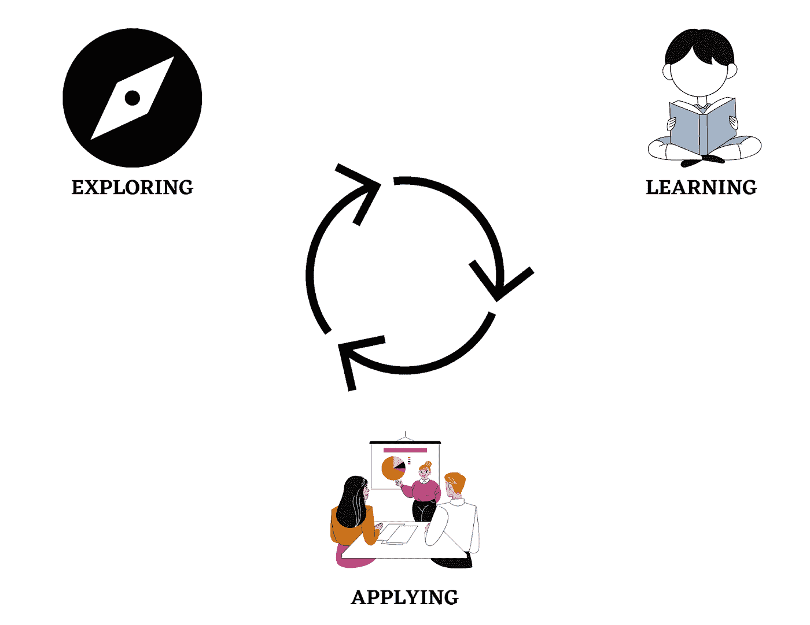
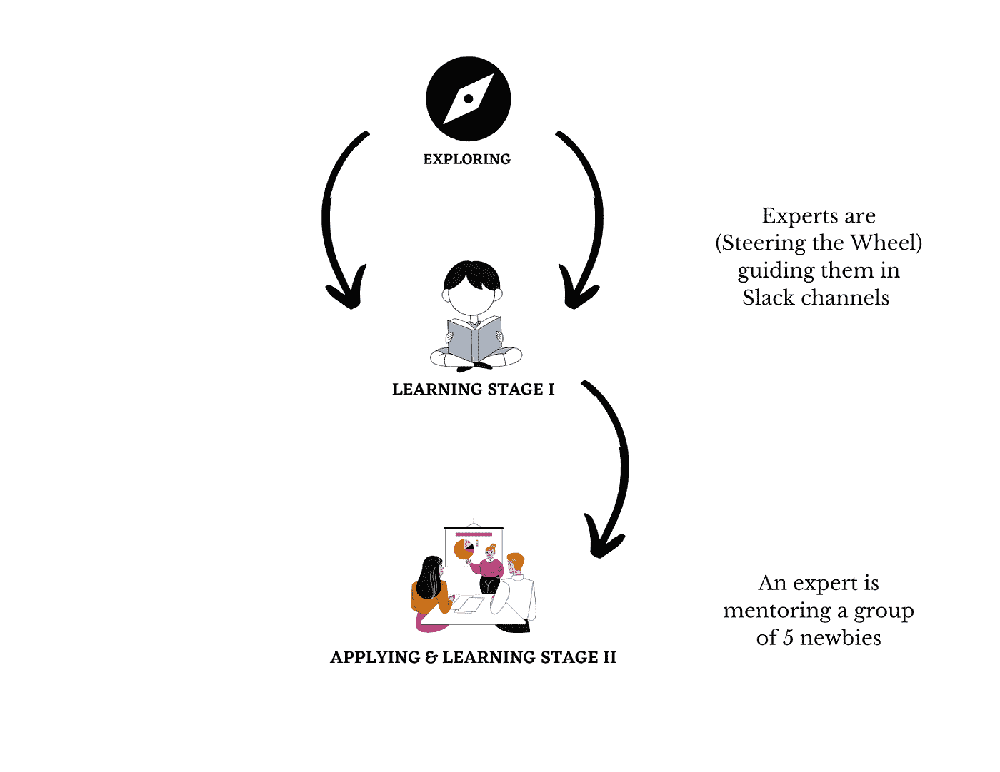

# 作为专家加入技术呆子

> 原文：<https://medium.com/nerd-for-tech/join-nerd-for-tech-as-an-expert-7c51d63adb66?source=collection_archive---------5----------------------->

**关于我们-**

由[李维·梅厄·克兰西](https://unsplash.com/@levimeirclancy?utm_source=medium&utm_medium=referral)在 [Unsplash](https://unsplash.com?utm_source=medium&utm_medium=referral) 上拍摄的照片

2020 年 6 月，我们以媒体出版物起家，现在我们是一家**教育媒体公司**，我们的愿景是围绕协作&实践学习创建强大的文化。

我们想象一个由世界各地的专业人士组成的生态系统，他们在新手学习之旅中掌舵，在这种文化中，学习者与其他同龄人合作，同时将技能作为解决现实问题的工具。

我们目前的状况-

*   [LinkedIn 社区](https://www.linkedin.com/company/68185327/admin/) — 6.9K 会员
*   [媒体出版物](https://medium.com/nerd-for-tech)—45000 名作者，71000 名读者，15000 名独立每日访问者
*   [真实脱口秀](https://www.youtube.com/channel/UCZy3TVD71ttqVHL5P9A_JBw) —原创播客系列，我们采访了来自美国宇航局、谷歌、特斯拉、网飞的 25 位嘉宾
*   松弛的社区空间——让事情变得更有条理&。
*   你可以在 www.nerdfortech.org 找到更多关于我们的信息

# 问题陈述-

Volodymyr Hryshchenko 在 [Unsplash](https://unsplash.com?utm_source=medium&utm_medium=referral) 上的照片

如今，学习一项技能背后的主要驱动力是获得一份工作或获得好成绩。这导致了平庸，因为大多数学生不知道如何将他们的技能作为解决现实世界问题或设计现实世界解决方案的工具。没有强有力的合作文化，在这种文化中，志趣相投的人相互合作，将他们的技能作为一种工具来应用。

因为要设计任何问题的解决方案，都需要来自多个领域的专业知识。我们观察到缺乏合作的生态系统和文化，在学习了一定数量的技能后，新手可以开始将它们与其他人一起应用到产品或某种解决方案中。

# 这个问题的解决方案(探索->学习->应用)

奥拉夫·阿伦斯·罗特内在 [Unsplash](https://unsplash.com?utm_source=medium&utm_medium=referral) 上的照片

我们已经建立了一个叫做 **ELA 的框架。**一个循环，一个不熟悉领域的新手可以开始**探索**，在实现他/她的兴趣&好奇心后，他们可以开始**学习** &一旦达到一定水平，他们可以开始**与其他同行一起应用**技能作为解决现实世界问题的工具。

# 你作为专家的角色-

约翰·施诺布里奇在 [Unsplash](https://unsplash.com?utm_source=medium&utm_medium=referral) 上拍摄的照片

这是一个初始框架&在这个过程中，我们将不断迭代，使事情变得更加高效和有效。

1.  **为探索&学习阶段**构建信息——由于网络上充满了信息&其他人正在生成大量有价值的内容。我们不需要生成任何东西。我们只需要为不同领域的新手组织信息。我们将有一组专家，例如数据科学专家。然后我们可以一起带来最好的免费学习资源&从初级到高级构建它们。这项工作将**一次。**
2.  **指导新手探索，学习&应用阶段**——我们坚信一个自我学习的过程。作为专家，你不用教他们任何东西。他们将拥有所有的资源，所以你的角色将是为他们的旅程掌舵。我们的 Slack 社区空间上有不同领域&职业对应的独立频道。如果任何新手发现问题，那么他们可以在各自的 Slack 频道发布。这就有了**探索** & **学习(第一阶段)**阶段。一旦他们达到**学习阶段 I** ，在那里他们有了基本的知识&理解，从那里我们可以把他们和其他 4 个兴趣领域可能不同的新手分成小组，&然后他们可以就一个问题进行头脑风暴，学习如何处理一个问题，验证，设计一个解决方案&实施。这个过程可能是一个比简单学习更好的学习方式。而作为一名专家，如果你愿意，你也可以指导 5 名新手。

简而言之，你作为专家的角色——这里的事情很灵活，因为我们都在合作中工作，所以如果你想休息或离开，我们尊重你的决定。我们不想要任何工作或时间承诺。

> 我们想要的是在我们所有人心中创造一种强大的动力，为一个共同的愿景而努力。

1.  一次工作，同时设计一个结构和积累资源。如果在你加入我们的时候我们已经做了这些，那么你可以检查一下这个结构&可以给你的反馈使它更有效率。
2.  与其他专业人士在一个宽松的渠道，在 ELA 过程中驾驶新手的旅程。
3.  指导一组 5 名新手，一旦他们准备好**申请&学习(第二阶段)**后**探索——学习第一阶段**(可选，这完全取决于你)

如果你有兴趣加入我们，成为一名期待解决问题的专家，请填写这张[表格](https://docs.google.com/forms/d/e/1FAIpQLSfhoICNEl6X5BKoa69zonT0TE7SH2a7-fFejUk4ky2k4cZFDQ/viewform)，我们在生活中的某个时刻都会遇到这个问题。

干杯！

技术团队呆子

[Linkedin](https://www.linkedin.com/company/nerdfortech/?viewAsMember=true) | [网站](https://www.nerdfortech.org/) | [媒体](https://medium.com/nerd-for-tech) | [YouTube](https://www.youtube.com/channel/UCZy3TVD71ttqVHL5P9A_JBw)