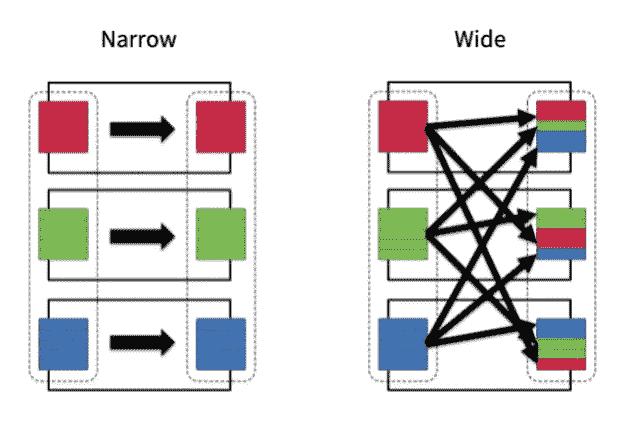
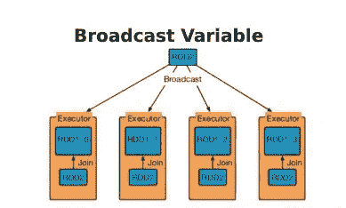
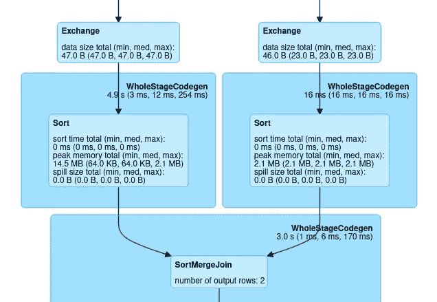
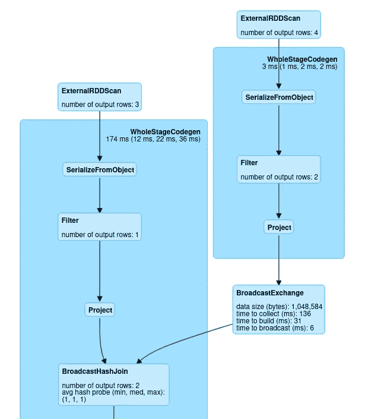
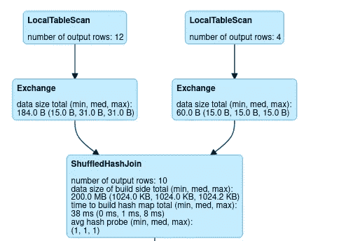

# Apache Spark 中的加入策略

> 原文：<https://medium.com/nerd-for-tech/joining-strategies-in-apache-spark-f802a7dab150?source=collection_archive---------2----------------------->

Apache spark 是广泛用于数据处理的分析引擎之一。Spark 为执行分析和查询提供了广泛的 API。**连接**是数据帧上最重要的操作之一，取决于数据帧的性质或 spark 在不同类型的连接策略之间选择的查询基础。

**节点间的通信**

Spark 集群由驱动程序和许多执行器节点组成，由于数据将被划分到不同的执行器上，因此需要在不同的执行器之间共享数据，主要有两种类型的节点通信方法。

**在节点通信中**:在这种方法中，数据将在不同的集群中被混洗，混洗数据可能成为 spark 中最昂贵的操作之一。

其中数据被转换的广泛转换导致数据在各种群集中的混洗是节点内通信策略的一个例子。



宽窄转换

**每个节点的通信策略:**在这种通信方法中，数据将从一个节点广播到所有其他节点，而不是在各个集群之间洗牌。



spark 中的广播示例

广播连接是 spark 中每节点通信的例子，其中较小的数据帧将被广播给不同的执行器。

**不同的加入策略**

**排序合并联接**

一种重要且最常用的连接策略，主要用于无法广播到不同节点的大型数据帧(spark 数据帧的广播限制为 8 GB)。排序合并联接分三个阶段执行。

*   **phase 1:Shuffle phase**——用于执行连接的两个表按照集群中的连接键重新分区。
*   **Phase2:Sort phase** -并行排序每个分区内的数据。
*   **Phase3:Merge phase** -在这个阶段，每个数据集都将被迭代，并连接具有相同连接键值的行。​



排序合并联接示例

**排序合并连接的理想条件**

*   确保分区已经在同一位置。这导致较少的数据混洗。
*   数据帧应均匀分布。
*   更多的唯一键意味着更好的并行性。

**广播加入**

广播连接是 spark 中最有效的连接策略之一，因为节点间的数据交换最少。仅与小于 8 GB 的较小数据集相关。

```
**val** items**=Seq**((**0**, "Tomato", **2.0**),(**1**, "Watermelon", **5.5**),(**2**, "pineapple", **7.0**))
**val** rdditem **=** spark.sparkContext.parallelize(items)
**val** **ItemsDF=**rdditem.toDF("id" , "name", "price")**val** orders**=Seq**((**100**, **0**, **1**),(**100**, **1**, **1**), (**101**, **2**, **3**), (**102**,**2**,**8**))
**val** rddorder **=** spark.sparkContext.parallelize(orders)
**val** **OrdersDF=**rddorder.toDF("id" , "itemid", "count")**ItemsDF**.join(broadcast(**OrdersDF**)).where((**OrdersDF**("itemid")===**ItemsDF**("id")) ).filter(**ItemsDF**("id")===**2**).groupBy("name","price").agg(sum("count")).show()
```

在上面的例子中，数据帧 **itemsDF** 被广播给所有的执行器，这导致下面给出的 DAG。



广播加入示例

**洗牌加入**

spark 连接的另一个最重要的策略是混合散列连接，它基于 map reduce 的概念工作。

*   **第一步:**使用连接 ID 作为关键字映射数据帧
*   **步骤 2:** 执行混洗操作，在不同节点间传输数据
*   **第三步:**根据关键点减少。

> 将 preferSortmergejoin 的值设置为 false 并设置 autobroadcastjoinThreshold limit 将阻止 spark 执行广播和 Sortmergejoin

```
spark.conf.set("spark.sql.autoBroadcastJoinThreshold", **2**)
spark.conf.set("spark.sql.join.preferSortMergeJoin", "false")**val** data1 **=** **Seq**(**10**, **20**, **20**, **30**, **40**, **10**, **40**, **20**, **20**, **20**, **20**, **50**)
**val** df1 **=** data1.toDF("id1")**val** data2 **=** **Seq**(**30**, **20**, **40**, **50**)
**val** df2 **=** data2.toDF("id2")**val** dfJoined **=** df1.join(df2, $"id1" === $"id2")
```



混合散列连接 DAG 示例