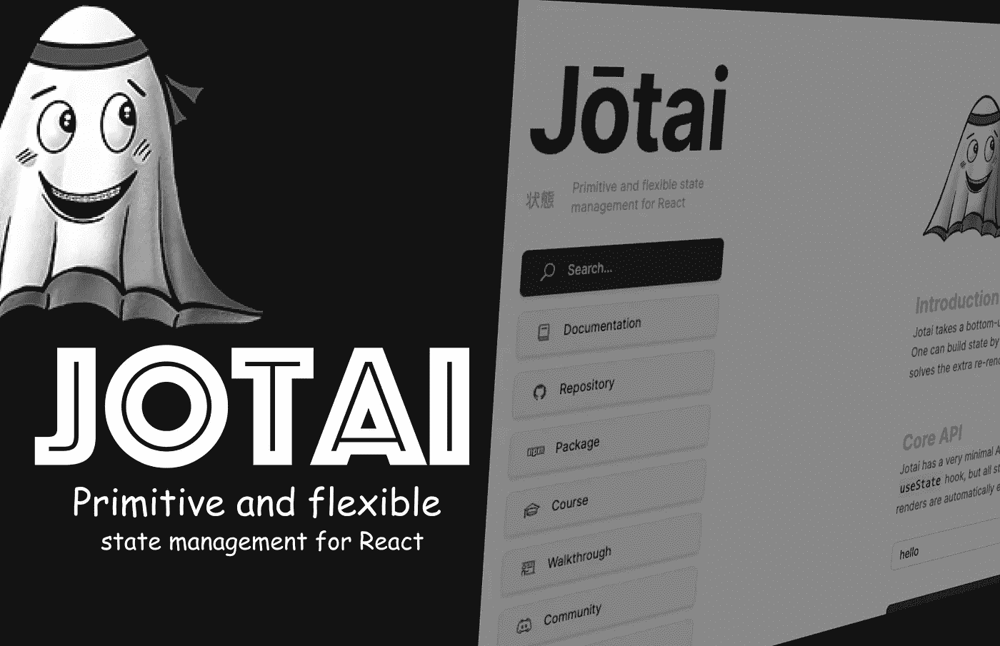

# jotai——React 的新状态管理库

> 原文：<https://medium.com/nerd-for-tech/jotai-new-state-management-library-for-react-ad66ccd95797?source=collection_archive---------0----------------------->

深入了解 Jotai 的 5 件事

# 约泰

最近，我为 react 应用程序找到了这个新的状态管理库。

React 的原始和灵活的状态管理库。原始是因为在核心层次上意味着非常基本和简单。