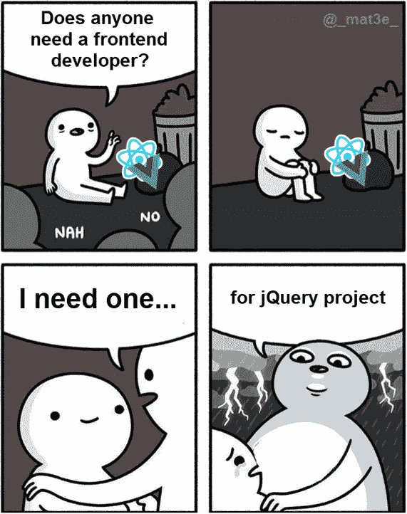
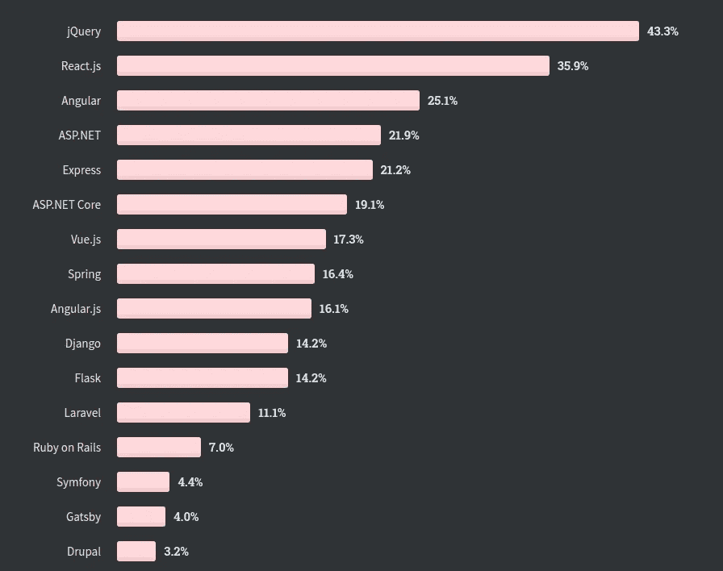

# jQuery vs Vue.js

> 原文：<https://medium.com/nerd-for-tech/jquery-vs-vue-js-aaa69744ebef?source=collection_archive---------1----------------------->

*透视从使用* ***jQuery*** *到改用* ***Vue.js***

为什么使用 **jQuery** ？为什么烦恼？它不是死了吗？是不是路太乱了？现在的项目还在用吗？还是…

如此等等…

jQuery 还活着，据我所知，它做得很好:

堆栈溢出开发者调查 2020

jQuery 的最新版本是 3.6.0，实际上是在本年度(2021 年)发布的。

仍然有很多公司在所需的技术堆栈中寻找拥有 jQuery 的开发者。人们仍然在为它开发插件，在商业/私人项目中使用它们(我也是)。它已经存在了很多年，而且很可能还会存在很多年。

Modern JS

当我们谈论现代 JS 时，我们大多(至少我和许多我有机会与之交谈/聊天的人)指的是: **React / Angular / Vue。**

我已经有机会和他们所有人一起玩了，到目前为止 **Vue.js** 是一个赢家——但这不是这里的主要话题。

在使用 **Vue.js** 的时候，我甚至想:

> **“vue . js**是……可怕的……”

没什么好担心的，只是…与 **jQuery** 相比，它在许多领域都要好得多，这就是…它的独特之处！例如 **Vue.js** 提供的是:

*   要写的代码更少，
*   更干净的代码，
*   模块化，
*   **TS** 支撑、
*   反应性，
*   超级好学(从 **jQuery** / **TS** 人的角度)，
*   越来越受欢迎，
*   使用简单，

不要误解——这不是一个完美的工具，有一些错误需要不断修正。

另一个很酷的例子是，我列出了我想在项目中实现的东西的清单——我完成得如此之快，以至于我觉得:

> “我一定忘了什么”

我没有——用 **Vue.js** 编码非常顺利。

L

我使用 jQuery 已经很多年了，我有一种感觉，是时候学习一些现代的东西了(不仅仅是为了未来的自己，也是出于好奇)，此外，Vue.js 允许我学习现代的普通 js 解决方案。

H **学 Vue.js 有多难？**

像往常一样*“视情况而定”*——我将在我的案例中展示这一点:

*   用了几年的**香草 JS** 和 **jQuery，**
*   1y +带**打字稿，**
*   **中的一个项目 React** (乱得要命，几年前写的)，
*   **角度**一大更新(4+？),

它花了我… ***2 周*** 学习 Vue.js 到我觉得有足够信心使用它的程度。

然而…这些 ***2 周*** 并不像教程中的 ***24/7*** ，而是我在圣诞节期间阅读手册*(当其他人盯着电视时，我跟随官方的****vue . js****手册)。*

在我看来， **Vue.js** 非常容易学习——官方文档写得很好，包括很好的例子、用例以及解释。之后剩下的就是自己写代码了。

**React** 和 **Angular** 太大，太复杂——与它们相比 **Vue.js** 是一个小的/紧密的盐粒——但它以它应该的方式工作。

**但是 Vue CLI、Vuex 等呢……**

你不需要这个来开始使用**vue . js**——我使用的真正必要的包是:

*   **vue 路由器**，
*   **i18n** (但是我使用我自己的实现，我在这里已经描述过)

与 jQuery 一起使用 Vue.js 安全吗？

答案是——在某种程度上。

问题是 **jQuery** 或 **Vanilla Js** 通过直接操纵 DOM 来更新/插入/移除元素(它们的值)——vue . Js 不喜欢那样，它也不会被告知其他库改变了什么。

**Vue.js** 意在通过操作交付的数据来更新 **DOM** (也就是说，改变变量的状态会自动反映在 **DOM** 的变化中)

T **颠倒世界——逻辑分离 vs *单一文件组件***

切换到 **Vue.js** 的最大问题是改变代码的思维方式，它的结构——它应该被编写的方式。

在我的例子中，我转移到了*单个文件组件*——这是一个大的 **no(！)**对我来说，我一直在分离 js/html/CSS——就*单个文件组件*而言，这不再是一条路。

在传统的解决方案中，我们会这样做:

*   *styles.scss*
*   *script.js*
*   【index.html】

而在 **Vue.js** 中，我们只需:

*   由模板(html)、脚本(js)和样式(css)部分组成

也就是说，我的解决方案只有一个文件。没有人说你不能分离逻辑——但我想从头开始遵循***vue . js****编码标准，并学习现代 js。*

L

值得一提的是，我们不再依赖`let $element = $(element)`或`$element.on('click', () => {})`，取而代之的是`$refs`和`@ event`。

看起来没什么大不了的，但是这已经让代码变得干净了。考虑您的模板代码，如下所示(附加一个事件):

在**中，jQuery** `this`依赖于我们调用它的地方，而在 **Vue.js** 中，它几乎总是引用`root`，所以不需要创建`this`的副本来使用`on`中的其他上下文——这可以用`bind`解决一些问题，但我永远无法理解这个概念。

如果我们把它转换成 vue，我们会得到这样的结果:

**移除** `**$(selector)**` **，减少需要更新的 DOM**

在 Vue.js 中，不再需要以这种方式获取选择器，我们可以简单地在任何需要 dom 元素的地方使用`this.$refs.divElement`

看起来不多，但这已经减少了代码，我们用这种方法在很多地方去掉了小的可重复代码。

此外，每当我们在其他脚本中做一些更改时，我们不再需要*手动更新 values / DOM 元素*——这是可能的，因为**反应**意味着如果我们在一个地方更新一个变量……它在其他地方的所有用法也会被更新——这……大大减少了代码。

从 jQuery 的角度来看，这个过程应该是这样的:

*   在 html(模板)中设置一些值(硬编码)，
*   在一个地方更新它(抓住`$(selector)`)
*   然后在所有其他地方更新，增加`$(selector).find.parent`的音调
*   也许加上`if dom element is not existing`，

我想你明白了——你非常喜欢重复的代码。

而从 **Vue.js** 的角度来看，你基本上是这样做的:

*   定义变量的初始值—将其绑定到 html(模板)，
*   通过调用`this.variableName = "something"`在任何需要的地方更新变量
*   最终从父组件更新子组件`this.$refs.component.variableName = "something",`

*简单来说，****vue . js****处理更新给定变量的所有文档！*

V **ue.js — cons ( *对比 jQuery* )**

Vue.js 并不完美——这是这里需要理解的一点。bug 时有发生，所以在 **3.0.0** 中有一个 bug，我与之斗争过，但后来在 **3.0.2** 中被修复了——但是嘿，那是正常的。

我能写的唯一真正的**缺点**——就技术解决方案/概念而言是*“部分* ***TS*** *支持”*，意思是*“在 Vue.js 方法中没有 Typehint 支持”*(然而这在 CLI 中有效——从未使用过那个，只是在这里或那里看到一些信息)。

> 最大的缺点是缺乏众所周知的用于 Vue 的插件

举个例子——我真的想使用**数据表**用于 **Vue.js** 但是我找不到任何具有相同功能的像样的工作组件。这迫使我编写自己的插件精简版——因此它显示了在 Vue 中重新创建代码是多么简单。

Few 总结的话

我可以自然地写更多，但是没有人会简单地阅读无尽的文本。