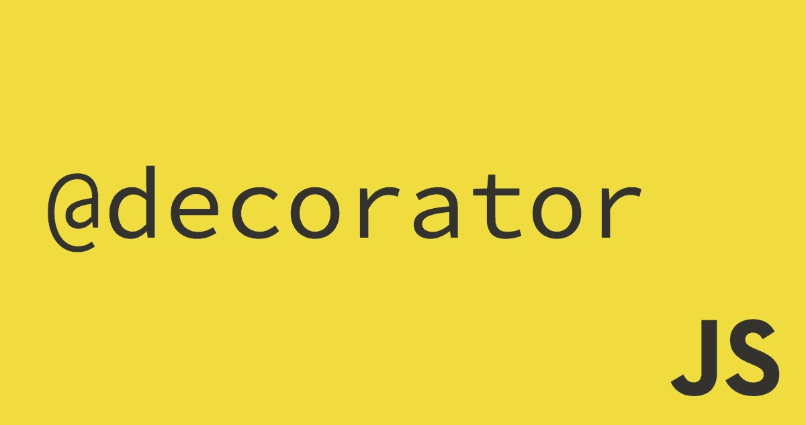
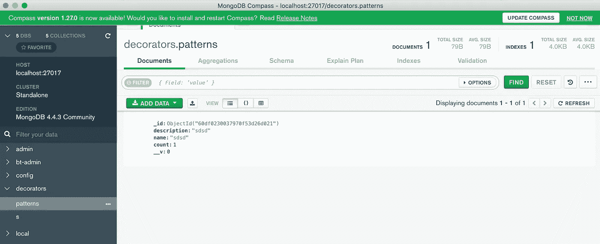

# 从零开始为猫鼬模型的 JS 装饰

> 原文：<https://medium.com/nerd-for-tech/js-decorators-for-mongoose-model-from-scratch-cc329a36d412?source=collection_archive---------5----------------------->

任何优秀的开发人员都很好奇这些东西是如何工作的。我们将尝试使用 decorator 来消除一个缺点，这个缺点你可能已经在一些关于 mongoose API 和 TypeORM 的讨论中听说过了(我在这里发现了惊人的对比)。这是一种快速揭开事物神秘面纱的神奇方式——弄脏我们的手。让我们看看 decorators 如何在您使用 mongoose API 的情况下发挥作用。

这里有一个缺点:*如果您希望您的模型支持 TS 类型，您需要定义 Mongo 模式和 TypeScript 类型*。在代码中，它可能是这样的:

对于这个小模型来说，这没什么大不了的，但是我们可能会忘记在类型中添加新的属性也需要更新模式定义。有很多库已经用不同的方式解决了这个问题，但是在这里我看到这是一个很好的机会来探索 decorator 的用法并简要概述可能使用的技术。

我们的目标是定义模型类型，并提出一种方法来创建模型，减少 props 和 schema 不匹配的可能性。

首先，我们需要知道，所有的 TS 类型和接口在转换阶段都被删除了，为了装饰器的使用，因此要定义新的模型类型，我们应该使用*类*关键字，TS 将*类*视为一个类型，在转换后不会被删除。让我们从模型的定义开始:

让我们定义工厂函数，在这里我们将传递我们的模型类，它将创建 mongoose 模型:

ModelFactory 的实现如下所示:

我们稍后会回来提取*模型名称*和*模式元数据*。

嗯， *modelName* 它只是一个带有我们数据库集合名称的字符串。为了提取这个名字，我们可以声明第一个装饰器*模式*，我们将它放在类声明下，它帮助我们提取这个名字:

Decorator 非常简单，它只是获取*目标*什么是类构造函数，并调用*typemetadastorage . addschemametadata*方法，该方法将元数据存储在内存中。让我们回顾一下*类型元数据存储*的实现:

这里没什么特别的，只是存储在内存映射中，这里的键是我们的构造函数和它们相关的选项。让我们使用这个装饰器:

对于*类型元数据存储*，我们需要定义方法，该方法将通过目标类解析集合数据库名称( *getSchemaMetadata* 方法):

现在我们可以在我们的工厂方法中使用它，该方法通过我们前面留下的类声明来构建模型，现在我们可以从元数据中定义我们的 DB 集合名称:

第一步完成了。现在让我们实现 *Prop* decorator，它可以跟踪我们属性的 Mongoose 定义。这将是一个简单的实现，我们可以调用没有道具的*道具*装饰器，并允许它从属性声明中推断类型，或者只是用 Mongoose SchemaDefinition 放置标准对象，有两种方法可以使用它:

以下是 Prop decorator 的实现:

这里也没什么特别的，我们只是将所有元数据存储在内存中。只有一件事需要提及，当 decorator 在没有选项的情况下调用时，我们试图使用外部库 [reflect-metadata](https://www.npmjs.com/package/reflect-metadata) 隐式定义类型。并且不要忘记为您的 *tsconfig.json* 打开以下属性:

我们还需要实现 type metadata . addpropertymetdata 方法:

addPropertyMetdata 是非常简单的方法，我们只需将所有参数保存在内存中。我们还定义了*getPropertiesDefinitions*，它构造了所有与目标类对象相关联的 mongose*ShemaDefinitions*。让我们完成我们的工厂方法:

就这样，我们只需要测试实现了什么。这是我们的模型:

这里是我们使用它的索引文件:

运行该文件后，我们按预期保存了实体:

我希望本教程给出了一个使用 decorators 的要点，它受到了[@ nestjs/mongose](https://www.npmjs.com/package/@nestjs/mongoose)模块的启发，你可以深入到它们的实现中，并且本教程肯定会加速它。一些使用[@ nestjs/mongose](https://www.npmjs.com/package/@nestjs/mongoose)的文档可以在这里找到*。*

*如果你需要深入教程代码，你可以在这里找到*。**