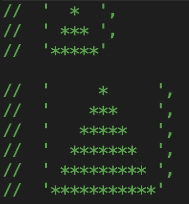
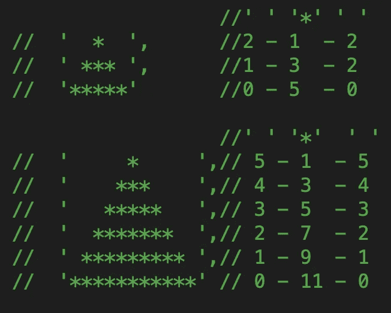
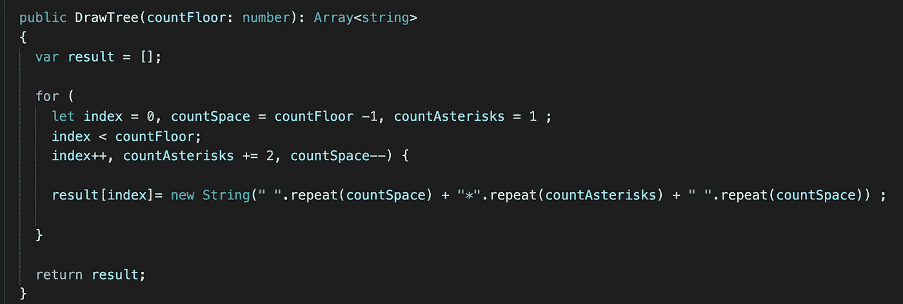

# JS 测试任务实时。画一棵树。

> 原文：<https://medium.com/nerd-for-tech/js-test-task-real-time-draw-a-tree-2fefcfbcb07e?source=collection_archive---------7----------------------->

画一棵树是一个非常流行的测试任务。有许多方法可以解决这个任务。但是面试期望从你这里看到一个周期的解决方案。

**任务**

通过以下给定的参数建造塔:楼层数(整数且总是大于 0)。

第一个图片参数是 3，第二个图片参数是 6。

我们需要创建一个包含星号和空格的字符串数组。我们需要找到一个模式。我们来数一下人物。

正如我们所见，第一根弦上的空白空间等于楼层数减一。每次迭代减一。

星号的数量是 1，每次迭代增加 2。

这是我们的算法。

现在你有更多的机会通过面试。

如果你需要仔细看看这个项目[，这里是 angular 项目](https://github.com/8Tesla8/draw-tree)的链接。

*原载于 2021 年 2 月 15 日 http://tomorrowmeannever.wordpress.com***。**