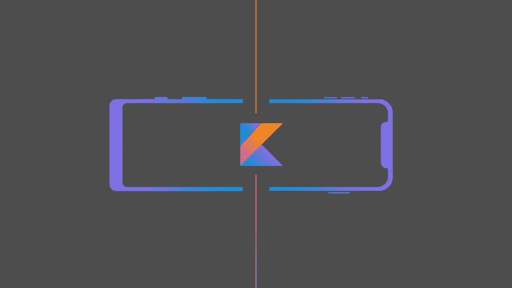
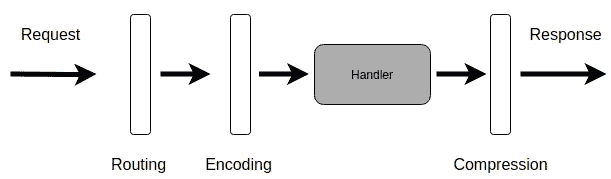

# Ktor 中的 JSON 序列化

> 原文：<https://medium.com/nerd-for-tech/json-serialization-for-ktor-feae3d06eadb?source=collection_archive---------4----------------------->



# 介绍

作为我的系列“[一个固执己见的 Kotlin 后端服务](/p/87f814e3dffd)”的一部分，我检查了序列化/反序列化 JSON 有效负载的不同方法。

根据 https://ktor.io/docs/serialization.html[的说法](https://ktor.io/docs/serialization.html)这些是受支持的转换器:

1.  [Gson](https://github.com/google/gson)
2.  [杰克逊](https://github.com/FasterXML/jackson)
3.  [kotlinx.serialization](https://github.com/Kotlin/kotlinx.serialization)

我测试了#1 和#3，因为我喜欢时不时的挑战，所以我把[魔石](https://github.com/square/moshi)放入其中。我没有提到杰克逊是因为…为什么不呢；-).

我的测试很简单。我想序列化/反序列化此数据结构:

```
data class Customer(
    var customerUUID: String,
    var createdAt: Instant,
    var modified: Instant,
    var firstName: String,
    var lastName: String,
    var language: Language,
    var account: Account,
)data class Account(
    var accountUUID: String,
    var createdAt: Instant,
    var modified: Instant,
    var status: AccountStatus
)
```

序列化部分检索一个客户列表(ArrayList <customer>)，每个客户引用一个 account -> GET。</customer>

反序列化部分首先创建一个帐户，然后是引用该帐户的客户-> POST。

# 间奏曲

自定义转换器可以很容易地注册到 Ktor。它们只是另一个 [Ktor 特性](https://ktor.io/docs/features.html)，如路由、日志或错误处理:



(在其他框架中，一个特性被称为中间件、过滤器或委托处理程序)

可以使用安装功能来安装功能。出于我们的目的，我们安装了一个 [*内容协商*](https://api.ktor.io/1.5.3/io.ktor.features/-content-negotiation/index.html) 特性，如下所示:

```
install(ContentNegotiation) {
   register(ContentType.Application.Json, CustomJsonConverter())
   register(ContentType.Application.Xml, CustomXmlConverter()) 
}
```

所有三个经过测试的转换器都具有扩展功能来简化注册:

```
install(ContentNegotiation) {
   gson()                  // Gson converter
   json()                  // kotlinx.serialization converter
   moshi { }               // Moshi converter
}
```

当然，你一次只能安装其中一个。

# Gson

## 属国

将此依赖项添加到您的 Gradle 构建文件中:

```
implementation(“io.ktor:ktor-gson:$ktor_version”)
```

## 装置

如上所述，这就是安装 GSON 转换器所需的全部内容:

```
install(ContentNegotiation) {
   gson()
}
```

通过 *gson* 功能，您可以访问 [GsonBuilder](https://www.javadoc.io/doc/com.google.code.gson/gson/latest/com.google.gson/com/google/gson/GsonBuilder.html) 来定制转换器:

```
install(ContentNegotiation) {
   gson {
      setPrettyPrinting()
      disableHtmlEscaping()
      registerTypeAdapter(yourClass, yourCustomAdapter)
   }
}
```

## 用户化

运行开箱即用的测试。我为客户/账户数据结构得到了这个:

```
[
    {
        "customerUUID": "bbbe4f11-c36d-49cd-a031-787d6559d3ea",
        **"createdAt": {
            "seconds": 1617802016,
            "nanos": 609375000
        },**
        **"modified": {
            "seconds": 1617802016,
            "nanos": 609375000
        },**
        "firstName": "Emanuel",
        "lastName": "Moecklin",
        "language": "en",
        "account": {
            "accountUUID": "20836570-d4ef-420e-b500-7b7f6516e1a8",
            "createdAt": {
                "seconds": 1617802016,
                "nanos": 415274000
            },
            "modified": {
                "seconds": 1617903421,
                "nanos": 798094000
            },
            "status": "Created"
        }
    },
```

正如你所看到的，即时对象被序列化了，但是以一种非常规的方式。为了解决这个问题，我添加了一个自定义适配器:

```
object **GsonInstantAdapter**: TypeAdapter<Instant>() {
    override fun write(writer: JsonWriter, value: Instant?) {
        runCatching **{** writer.value(value.toString())
        **}**.onFailure **{** throw IllegalArgumentException(it.message)
        **}** }

    override fun read(reader: JsonReader): Instant? {
        return runCatching **{** Instant.parse(reader.nextString())
        **}**.throwOnFailure()
    }
}
```

请注意，我使用了[https://github.com/michaelbull/kotlin-result](https://github.com/michaelbull/kotlin-result)来处理序列化/反序列化的结果( *runCatching* 、 *onFailure* )。

*throwOnFailure* 是我结合 [Valiktor](https://github.com/valiktor/valiktor) 使用的扩展函数(见我关于对象验证的文章:[https://medium . com/nerd-for-tech/object-validation-in-kot Lin-c 7 e 02 b 5 dabc](/nerd-for-tech/object-validation-in-kotlin-c7e02b5dabc))。下面的代码省略了 Valiktor 部分，完整的代码将在我的主要文章“一个固执己见的 Kotlin 后端服务”中。

```
fun <V> Result<V, Throwable>.throwOnFailure(): V? {
    *onFailure* {
        val message = it.message ?: it.*javaClass*.*simpleName* throw IllegalArgumentException(message)
    }
    return component1()
}
```

现在我们需要向 [GsonBuilder](https://www.javadoc.io/doc/com.google.code.gson/gson/latest/com.google.gson/com/google/gson/GsonBuilder.html) 注册适配器:

```
gson **{** setPrettyPrinting()
    disableHtmlEscaping()
 **registerTypeAdapter(Instant::class.java, GsonInstantAdapter)
}**
```

结果是:

```
"createdAt": "2021-04-09T19:55:13.571019Z",
"modified": "2021-04-09T20:22:58.167671Z",
```

# kotlinx .序列化

## 属国

Kotlin 自己的序列化插件需要这样配置:

```
plugins {
    kotlin("plugin.serialization") version "1.4.32"
}
```

它也需要这种依赖性:

```
implementation("io.ktor:ktor-serialization:$ktor_version")
```

## 装置

```
install(ContentNegotiation) {
        json(Json {
            prettyPrint = true
            isLenient = true
        })
   }
```

## 用户化

运行此命令将引发一个异常:

> kot linx . serialization . serialization exception:找不到类“Customer”的序列化程序。将该类标记为 [@Serializable](http://twitter.com/Serializable) 或显式提供序列化程序。

所以我们给每个数据类添加了一个 [@Serializable](http://twitter.com/Serializable) 注释:

```
@Serializable
data class Account(@Serializable
data class Customer(
```

现在我们得到一个编译错误:

> 未找到类型为“Instant？”的序列化程序。若要将上下文序列化程序用作后备，请用@Contextual 显式批注类型或属性

为了解决这个问题，我为 Instant 类编写了一个序列化程序(类似 Gson):

```
@OptIn(ExperimentalSerializationApi::class)
@Serializer(forClass = Instant::class)
object InstantSerializer : KSerializer<Instant> {
    override fun deserialize(decoder: Decoder): Instant  
        = Instant.parse(decoder.decodeString())

    override fun serialize(encoder: Encoder, value: Instant) {
        encoder.encodeString(value.toString())
    }
}
```

要注册序列化程序，每个属性都需要进行如下注释:

```
@Serializable(with = InstantSerializer::class)
var createdAt: Instant?,@Serializable(with = InstantSerializer::class)
var modifiedAt: Instant?,
```

或者，您可以将它添加到文件的顶部(如果您有多个属性，这样会更方便):

```
@file:UseSerializers(InstantSerializer::class)
```

第二个选项可用于注册多个适配器:

```
@file:UseSerializers(InstantSerializer::class, AnotherSerializer::class)
```

# 魔石

Moshi 没有得到 Ktor 的官方支持，但是杰克逊支持，那么为什么不是杰克逊而是 Moshi 呢？答案很简单:我想要一个现代的库，具有简洁流畅的 API，并且明确支持 Kotlin。这两个库都是最重要的 Java 库，但是 Moshi 肯定有更好的 Kotlin 支持。

> Jackson 被称为“Java JSON 库”或“Java 的最佳 JSON 解析器”。或者简称为“JSON for Java”。

([https://github.com/FasterXML/jackson](https://github.com/FasterXML/jackson))

> Moshi 是 Kotlin 的一个很棒的 JSON 库。它理解 Kotlin 的不可空类型和默认参数值。当你使用 Kotlin 和 Moshi 时，你可以使用 reflection，codegen，或者两者都用。

([https://github.com/square/moshi](https://github.com/square/moshi)

## 属国

设置 Moshi 不像其他两个库那样简单。TBH:制作这个作品是一个相当严峻的考验，所以让我来告诉你整个过程。

首先，添加标准依赖项:

```
implementation("com.squareup.moshi:moshi:1.12.0")
implementation("com.squareup.moshi:moshi-kotlin:1.12.0")
```

然后需要安装 Moshi 作为 Ktor 特性。我发现了这个连接莫希和 Ktor 的图书馆:【https://github.com/rharter/ktor-moshi[。不幸的是，添加后我得到了一个异常:](https://github.com/rharter/ktor-moshi)

> 不允许在此调度程序上使用阻塞原语。请考虑改用异步通道或在 withContext(Dispatchers)中使用阻塞原语。IO)代替。

经过一些研究，我通过在调用线程之外运行一些转换代码来修复它:

添加此 Moshi 后，可以作为 Ktor 功能安装:

```
install(ContentNegotiation) {
    moshi {  }
}
```

当运行这个并尝试序列化时，我得到:

> 无法序列化 Kotlin 类型客户。不使用 kotlin-reflect 的 Kotlin 类的反射序列化具有未定义和意外的行为。请使用 moshi-kotlin 工件中的 KotlinJsonAdapterFactory 或使用 moshi-kotlin-codegen 工件中的 code gen。

经过一番挖掘，我发现有两种方法可以让 Moshi 自动创建适配器:

1.  反射
2.  Codegen

## 魔石反射

顾名思义，它使用反射来生成适配器。你所需要做的就是添加 *KotlinJsonAdapterFactory* :

```
*moshi* {
    addLast(KotlinJsonAdapterFactory())
}
```

注意，我们使用 *addLast* 而不是 *add* ，因为 Moshi 适配器是按优先级排序的，并且您希望自己的适配器“优先”。

当然，现在我们还需要一个用于即时类的适配器:

```
object MoshiInstantAdapter : JsonAdapter<Instant>() {
    @FromJson
    override fun fromJson(reader: JsonReader): Instant =
        Instant.parse(reader.nextString())

    @ToJson
    override fun toJson(writer: JsonWriter, value: Instant?) {
        writer.value(value.*toString*())
    }
}
```

适配器需要注册:

```
*moshi* {
    add(MoshiInstantAdapter)
    addLast(KotlinJsonAdapterFactory())
}
```

你可能会想，我们已经准备好了……但是不:

> java.util.ArrayList 类没有 JsonAdapter，您可能应该使用 List 而不是 ArrayList (Moshi 默认情况下只支持集合接口),或者注册一个自定义 JsonAdapter。

经过深入研究，我发现 Moshi 根本不支持开箱即用的数组列表，我在 stack overflow[https://stackoverflow.com/a/61272734/534471](https://stackoverflow.com/a/61272734/534471)上找到了这个答案:

注册 ArrayListAdapter，我们最终真正完成了:

```
*moshi* {
    add(MoshiInstantAdapter)
    add(MoshiArrayListJsonAdapter.FACTORY)
    addLast(KotlinJsonAdapterFactory())
}
```

## 摩西法典

Moshi 反射很慢，并且增加了大量的额外代码(kotlin-reflect library) ->对移动应用程序很重要。另一方面，Codegen 使用注释处理器。它在编译时为每个 Kotlin 类生成一个小而快速的适配器。

要使用 Codegen，我们需要添加

要使用 Codegen，我们需要添加 [Kotlin 注释处理工具](https://kotlinlang.org/docs/kapt.html) ( [kapt](https://kotlinlang.org/docs/kapt.html) )和 Codegen 注释处理器:

```
plugins **{** *kotlin*("jvm") *version* "1.4.32" *apply* false
    *kotlin*("kapt") *version* "1.4.32" *apply* false
**}**kapt("com.squareup.moshi:moshi-kotlin-codegen:1.12.0")
```

请注意， *kapt* 需要在 *jvm* 插件之后。还要注意，它是*kapt(“…”*而不是*实现(“…”*)。我浪费了时间，因为我使用了*实现*(复制&粘贴错误)，并想知道它为什么不生成适配器类(得到“未能找到生成的 JsonAdapter 类”)。

我们还需要用*@ JSON class(generate adapter = true)*注释每个数据类:

```
@JsonClass(generateAdapter = true)
data class Account(@JsonClass(generateAdapter = true)
data class Customer(
```

就是这样。

# 结论

*   **Gson (19.4k 星，3.8k 叉，最后提交 2020 年 5 月 13 日):**
    容易设置，唯一开箱即用的 lib(有点)。我绝对花了最少的时间，让 Gson 序列化启动并运行。如果你不想浪费时间，让最先进的技术发挥作用，也不关心最大性能，Gson 是一个不错的选择。
*   **kotlinx.serialization (3k 星，320 叉，最后提交 2021 年 4 月 5 日):** 镇上的新警长。我花了比 Gson 更长的时间来设置它，但它显然是为 Kotlin 制作的，因为 Kotlin 插件在编译时而不是运行时施展魔法。它也支持 Kotlin 多平台，你可以使用它为 Android，Ktor，Gradle/Maven，Kotlin/JS，Kotlin/Native 等..我对 kotlinx.serialization 的唯一不满是，它支持带有@Serializable 注释的类，但不支持可序列化的类(扩展可序列化接口的类)。我知道在编译时创建序列化器对于接口*"*[*@ Serializable*](http://twitter.com/Serializable)*来说是不可能的，注释被忽略是因为它不可能自动序列化接口或枚举。通过同伴对象等手动提供序列化程序)*但在运行时可能会有基于反射的接口解决方案。
*   **Moshi (7.2k stars，598 forks，最后提交 2021 年 4 月 10 日):** 很难设置，如果你不是针对它的默认平台(Android 和 Java)，文档会很混乱。现在我不明白为什么我会选择 Moshi 而不是其他两个库。该项目非常活跃，因此它可能会发展为 Ktor 和 Kotlin 多平台提供更好/更容易的支持。

我个人会使用 kotlinx.serialization。到目前为止我还没有发现任何阻碍，这似乎是一个非常活跃的项目，尽管我肯定会关注 Moshi 及其发展方向。

**注意:**在研究 https://github.com/papsign/Ktor-OpenAPI-Generator(文章随后)时，我在 kotlinx.serialization 中发现了以下错误

> 出现异常:尚不支持序列化不同元素类型的集合

我切换回使用 Gson，一切正常。使用旧的但是久经考验的库似乎有它的优势。

# 附录:性能

比较不同库的序列化/反序列化的性能似乎是一项具有挑战性的任务。我注意到不同基准之间的主要差异。有些人认为 kotlinx.serialization 是赢家，有些人认为是 Moshi，有些人认为是 Jackson:

*   [https://medium . com/stanwood/save-my-ass-benchmark-of-JSON-deserialisers-on-Android-28341 C1 e 82 df](/stanwood/save-my-ass-benchmark-of-json-deserializers-on-android-28341c1e82df)
    ->**kotlinx . serialization**>Gson>Moshi>>>Jackson
    (对比旧版 libs，基准从 2018 年开始)
*   [https://proandroiddev . com/goodbye-Gson-hello-Moshi-4e 591116231 e](https://proandroiddev.com/goodbye-gson-hello-moshi-4e591116231e)
    ->**Moshi**>Gson
    (不运行自己的基准，只是引用下一个基准)
*   [https://github . com/zacs weers/JSON-serialization-benchmark/](https://github.com/ZacSweers/json-serialization-benchmarking/)
    [https://zacs weers . github . io/JSON-serialization-benchmark/](https://zacsweers.github.io/json-serialization-benchmarking/)
    **Moshi**>kot linx . serialization/Gson
*   [https://tech . olx . com/Android-jetpack-benchmark-JSON-parsers-performance-1e 76031 a 296 b](https://tech.olx.com/android-jetpack-benchmark-json-parsers-performance-1e76031a296b)
    **Jackson**>kotlinx . serialization>Gson>Moshi
    (对比旧版 libs，2019 年的基准)

如果性能对您很重要，您可能希望针对您的特定环境和特定用例运行自己的基准测试。令人惊讶的是，我自己的基准测试将 Gson 排在 Moshi 之前(反射比 codegen 慢)，而 kotlinx.serialization 排在最后，但由于我在这些基准测试上花了大约 15 分钟，我并不真正信任它们。我在复杂后端服务方面的经验是，网络性能/延迟通常是最耗时的方面(有时是数据库性能)，而序列化实际上可以忽略不计，所以我不会因为考虑不同序列化库的性能而失眠。

欢迎对文章和快乐编码提供反馈！