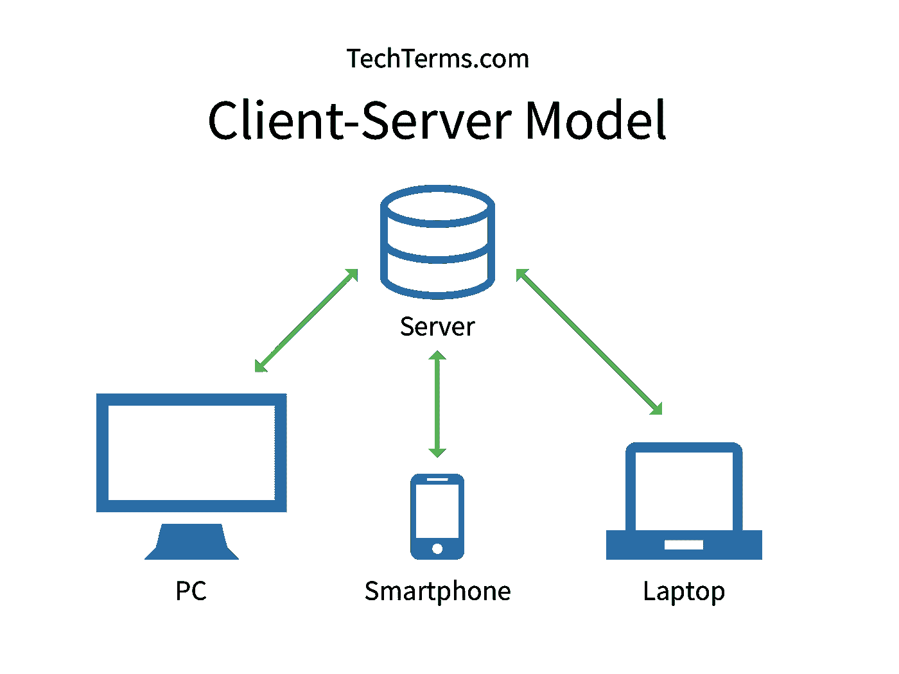
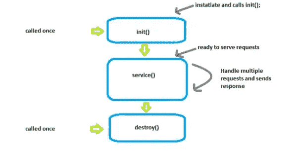
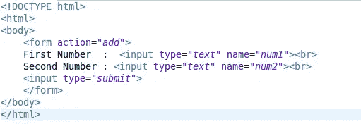
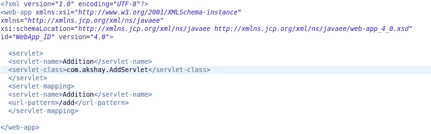
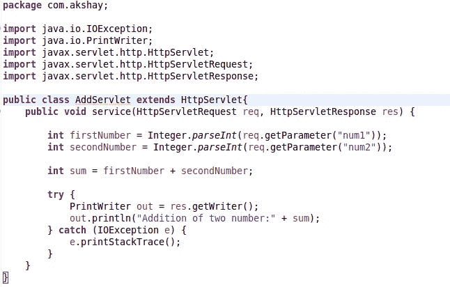
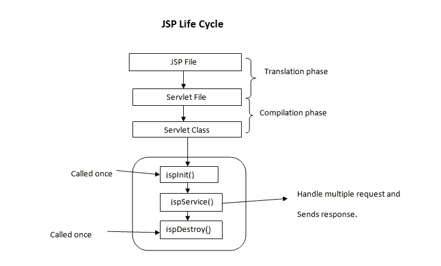

# Java 中的 JSP 和 Servlet

> 原文：<https://medium.com/nerd-for-tech/jsp-and-servlet-in-java-9981759972f0?source=collection_archive---------7----------------------->

在本文中，我们将学习 JSP 和 Servlet

## 客户机-服务器体系结构

当客户端计算机通过互联网向服务器提交数据请求时，服务器接受请求并将所需的数字数据返回给客户端。



**客户:**客户是使用特定服务的个人或组织。客户端是数字世界中的计算机，能够接收信息或使用服务提供商提供的特定服务。

**服务员:**同样，“服务员”这个词指的是提供某种服务的人或媒介。在数字世界中，服务器是提供数据或访问特定服务的远程计算机。

## 小型应用程序

在网络服务器上运行的 Java 程序被称为 Servlet。它们充当 web 浏览器的请求和服务器的响应之间的链接。

servlet 的生命周期由三个主要方法组成。

1.  init()方法
2.  service()方法
3.  destroy()方法

init()方法:只有一个对 init 方法的调用。它只在 servlet 创建时被调用一次，以后再也不会被调用。它用于一次性初始化。

**service()方法:**执行实际任务的主要方法是 service()方法。为了处理来自浏览器的请求并返回响应，servlet 容器调用 service()方法。

1.  **doGet(): T** 这个方法由 servlet 服务方法调用，处理来自客户端的 Get 请求。
2.  **doPost():**servlet 服务方法调用这个方法来处理来自客户端的 Post 请求。

**destroy()方法:**在 servlet 生命周期的末尾，destroy()函数只被调用一次。这个方法允许您的 servlet 执行清理任务，比如关闭数据库连接。



Servlet 生命周期

例如，客户提供了两个数字，他想将这两个数字相加。让我们看看它内部是如何工作的。



index.html

它是提供给客户的接口，用来给出两个数的加法。



web.xml

一旦客户机单击 submit 按钮，它就会发现为这个请求指定了哪个 servlet，这将在 web.xml 文件中完成。之后，将调用 servlet，并开始处理请求。



AddServlet.java

之后，该客户将在他/她的浏览器上收到响应。

## JSP (Java 服务器页面)

JSP 代表 JavaServer Pages，是一种创建动态网页的技术。这允许开发人员通过使用特定的 JSP 标签在 HTML 页面中嵌入 java 代码，其中大多数标签以开头。JSP 的唯一好处是为开发人员编写 JSP 代码很简单。

JSP 在内部被转换成一个 servlet。



JSP 转换

毕竟，Servlets 是为动态 web 内容设计的。然而，没有有效的方法使用 Servlets 在 web 页面上表示动态 web 内容。太多了，我们需要写下 out.print()语句。web 应用程序中不能只有一个网页。实际上，它是网页的集合。不建议以这种方式创建网页。

**Scriptlet 标签:**写入该标签的任何内容都被转换成 servlet 中的服务函数。商业逻辑是这样写的。

```
<%  java source code %>
```

**指令标签:**这个元素用来声明整个页面使用的任何东西，比如导入一个文件。

```
<%@ directive attribute="value" %>
```

**声明标签:**该标签用于声明服务函数之外但在类之内的所有变量和语句。

```
**<**%!  field or method declaration %**>**
```

**表情标签:**这个标签里面的东西都打印在屏幕上。

```
**<**%=  statement %**>**
```