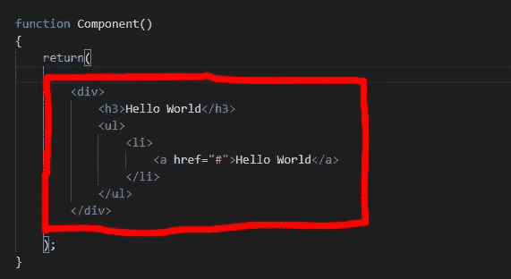
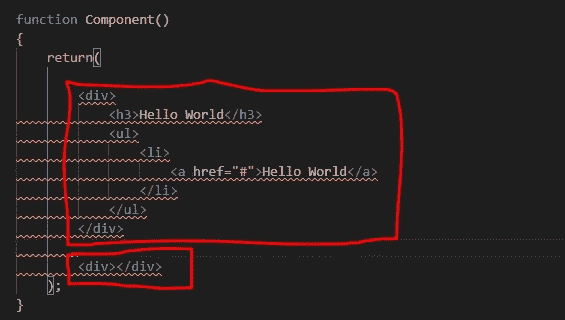
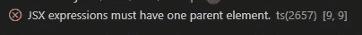
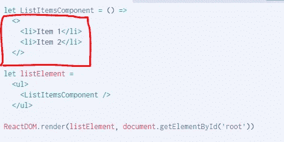
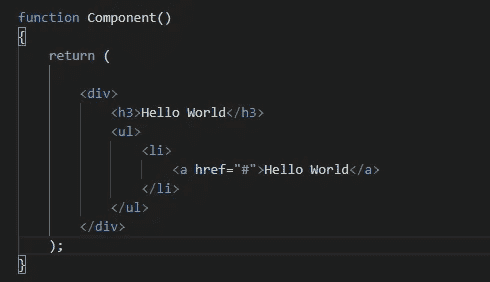
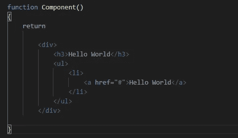
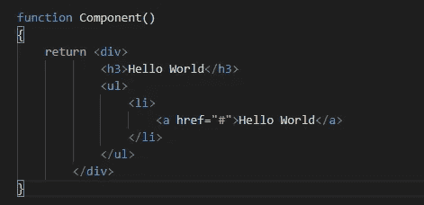

# React(一个 JavaScript 框架)中的 JSX 规则。

> 原文：<https://medium.com/nerd-for-tech/jsx-rules-in-react-a-javascript-framework-4b0ab66fdbf9?source=collection_archive---------4----------------------->

在我们的生活中，我们总是按照一些规则工作。无论你想去哪里，你都会面临一些需要遵守的规则。我遇到了一些在使用 React 时必须遵守的 React JSX 规则。

1.  返回单个元素。
2.  div/section/article 或 React 片段。
3.  对 HTML 属性使用 camelCase。
4.  className 而不是 Class。
5.  关闭每个元素。
6.  格式化。
7.  标签是元素。

## 返回单个元素:

在 JavaScript 中，我们通过组件将 JSX 元素返回给 DOM。我们返回 HTML 元素或标签以便稍后呈现。所以规则之一是返回单个元素。等等，我不是说你可以只返回一个标签。不，你可以返回一整串代码或元素，但是 HTML 代码必须包装在一个顶级元素中。所以如果你想写两个“div ”,你必须把它们放在一个父元素里面，就像一个“div”元素。

返回单个元素

如果 HTML 不正确，或者 HTML 缺少父元素，JSX 将抛出一个错误。

返回更多元素

错误

## div/section/article 或 React 片段:

在使用 JSX 时，应该记住 HTML 语义。在上面的规则中，我明确了所有 HTML 元素都应该有一个父元素。对于这些元素，我们可以使用“div ”,但我们不应该在任何情况下都使用它。没有规则禁止到处“div ”,但是遵循 HTML 语义是最佳实践。空标签也可以用于顶级元素。

空标签

一对空的<>和>标签变成了 React。片段元素，即不映射到 DOM 节点的元素。片段对于从组件返回多个单元格或列表项很有用。

## 将 camelCase 用于 HTML 属性:

在 JavaScript 中，我们过去常常编写内联属性或事件监听器，例如“onclick()”。但是在 React 的情况下，我们不能像这样写属性。JavaScript 的“onclick”属性必须大写，例如 camelCase。如果你不知道驼绒，[在这里](https://techterms.com/definition/camelcase)你可以阅读更多关于驼绒。

## 类名而不是类:

在 HTML 中，我们对特定的元素使用类属性。因为我们使用 React，一个 JavaScript 框架，所以我们不能使用 class 关键字，因为在 ES6 中它是一个保留关键字来定义一个类。如果我们对 HTML 属性使用 class，将会产生错误，我们应该使用 className。

## 关闭每个元素:

在 HTML 中，几乎所有的标签都有开始和结束标签，而不是少数标签，如、、
。

这几个标签没有结束标签。我们只是按照上面例子中的定义来使用它。在反应 JSX 中，每个标签都必须是关闭的，即使是那些没有关闭标签的标签，例如

> 

## 格式:

当返回 JSX 时，我们应该有括号，所以 HTML 代码必须被包装在里面。

应该使用括号

如果我们不使用括号，编译器会给我们一个错误。

不带括号

不要担心，你可以选择使用或不使用括号。如果你不想使用它，你的父元素开始标签必须在 return 关键字所在的同一行。

## 标签是元素:

JSX 标记映射到对 React.createElement()的调用。

当你需要一个 DOM 元素时使用小写标签<lowercase>，而对于组件元素使用大写标签<capitalized>。</capitalized></lowercase>