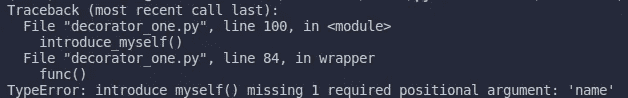

# 用 Python Decorator 充实我们的函数(第 1 部分)

> 原文：<https://medium.com/nerd-for-tech/juice-up-our-functions-with-decorator-part-1-5439879c365?source=collection_archive---------9----------------------->

在 [Unsplash](https://unsplash.com?utm_source=medium&utm_medium=referral) 上由 [Timo Vijn](https://unsplash.com/@timovijn?utm_source=medium&utm_medium=referral) 拍摄的照片

在本文中，我们将讨论 Python 中大量使用的特性之一，即装饰器。当我们想用[高阶函数](https://en.wikipedia.org/wiki/Higher-order_function#:~:text=In%20mathematics%20and%20computer%20science,a%20function%20as%20its%20result.)来装饰我们的函数时，Decorator 给了我们一个简单的形式。一般情况下，当我们有几个不同用途的函数，但它们并不完全不同时，我们会使用 decorator。所以，我们应该把他们的相似性放在一个地方，装饰其他人，让他们做自己的特定任务。我们必须这样做，以使我们的代码干燥。

根据定义，装饰器是一个将其他函数作为参数并返回修改过或未修改的函数的函数。好的，现在我们必须继续寻找一些我们已经讨论过的例子。

# 功能

在我们深入了解什么是高阶函数或装饰之前，我们必须先了解函数的含义。函数将参数作为输入，返回值作为输出。我们在那里写的所有东西都会处理我们的输入并返回正确的输出。除了处理和返回，函数还会有副作用，这取决于我们如何定义它们，比如 print 语句。

上面的函数执行打印命令的次数与副作用的次数一样多，并在第 4 行返回一个值。换句话说，这个函数有一个名为 num_times 的参数，返回值“嗨，很高兴见到你！”，并且有一个副作用，就是打印出与 num_times 一样多的“Hi”。

# 高阶函数和第一类对象

[高阶函数](https://en.wikipedia.org/wiki/Higher-order_function#:~:text=In%20mathematics%20and%20computer%20science,a%20function%20as%20its%20result.)的定义是这样一个函数，它执行以下一个或两个操作，首先，它接受单个或多个参数，其次，返回函数。同时，[一级对象](https://en.wikipedia.org/wiki/First-class_citizen)只是一个对象，它可以作为其他函数的参数或成为返回值，就像任何其他对象一样(int、string、list 等)。

第一个和第二个函数很简单，因为它们是我们已经知道的普通函数。第一个函数接受类型为 integer 的单个参数，并返回一个字符串。第二个函数接受一个字符串参数并返回一个字符串。同时，第三个函数接受另一个函数，然后返回它的值。

# 内部函数

我们也可以在另一个函数中定义函数。但是，就像一个变量只能在其父函数作用域(或全局)内被访问一样，内部函数也只存在于其父函数作用域内。让我们写一些例子:

在上面的例子中，有两个没有参数和返回值的内部函数。注意，在第 8 行和第 9 行，我们调用了这两个内部函数，但是当我们不调用这些函数时会发生什么呢？当然，打印命令不会被执行。

# 从函数返回函数

现在，我们将创建一个具有更多功能的不同函数，姑且称之为 simple_calculator。

上面的代码比我们之前的代码相对要长(当然我们可以通过使用 lambda 表达式使上面的代码更短)，但是它并没有那么复杂，对吗？现在，请注意从第 17 行到代码末尾，在一个 *return* 关键字之后，我们编写了我们想要基于它所采取的操作返回的函数(add，而不是 add())。它返回函数的引用，但不调用它。

# 简单装饰

在我们了解了我们可以从函数中得到什么之后，让我们来谈谈这篇文章的主题，从简单的开始。

从一个叫做 simple_decorator 的高阶函数开始。这个函数接受另一个函数，并且有一个叫做 wrapper 的内部函数。在包装器内部，它“在调用函数之前”执行打印命令，然后执行从其参数中获取的函数 simple_decorator，然后“在调用函数之后”调用打印命令。之后，simple_decorator 返回函数包装器。那么在第 15 行，当前的 say_hi 会引用什么呢？它仍然引用自身还是包装器？不幸的是，当前的 say_hi 引用了 wrapper，您可以通过键入 say_hi 来证明这一点。第 15 行后的 __name__。但是，我们可以稍后解决这个引用问题。

Decorator 来拯救……我们可以使用 python decorator 语法糖重写以前的代码。会是什么样子？

注意，在第 11 行，我们在 say_ho 的函数定义上面写了 *@simple_decorator* 。改变很简单，但是让它看起来更好(在我看来)。我们不必像以前那样重新分配函数 say_ho，我们只需为装饰器添加语法糖。

现在，让我们来看第二个例子。我们的任务是如何创建一个可以重复另一个函数十次的函数？

Decorator do_ten_times 运行被修饰的函数十次，我们可以在第 5 行看到这一点，因为那里有一个 for 循环。但是，如果我们希望它只运行两次，而不是十次呢？我们必须创建另一个装饰器来完成吗？不，我们可以使用同一个装饰器，但是带有参数，我们以后会学到。

# 用参数装饰函数

以前，我们为一个没有参数的普通函数编写了一个装饰器，它的任务只是打印一些东西。我们能有一个可以用参数装饰函数的装饰器吗？我们来试试，`@do_ten_times`能做到吗？

当我们运行这段代码时，会发生什么？*瞧，*我们得到一个错误。没问题，我们可以解决这个问题。

回到我之前解释过的概念。被修饰的函数变成了包装器的引用，而不是它本身。让我们运行命令 say_hi。__name__ 在此函数被修饰后，将其与未修饰的函数进行比较。

注意:`func.__name__` 返回函数的名称。

在第 19 行，我们写了`say_hi.__name__`，它打印了`wrapper`，这意味着新装饰的函数引用了装饰器的包装，但是在第 21 行，我们打印了一个未装饰的函数，它打印了自己。所以我们的装饰者正在改变我们的函数，对吗？

我们有两个问题，首先如何修饰一个函数而不改变它的引用，以及如何用参数修饰函数。

让我们用 *functools* 模块解决第一个问题。

注意，在第 7 行，我们添加了一行，其中有*functools . wrapps*。这一行将确保我们新修饰的函数仍然引用它自己。您可以通过编写命令 say_hi 来证明这一点。__name__。实际上，*functools . wrapps*改变函数的属性，比如它的 __name__ 和 __doc__。

我们的第二个问题呢？

在第 8 行和第 10 行，我们写了*args 和**kwargs。这些表达式用作位置参数和关键字参数。因此，我们可以根据需要提供任意多的位置参数或关键字参数。

# 修饰函数及其返回值

让我们改变函数 *introduce_myself* ，使它返回数值，而不是仅仅打印一些东西。

我们的新函数将只打印“嗨，我的名字是约翰”一次，因为在第 10 行，我们不打印 *func* 的返回值。

# 装饰者的真实例子

如果我们学到了一些东西，但我们不知道在现实世界中把它们应用到哪里，那就不好了。因此，在本节中，我们将学习如何使用它们以及何时使用它们。

## 1.计时器

装饰计时器将让我们知道一个函数执行需要多长时间。在包装函数中，我们将函数的执行放在两个时间标记内，在执行函数之前，我们标记开始，在执行函数之后，我们标记结束。所以减去 end 和 start，我们得到函数运行的时间。

## 2.注册插件

有时候使用插件比自己写同样的代码更好(不要多此一举)。但是为了跟踪我们使用了哪些插件，我们必须注册它们，这样我们就不会浪费资源在不必要的插件上，也不会弄乱我们的代码。这里，我们使用装饰者的力量来达到这样的目的。

注意，函数*寄存器*没有内部函数，比如 wrapper，因为这不是必需的。然后在函数*say _ random，*将从这三个( *say_hi* 、 *say_hello* 和 *say_bye* )中选择运行哪一个。

## 3.在烧瓶上实现

如果你以前学过 Flask，编写装饰器可能并不新鲜，不管你是自己编写的还是使用 Flask 的功能。这里，我提供了一个使用 Flask 的简单应用程序。

decorator*log in _ required*确保只有登录的用户才能访问这个路由，如果用户没有登录，他将被重定向到登录路由。

# 结论

最后，我们在本文的结尾。我们已经学习了几个关于函数、高阶函数、一级对象、内部函数、装饰器及其实现的概念。所以，我们这些人问你什么是 decorator，你知道该怎么回答吧？简单地说，它只是一个接受函数并返回函数的函数。尽管这篇文章很长，但是我们还没有涵盖所有的主题，比如我们的问题，装饰者可以接受参数吗？当然可以，我们将在第二部分学习。感谢您的阅读。

你可以在这里访问以上所有代码:[https://github . com/agusrichard/python-workbook/tree/master/decorator](https://github.com/agusrichard/python-workbook/tree/master/decorator)

## 资源:

 [## Python 装饰者入门——真正的 Python

### 更新:在你能理解 decorators 之前，你必须首先理解函数是如何工作的。为了我们的目的，一个…

realpython.com](https://realpython.com/primer-on-python-decorators/)  [## Python 装饰者

### Python 有一个有趣的特性，叫做 decorators，用于向现有代码添加功能。这也叫…

www.programiz.com](https://www.programiz.com/python-programming/decorator)  [## Python 中的装饰者- GeeksforGeeks

### 在 Python 中，函数是第一类对象，也就是说-函数是对象；他们可以参考…

www.geeksforgeeks.org](https://www.geeksforgeeks.org/decorators-in-python/)