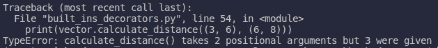
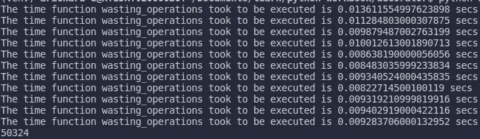
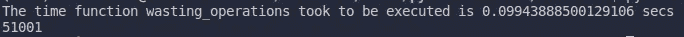

# 用 Python Decorator 充实我们的函数(第 2 部分)

> 原文：<https://medium.com/nerd-for-tech/juice-up-our-functions-with-python-decorator-part-2-837f45715d52?source=collection_archive---------3----------------------->

照片由[艾玛·斯瓦斯塔德](https://unsplash.com/@emmasvalstad?utm_source=medium&utm_medium=referral)在 [Unsplash](https://unsplash.com?utm_source=medium&utm_medium=referral) 上拍摄

在本文中，我们将继续我们关于 Python Decorator 的旅程，并讨论一些更复杂的概念。在前一篇文章中，我们问装饰者可以接受参数吗？我们将在这里学习它。

# 装饰方法

在上一篇文章中，我们学习了如何修饰一个函数，但是我们也可以修饰一个方法吗？基本上，[一个类的方法就是一个函数](https://stackoverflow.com/questions/155609/whats-the-difference-between-a-method-and-a-function)，不同的是一个方法被一个与对象相关联的名字所调用。

先说一些内置的装饰器。

在上面的代码中，我们定义了一个名为`Vector.`的类。这个类表示一个二维向量，包含 x 和 y 两个分量。注意，在第 5、6 和 7 行中，我们使用了`__x`、`__y`作为 x 和 y 的引用。这样做的目的是为了区分我们可以“自由”访问的变量和应该“私有”的变量。[尽管如此，我们不能像在 Java](https://stackoverflow.com/questions/1641219/does-python-have-private-variables-in-classes#:~:text=Python%20does%20not%20have%20any,expose%20your%20classes%20member%20variables.&text=The%20double%20underscore%20%22__%22%20does,mean%20a%20%22private%20variable%22.) 中那样在 Python 中创建私有变量 [。](https://stackoverflow.com/questions/1641219/does-python-have-private-variables-in-classes#:~:text=Python%20does%20not%20have%20any,expose%20your%20classes%20member%20variables.&text=The%20double%20underscore%20%22__%22%20does,mean%20a%20%22private%20variable%22.)

类`Vector`中有几个方法。首先，我们定义了一个 [dunder](https://www.geeksforgeeks.org/dunder-magic-methods-python/) ，这样实例的字符串表示就很容易阅读了。然后，它有三种使用`@property` (x，y 和距离)进行修饰的方法。`@property`将一个方法变成一个实例变量。所以为了访问 x(或 __x ),我们必须写，而不是像我们总是做的那样访问一个实例变量。

接下来是`setter,`如果我们想要重置或改变一个实例变量，我们使用这个装饰器。我们可以在第 24 行和第 28 行看到定义，以及它在第 49 行和第 50 行的用法。这里，我们将实例变量 x 和 y 从之前的 1，1 改为 3，3。

装饰器`@classmethod`通常在我们想要创建一个特殊的实例时使用。在这个方法中，我们提供的参数是`cls,`，它指的是类的构造函数。看看我们在第 32、33 和 34 行中的定义，这个方法将通过调用`cls(1, 1)`来创建一个带有向量值(1，1)的实例，其中`cls(1, 1)`调用这个类的构造函数(`__init__`)并为其参数提供值`x=1`和`y=1`。

最后一个装饰器是第 53 行的`@staticmethod.`，我们直接从类中调用该方法。但是怎么做呢？难道我们不能从实例中调用方法吗？让我们这样做吧。现在，当我们移除第 36 行时会发生什么？

错误发生在哪里，是什么原因造成的？它发生在第 53 行，因为当我们使用一个方法时，这个函数的签名变成了`calculate_distance(self, tup1, tup2)`，但是我们只定义了它只接受两个参数。为了缓解这个问题，我们必须将`@staticmethod`或`self`添加到函数定义中。

# 嵌套装饰器

以前，我们只使用单个装饰器，但实际上，我们可以使用多个装饰器来装饰一个函数。让我们来回顾一下上一篇文章。

从上一篇文章中我们知道了`@do_ten_times`和`@timer`是做什么的；`@do_ten_times`重复一个函数调用十次，而`@timer`是测量一个函数完全执行需要多长时间。现在，我们试着结合这两个装饰器来装饰`wasting_operations.`注意，我们把`@do_ten_times`放在`@timer,`上面，所以上面的代码本质上是

它从下往上开始。结果是

注意在`wasting_operations`的每次重复中，`@timer`测量函数调用的时间。当我们改变顺序，把`@timer`写在`@do_ten_times`上面，会发生什么？

这次函数运行了十次，然后测量时间。

# 带参数的装饰器

现在，我们将回答我们长期以来的问题，装饰者可以接受论点吗？让我们把`@do_ten_times`改成`@repeats,`,这样它就可以根据我们给它的参数重复函数调用。

我们有一个名为`repeats`的装饰器，带有一个参数`num_reps`，它定义了将执行多少个函数调用。然后我们看到函数 *say_hi* 被一个参数`num_reps = 5.`修饰

我们来剖析一下这个装修工。首先，我们定义了一个函数`repeats`来获取关键字`num_reps,`这是我们必须提供`num_reps.`的部分，然后我们有一个内部函数叫做`decorator,`，它的任务和我们知道的一样，就是修饰一个函数。所以，普通的装饰器和带参数的装饰器之间的区别在于，我们只是在带参数的装饰器之上添加了另一层。

# 有状态装饰器

除了修饰函数，decorator 还可以存储变量。如果我们想知道一个函数在某个特定时间和地点的状态，例如，一个函数被调用了多少次，这就变得很有用。

来自[https://real python . com/primer-on-python-decorators/# fancy-decorators](https://realpython.com/primer-on-python-decorators/#fancy-decorators)的示例

装饰器`@count_calls`用于计算函数`say_hi`被调用的次数，在上面的例子中是两次。请注意，在`count_calls`定义中，函数`wrapper`在第 10 行有一个内部状态变量`num_calls.`，我们在第 7 行初始化了`num_calls`，每次调用该函数，计数器都会增加 1

# 作为装饰者的类

我们已经从一个函数制作了一个装饰器，现在我们将学习一些不同的东西。我们将从一个类中创建一个装饰器。让我们把 decorator `count_calls`改成一个类。

函数作为装饰者`num_calls`现在变成了类作为装饰者`CountCalls.`我们该怎么做呢？在第 28 行，我们使用`CountCalls`作为一个普通的高阶函数(没有语法糖)。当我们写`CountCalls(say_ho)`时，结果将成为`CountCalls.`的一个实例，所以下次我们执行`say_ho()`时，我们也将调用 dunder `__call__.`，注意我们使用`functools.update_wrapper`而不是`functools.wraps.`

# 用方法作为装饰器的类

现在，让我们把我们编写的几个 decorators 放在一个类中。

在上面的代码中，我们定义了一个名为`MyClass`的类，它有两个方法作为装饰器。我们可以像使用普通函数一样使用这些方法。不同之处在于我们必须添加参数`self`(第 9 行和第 24 行)，并且我们使用类的实例来访问它的方法(第 39 行和第 43 行)。

# 装饰者的真实例子

## 1.创建单件

Singleton 是一个只有一个实例的类。让我们看看它的实际效果。

请注意，第 6 行和第 7 行是神奇的地方。我们第一次创建类`Single, wrapper.instance`的实例是 None。所以当我们运行`not wrapper.instance`时，这个值为真，然后执行第 7 行并返回。我们确定这在第 20 行。

## 2.贮藏

缓存将帮助我们减少操作的数量，这样以后就不会执行相同的操作，例如当我们执行递归操作时。让我们创建一个递归函数来获取斐波那契数列的值。

在上面的代码中，我们使用装饰器`@count_calls`来计算函数`fibonacci`被调用的次数。对于`fibonacci(19),`,它需要的操作数是 13529。我们可以通过使用 decorator 来减少这种情况。

Decorator `cache`可以通过使用我们所学的一种行为来做到这一点，这种行为是通过存储变量来跟踪函数调用。在第 19 行，我们编写了`cache_key`，它将成为特定函数调用的签名。因此，如果下一次用相同的参数调用这个函数，这个函数将只需要查看它的字典，但是如果用新的参数调用这个函数，它将向它的字典添加一个新的键-值对。即使你可以自己做，最好还是用`[@functools.lru_cache](https://docs.python.org/3/library/functools.html#functools.lru_cache).`

# 结论

我们已经学习了很多关于装饰器的知识，从函数作为装饰器，类作为装饰器，方法作为装饰器，等等。需要记住和理解的是，decorator 基本上只是一个接受另一个函数并返回该函数的函数。记住这个简单的概念，我们会更容易变得有创造力，用 decorator 解决某些问题。

感谢您的阅读。

以上所有代码都可以在:[https://github . com/agusrichard/python-workbook/tree/master/decorator](https://github.com/agusrichard/python-workbook/tree/master/decorator)中访问

## 资源:

 [## Python 装饰者入门——真正的 Python

### 更新:在你能理解 decorators 之前，你必须首先理解函数是如何工作的。为了我们的目的，一个…

realpython.com](https://realpython.com/primer-on-python-decorators/)  [## Python 装饰者

### Python 有一个有趣的特性，叫做 decorators，用于向现有代码添加功能。这也叫…

www.programiz.com](https://www.programiz.com/python-programming/decorator)  [## Python 中的装饰者- GeeksforGeeks

### 在 Python 中，函数是第一类对象，也就是说-函数是对象；他们可以参考…

www.geeksforgeeks.org](https://www.geeksforgeeks.org/decorators-in-python/)