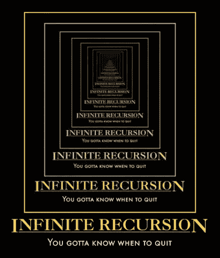
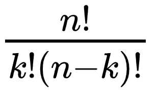
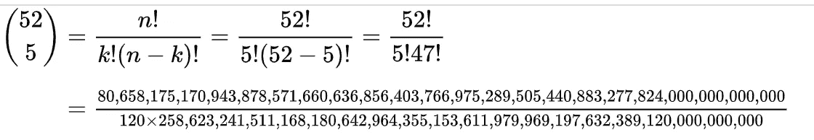
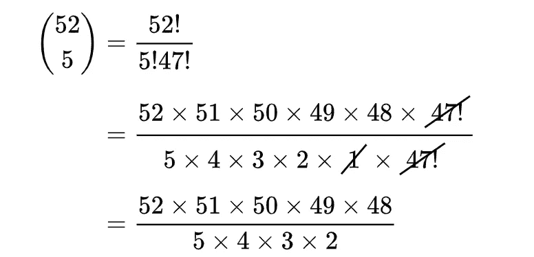
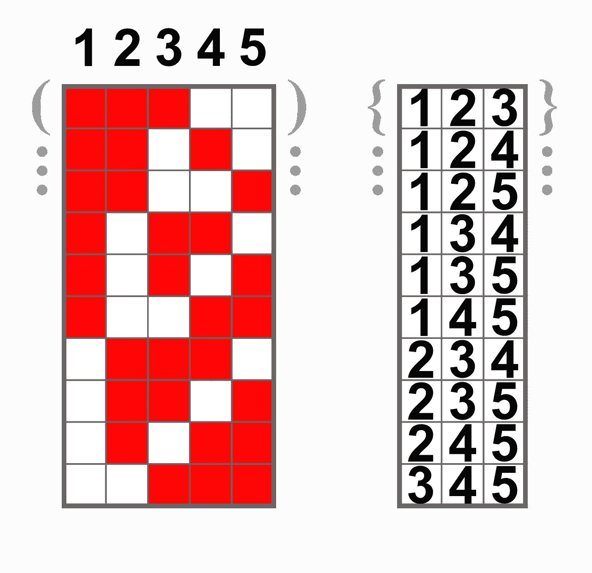

# 用 JavaScript 递归生成 k-组合

> 原文：<https://medium.com/nerd-for-tech/july-2-generating-k-combinations-with-recursion-in-javascript-71ef2b90b44b?source=collection_archive---------3----------------------->


图片来源:冰屋

众所周知，我喜欢游戏——因为它们的教育价值和娱乐价值。没有比写游戏更好的学习编码的方法了。即使是简单的游戏也有规则、等级、状态和条件——解决这些问题所需的技能与工程师用来解决现实世界问题的技能没有什么不同。

如果我正在学习一门新的编程语言，我通常做的第一件事就是尝试编写一个游戏，这个游戏通常是 **poker。**对我来说，扑克是无尽快乐和愉悦的源泉，因为它是一个令人上瘾的逻辑谜题——当然，它被巧妙地伪装成了赌场赌博游戏。今天，让我们重温一下我写的关于扑克的一篇非常老的博客文章[的主题，并使用它来探索两个重要的、被广泛讨论的软件工程概念: **k 组合**和**头/尾递归。**](https://joshgoestoflatiron.medium.com/december-16-possible-hands-and-holds-in-a-ruby-poker-machine-9d61de22e948)

# 背景:K 基金会

在数学和比较科学中， ***组合*是从集合中无序选择的项目。**如果顺序很重要，那就叫做 ***排列*；**两者密切相关，对组合/排列的研究被称为 ***组合学*。这个领域非常广阔，有很多非常重要的应用:**

*   **性能评估:**在通信系统上生成路由排列以比较性能
*   **分子生物学:**产生原子、分子、DNA、基因或蛋白质的组合/排列
*   **自然语言处理:**生成词性组合/排列的文本匹配算法
*   运筹学:用组合学解决作业调度和资源分配问题
*   **数据挖掘和取证:**为什么不生成`SELECT ... WHERE ...`命令的组合来寻找丢失的数据或隐藏的数据或犯罪证据？
*   广义而言，**图像、声音、温度、压力、电导率等物理世界的测量值中的任何模式匹配**

**所有的卡牌游戏都是组合学游戏；**这副牌是我们的收藏，手牌大小是我们的 *k.* 五张 Jacks 或更好的牌，[游戏 Vegas video poker 基于](https://joshgoestoflatiron.medium.com/december-16-possible-hands-and-holds-in-a-ruby-poker-machine-9d61de22e948)，是一个 52 组合 5 游戏；德州扑克和其他梭哈扑克品种是 52-组合-7 游戏。

# 正面我赢，反面你输

一些流行的语言有内置的方法，比如 Ruby 的`combination()`和 Python 的`itertools`，但是 **JavaScript，可悲的是，没有原生/低级组合函数**。为了拓宽我们的知识面，满足我们对惩罚的欲望，让我们使用**递归来编写我们自己的 JS `combination()`方法。** ( *请记住，有许多组合学算法，其中许多与我将讨论的递归方法非常不同，并且可能比它快得多……但是对它们进行详细的比较/讨论是博士候选人的工作——*而不是中等博客作者的工作。)

首先，快速回顾一下我以前的博客文章中的递归[:](https://joshgoestoflatiron.medium.com/december-28-finding-paths-on-a-grid-in-ruby-with-recursion-53e83bfa99e8)**递归通过重复解决一个相同但较小的问题(基础案例)来解决一个大问题(T21 递归案例)。基本情况看起来和递归情况一样——只是规模更小。**递归只在程序最终到达基础用例时才起作用；如果没有达到基本情况，递归方法将无限重复。****



我不会为这个迷因的照片信用而烦恼，因为它似乎从时间的黎明就开始四处飘荡

我没有讨论的一个重要区别存在于**头递归**和**尾递归之间；**递归调用可能在基本情况处理之前*(在函数的顶部或“头部”)，或者在*基本情况之后*(在底部或“尾部”)。我已经用下面的两个`factorial()`函数说明了这一点，它们做同样的事情:*

```
const headFactorial = n => {
  if ( n > 1 ) return n * headFactorial( n - 1 );
  else return 1;
}const tailFactorial = n => {
  if ( n === 1 ) return 1;
  else return n * tailFactorial( n - 1 );
}
```

这两种递归风格看起来微不足道，但是您将在下面看到，在我们生成 k-组合的方法中，选择是非常重要的。

# 凭借我们的力量…

如果一个集合有 *n* 个元素，则来自该集合的 *k* 个组合的数量可以表示为一个带有阶乘的[二项式系数](https://en.wikipedia.org/wiki/Binomial_coefficient):



这写起来很简单，但是在我们的扑克例子(52-combo-5)中，它导致了一些令人头痛的数学问题…



…因此，让我们通过一些因素来清理它:



当你想象自己在牌桌上抽一手牌，以一种更具体的方式来思考时，这就很有意义了。抽第一张牌时，你有 52 张牌可供选择，抽第二张牌时，你有 51 种可能性，依此类推。想想看:**这真的不意味着每一个组合都只是前面的组合，其余的组合都加在了后面吗？**

让我们用下面的方法来检验这个假设。它使用尾部递归，但它也**跟踪集合的头部*和尾部*我们在递归时为**生成组合:

```
const combinations = ( collection, combinationLength ) => {
  let head, tail, result = [];
  if ( combinationLength > collection.length || combinationLength < 1 ) { return []; }
  if ( combinationLength === collection.length ) { return [ collection ]; }
  if ( combinationLength === 1 ) { return collection.map( element => [ element ] ); }
  for ( let i = 0; i < collection.length - combinationLength + 1; i++ ) {
    head = collection.slice( i, i + 1 );
    tail = combinations( collection.slice( i + 1 ), combinationLength - 1 );
    for ( let j = 0; j < tail.length; j++ ) { result.push( head.concat( tail[ j ] ) ); }
  }
  return result;
}
```

逐行分解:首先我们定义一个`head`和`tail`来跟踪我们到目前为止的进展，然后定义三种基本情况:

*   然后，如果`combinationLength`大于集合的大小，或者如果`combinationLength`为零，我们返回一个空数组`[]`。
*   如果`combinationLength`等于集合大小，那么只有一个可能的组合，即整个集合——所以我们在一个数组中返回整个集合。
*   如果是`combinationLength === 1`，我们可能的组合只是单个元素——所以我们将集合`map()` ped 作为长度为 1 的单个数组(组合)返回给它的元素。

否则，我们将遍历集合并开始循环！

*   我们的`head`将是一个单元素的数组:由`for()`循环中的`i`定义的当前索引处的元素。
*   我们的`tail`将是一个递归调用**的结果，其中** `**combinationLength**` **递减 1——记住，如果不递减，我们将永远循环并崩溃！**我们将`tail`中的每个元素添加到`head`的末尾，因为每个元素代表一个新的组合，所以我们将每次`push`添加到`result`。
*   最后，当然，当我们完成循环时。

当它不那么抽象时，更容易想象，所以让我们在`console`中测试一下:

```
const deck = [
  'Two of Clubs',      'Two of Diamonds',   'Two of Hearts',
  'Two of Spades',     'Three of Clubs',    'Three of Diamonds',
  'Three of Hearts',   'Three of Spades',   'Four of Clubs',
  *...trust me they're all there*
];const possibleHands = combinations( deck, 5 );console.log( possibleHands.length );
  -> 2598960
console.log( possibleHands.slice( 0, 5 ) );
  -> [
    [ 'Two of Clubs', 'Two of Diamonds', 'Two of Hearts', 'Two of Spades', 'Three of Clubs' ],
    [ 'Two of Clubs', 'Two of Diamonds', 'Two of Hearts', 'Two of Spades', 'Three of Diamonds' ],
    [ 'Two of Clubs', 'Two of Diamonds', 'Two of Hearts', 'Two of Spades', 'Three of Hearts' ],
    [ 'Two of Clubs', 'Two of Diamonds', 'Two of Hearts', 'Two of Spades', 'Three of Spades' ],
    [ 'Two of Clubs', 'Two of Diamonds', 'Two of Hearts', 'Two of Spades', 'Four of Clubs' ]
]
```

我们可以看到，这种方法从一副 52 张牌中生成了可能的五手牌的正确数量: **2，598，960，**与`( 52 * 51 * 50 * 49 * 48 ) / ( 5 * 4 * 3 * 2 )`的结果相同(如果你不相信我，你自己去查)。

让我们试着用一个更小的集合生成组合，并添加一些`console.log`来看看发生了什么:

```
const combinations = ( collection, combinationLength ) => {
  let head, tail, result = [];
  if ( combinationLength > collection.length || combinationLength < 1 ) { return []; }
  if ( combinationLength === collection.length ) { return [ collection ]; }
  if ( combinationLength === 1 ) { return collection.map( element => [ element ] ); }
  for ( let i = 0; i < collection.length - combinationLength + 1; i++ ) {
    head = collection.slice( i, i + 1 );
    **console.log( "head: ", head );
**    tail = combinations( collection.slice( i + 1 ), combinationLength - 1 );
    **console.log( "tail: ", tail );
**    for ( let j = 0; j < tail.length; j++ ) { result.push( head.concat( tail[ j ] ) ); }
  }
  return result;
}const oneThroughFive = [ 1, 2, 3, 4, 5 ];
```

例如，如果您将它复制到一个节点控制台并运行`combinations( oneThroughFive, 3 )`，您将看到如下所示的日志溢出:

```
head:  [ 1 ]
head:  [ 2 ]
tail:  [ [ 3 ], [ 4 ], [ 5 ] ]
head:  [ 3 ]
tail:  [ [ 4 ], [ 5 ] ]
head:  [ 4 ]
tail:  [ [ 5 ] ]
tail:  [ [ 2, 3 ], [ 2, 4 ], [ 2, 5 ], [ 3, 4 ], [ 3, 5 ], [ 4, 5 ] ]
head:  [ 2 ]
head:  [ 3 ]
tail:  [ [ 4 ], [ 5 ] ]
head:  [ 4 ]
tail:  [ [ 5 ] ]
tail:  [ [ 3, 4 ], [ 3, 5 ], [ 4, 5 ] ]
head:  [ 3 ]
tail:  [ [ 4, 5 ] ]
[
  [ 1, 2, 3 ], [ 1, 2, 4 ],
  [ 1, 2, 5 ], [ 1, 3, 4 ],
  [ 1, 3, 5 ], [ 1, 4, 5 ],
  [ 2, 3, 4 ], [ 2, 3, 5 ],
  [ 2, 4, 5 ], [ 3, 4, 5 ]
]
```

这非常清楚地显示了一些有趣的事情:**我们从来没有真正打印过任何** `**tail**` **s，直到我们完成了循环或者到达了我们的一个基本案例！**`head`始终是该系列中的单一元素，加上来自`tail`的可能组合——确保组合永不重复。下图直观地展示了当我们遍历带有`3`的`combinationLength`的集合`oneThroughFive`时，这一切是如何发生的:



# **结论**

我们用来生成 k-组合的所有巧妙跟踪都不可能用头部递归来实现。也有相反的例子:许多排序算法不可能使用尾部递归。还有更多最适合其他类型问题的递归例子:所谓的*循环*或*相互递归，*其中两个或更多方法递归地相互调用，最广为人知的是来自河内 [**塔**谜题](https://en.wikipedia.org/wiki/Tower_of_Hanoi)的 CompSci 学生。


每当一位计算机科学教授用递归解决汉诺塔问题时，一位技术天使就展翅高飞了(图片来源:维基共享资源)

递归也有缺点——最大的缺点，我之前提到过，是它的潜在指数增长可能会让你的代码慢如蜗牛。如果您一直在将这段代码复制到 Node 中，您会注意到从一副 52 张牌中生成可能的牌需要几秒钟*——对于快节奏的扑克游戏来说，这并不理想。*

*所有这些都揭示了当考虑递归解决你在工程生涯中面临的问题时，仔细规划和研究的重要性。在尝试递归解决方案之前，考虑你需要的速度和你的应用程序的规模——尽管递归经常是笨拙和不切实际的，但它偶尔也是天赐之物！*