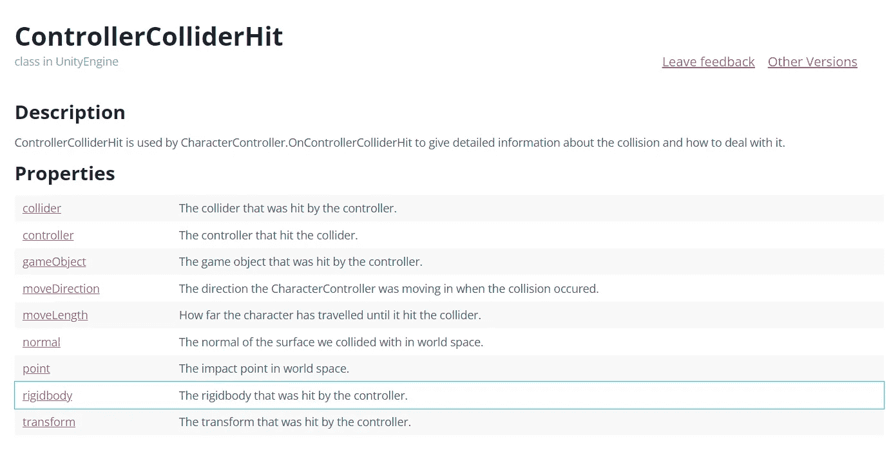
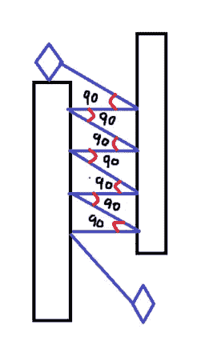
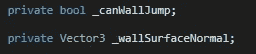
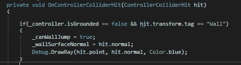
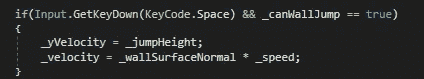

# 在统一的两堵墙之间跳跃

> 原文：<https://medium.com/nerd-for-tech/jumping-in-between-two-walls-in-unity-8c59f64f4600?source=collection_archive---------2----------------------->

这里的练习演示了如何在 Unity 中实现跳墙。

不做任何深入研究，必须理解 Unity 引擎库中的一个**内置类。**

> Unity 提供了一个开箱即用的类来解决基于冲突的问题。

[https://docs . unity 3d . com/2017.3/Documentation/script reference/controllercolliderhit . html](https://docs.unity3d.com/2017.3/Documentation/ScriptReference/ControllerColliderHit.html)

玩家对象有一个附加的角色控制器组件，它允许使用上面的类。

在这个类中，有一个属性可以解决这个问题。

# **正常。**

# "曲面法线是在特定点垂直于曲面的向量."

如上图所示，玩家在两者之间跳跃的目的是从碰撞的墙壁上反弹回来，并利用这一动量向上运动，直到到达目标位置。

这个曲面法线在上面提到的类中是可用的。

下面是播放器脚本组件的简单实现。

*   创建两个私有变量。一个是标志，第二个是存储法向量。

C#

*   编写从该类获取向量数据的方法。

C#

*   在更新方法中，检查此条件。(玩家不在地面上，并且 _canWallJump 为真，这意味着玩家刚刚与墙壁相撞。)
*   如果满意，将法向量加到其速度乘以某个速度变量。还有，给玩家的 Y 方向速度增加跳跃提升。

C#

请记住，上面的代码将被插入保持其他检查按照您的程序。

应该就是这样了:)

这是最终的结果。

 [## WallJumping.mp4

### 编辑描述

drive.google.com](https://drive.google.com/file/d/15DJLV4-ZDWMyeS8NOgbnwhrgBCbAEKR0/view?usp=sharing) 

非常感谢