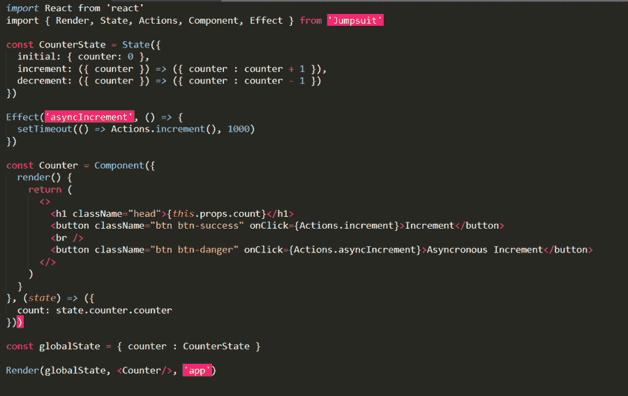

# 连身衣——一个反应框架

> 原文：<https://medium.com/nerd-for-tech/jumpsuit-a-react-framework-9ba00a90074a?source=collection_archive---------20----------------------->

今天大家都想用 Redux 和 React 这些工具让应用程序和网站的开发变得轻而易举。Redux 是一个用于管理应用程序状态的库，React 是一个开源的 JavaScript 库，它使得用户界面的创建变得容易。

一起使用 React 和 Redux 有几个原因，但是一起使用它们一点也不容易。同时做这两项工作是非常困难的(即使对于高级程序员来说)。

幸运的是，有很多方法可以同时处理这两者，但是理解这些方法相当麻烦。对于程序员来说，这只是进一步增加了混乱和复杂的事情。

直到开发出解决这个问题的工具，情况才有所好转。这个工具或平台就是连体衣。随着 Jumpsuit 的发展，开发人员能够享受 React 和 Redux 的好处，而无需投入大量精力。那么到底什么是连体衣呢？让我们在这篇文章中找到答案。

**目录**

# 什么是连体衣？

要理解连体衣，我们首先要知道 React 是什么。

React 是一个用于创建用户界面的 JavaScript 库。它是一个非常高效、声明性的、非常灵活的 JavaScript 开源库。React 由脸书和几个独立的开发者和公司共同维护。它被用作开发移动应用程序或单页应用程序的基础。React 的功能仅限于向 DOM 呈现状态和状态管理。因此，在 React 中创建应用程序包括使用 React Router 等其他路由库。

既然我们已经排除了反应，让我们用这些知识来理解什么是连体衣。

Jumpsuit 是一个框架和命令行界面(CLI ),非常高效和强大。它有助于以闪电般的速度启动项目，并有助于提高编码人员编码的效率。最重要的是，它帮助用户完全利用一起使用 React 和 Redux 的好处，而不用关心所有的开销。Redux 结构的配置相当复杂。React 提供了可伸缩性，并有助于快速、简单地编写代码。这反过来提高了开发人员的整体效率。

Jumpsuit 最有用的特性是它的状态管理和模块 Jumpstate。Redux reducer 创建了一个由动作常量和动作创建者组成的智能实例，Jumpstate 简化了 Redux reducer。

Jumpsuit 将许多现有的有用工具以及一些新想法汇集到一个令人惊叹的库中:

*   在开始一个项目时，不需要设置和导入大量的库。一个依赖项就足够开始了。
*   不需要锅炉电镀；从第一行开始写代码。
*   它是 Redux 和 React 的一个简单的应用程序编程接口(API)。
*   为了提高编码速度，有一个可选但重要的命令行界面(CLI)可用。
*   Jumpsuit 提供热状态重新加载(HSR)，类似于热模块替换(用于重新加载页面中的特定片段)。

# React 中连体裤框架的示例

在 index.js 中编写下面的代码。

在上面的代码中，我们导入所需的框架并初始化一个常量 CounterState。我们创建了一个显示计数器状态的标题。创建了两个按钮，用于改变具有递增或递减功能的计数器的状态。

# 为什么穿连体衣？

*   随着 Jumpsuit 的使用，要编写的代码量非常少。重要的是，它简单易懂。由于在 Redux 和 React 之间建立桥梁的问题在这里得到了解决，即使对于初学者来说，编码也变得很容易。
*   不再需要操作创建者、操作类型常量和调度程序等步骤。这些步骤以前没有真正的目的，但必须执行。
*   即使要使用一些高级功能，如 Redux dispatcher 或中间件，Jumpsuit 也会靠边站，让编码人员使用 Redux 并在需要时做出反应。
*   连体衣命令行界面的效果非常强大。Jumpsuit 为用户提供了一个替换的 webpack 以及附带的配置文件。

# 连体裤的替代品

## 著名框架

著名的被描述为一个具有可重用组件的用户界面框架。为了创建可组合、可重用和可互换的用户界面应用程序，使用了著名的框架。它是最新的 JavaScript 框架之一。著名的框架是建立在著名的引擎之上的，它也利用了命令式和函数式的有状态的，而不是声明式的。`

## 继电器框架

脸书认为 Relay 是一个框架，用于构建数据驱动的 React 应用程序。不需要使用命令式 API 与您的数据存储进行通信。而是用 GraphQL 来声明数据需求，让你的数据通过 Relay 算出来。

# 结论

本文让您深入了解 Jumpsuit 框架有多强大，以及它如何让开发人员的生活变得更好。然而，Jumpsuit 框架和 Jumpstate 已经被弃用，人们正在使用 Redux 和 redux-thunk。尽管 Jumpsuit 框架现在已经被弃用，但是了解这些框架有助于我们理解这些框架对状态的管理。这反过来帮助你更好地理解最近的框架。

*原载于*[*https://www . partech . nl*](https://www.partech.nl/nl/publicaties/2021/04/jumpsuit---a-react-framework)*。*