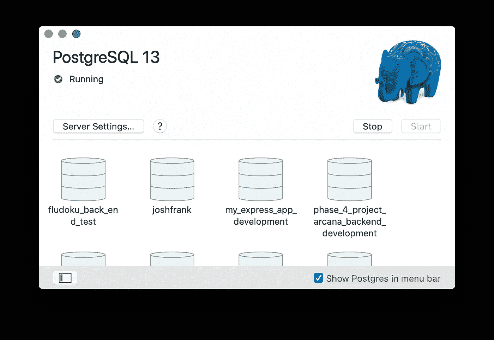
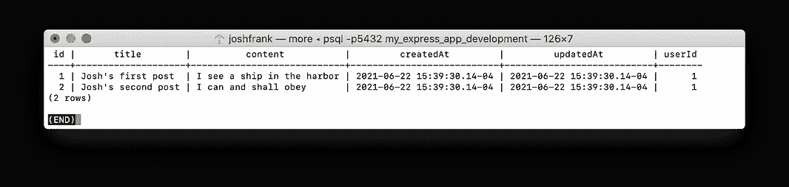

# 使用 Express 和 Sequelize 在 JavaScript 中构建 PostgreSQL API(第 2 部分):迁移和控制器

> 原文：<https://medium.com/nerd-for-tech/june-22-building-a-postgresql-api-in-javascript-with-express-and-sequelize-part-2-57a166814545?source=collection_archive---------3----------------------->


是时候继续我的**基础 JavaScript web API 食谱** **的第一部分了。这是一个很大的话题，当我们停止时，我们只是完成了设置:创建一个基本的 Express 应用程序，配置我们的环境，并配置 Sequelize。在这一集，我们将进入主要事件:模型、关联和迁移。如果你愿意，可以随意派生和克隆这个库；下面的指令前/后有分支，用于检查进度。**

# **5。创建您的数据库**

在创建模型之前，我们必须使用我们在`database.config.js`中为 Sequelize 留下的指令**创建我们的数据库**。对于任何习惯于 Rails 的人来说，这个命令应该会敲响警钟。我们不妨为它添加一个快捷方式到我们在`package.json`的`“scripts”`:

```
...
"scripts": {
   "dev": "nodemon -r dotenv/config index.js",
 **"db:create": "sequelize-cli db:create"** },
...
```

Sequelize 默认为 PostreSQL 的默认端口，`5432`；通过在`database.config.js`的`module.exports`中添加一个键来指定一个不同的端口。

现在交叉手指运行`yarn db:create`，您应该会看到类似这样的内容:

```
Loaded configuration file "app/config/database.config.js".
Using environment "development".
Database *my_express_app_development* created.
✨  Done in 1.11s.
```

**Qapla！**快速浏览一下 Postgres，确认我们已经成功创建了一个名为`my_express_app_development`的数据库:



# 6.创建模型和迁移

**我讨厌抽象的软件教程**——每个模型都叫`BelongsToModel`或者`HasManyModel`，每个关联都叫`Association`等等。让我们创建`User`和`Post`来代替:一个`User`有许多`Post`并且一个`Post`属于一个用户。要为`User` s 创建一个数据库条目，我们需要创建一个带有属性的模型，这个模型将链接到一个表及其列。我们现在只从两列开始:`username`和`email`。

在您的终端中，运行 Rails: `yarn sequelize-cli model:generate --name User --attributes username:string,email:string`中的`rails g model`的等价物。**在** `**--attributes**` **标志后指定属性时，只使用逗号，不要使用空格！**它非常快，所以您应该立即看到一条消息，确认您刚刚自动生成了两个文件:一个名为`models/user.js`的模型文件和一个带有日期戳的迁移文件，如:`20210622153117-create-user.js`:

```
New model was created at *.../app/models/user.js .*
New migration was created at *.../app/migrations/20210622153117-create-user.js .*
✨  Done in 0.34s.
```

`user.js`定义了我们的模型及其属性，并为我们提供了一个定义未来关联的框架(稍后会详细介绍)…

```
'use strict';const { Model } = require( 'sequelize' );module.exports = ( sequelize, DataTypes ) => {
   class User extends Model {
   /**
   * Helper method for defining associations.
   * This method is not a part of Sequelize lifecycle.
   * The `models/index` file will call this method automatically.
   */
 **static associate( models ) {
         // define association here
      }**
   };
   User.init( {
 **username: DataTypes.STRING,
      email: DataTypes.STRING**
   }, {
      sequelize,
      modelName: 'User',
   } );
   return User;
};
```

…但是要开始创建数据/行，我们需要运行我们的迁移，`...-create-user.js`:

```
'use strict';
module.exports = {
   up: async (queryInterface, Sequelize) => {
      await queryInterface.createTable('Users', {
         id: {
            allowNull: false,
            autoIncrement: true,
            primaryKey: true,
            type: Sequelize.INTEGER
         },
         username: {
            type: Sequelize.STRING
         },
         email: {
            type: Sequelize.STRING
         },
         createdAt: {
            allowNull: false,
            type: Sequelize.DATE
         },
         updatedAt: {
            allowNull: false,
            type: Sequelize.DATE
         }
      });
   },
   down: async (queryInterface, Sequelize) => {
      await queryInterface.dropTable('Users');
   }
};
```

一个顺序迁移模块`.exports`有两个功能:用于迁移表的`up`和用于删除表的`down`。请注意:

*   `**up()**` **和** `**down()**` **都是** `**async**` **函数，**是因为 Sequelize 需要等待一个数据库连接。
*   对于`createTable`，Sequelize 生成一个选项散列——根据需要随意添加/保留/删除这些熟悉的、有用的、不言自明的验证:`allowNull`、`defaultValue`、`unique`等等。
*   当然，Sequelize 也像 ActiveRecord 一样添加了一个主键、`id`以及`createdAt`和`updatedAt`时间戳。

在我们迁移之前，让我们强化为重要任务编写脚本的习惯。最好编写一个用于迁移的程序，另一个用于生成迁移(如果我们需要更新表的话),还有一个用于重置数据库，这样我们就不会得到一堆重复的主键:

```
...
"scripts": {
   "dev": "nodemon -r dotenv/config index.js",
   "db:create": "sequelize-cli db:create",**"db:migrate": "sequelize-cli db:migrate",
   "db:g:migration": "sequelize-cli migration:generate --name",** **"db:reset": "sequelize-cli db:drop && sequelize-cli db:create && sequelize-cli db:migrate"**
}
...
```

运行`yarn db:migrate`，Sequelize 会将`User`迁移到你的 PostgreSQL 数据库中。它会显示一条确认消息，如下所示:

```
Loaded configuration file "app/config/database.config.js".
Using environment "development".
== 20210622153117-create-user: migrating =======
== 20210622153117-create-user: migrated (0.021s)✨  Done in 1.08s.
```

您也可以在您的 Postgres 客户端中亲自查看。它们都为此提供了一个 CLI。有些像 SQLPro 或 Postico 提供了一个类似电子表格的 GUI，这比重复输入`SELECT … FROM …`要简单一些。

`add`、`commit`和`push`提交您的进度。

# 7.创建关系并用种子数据测试它们

现在我们创建一个`Post`模型，定义`User` s 和`Post` s 的关系，有四种顺序关系:`hasOne`、`belongsTo`、`hasMany`、`belongsToMany`；为了使本教程简单，我们将创建一个`hasMany` / `belongsTo`关系。有关关系的更多细节，请查阅后续文档。

我们的帖子会有一个标题和一些文本内容，所以运行`sequelize model:create --name Post --attributes title:string,content:string`；和前面一样，这将创建一个模型文件和相应的迁移文件。但是这一次在我们迁移之前，我们将开始从**向** `**Post**` **s** 添加一个 `**belongsTo()**` **关联，如下所示:**

```
*// ...-create-post.js* 'use strict';
module.exports = {
   up: async (queryInterface, Sequelize) => {
      await queryInterface.createTable('Users', {
         id: {...},
         title: {...},
         content: {...},
         createdAt: {...},
         updatedAt: {...},
 **userId: {
            type: Sequelize.INTEGER,
            references: {
               model: "Users",
               key: "id",
               as: "userId"
            }
         }**
      });
   },
...
};
```

在这个迁移文件中，我们将为给定的`Post` `belongsTo()`添加一列`userId`。该列需要的选项包括该列的`type`和`references`，它们告诉 Sequelize 所属模型的名称、键和别名。

在`user.js`中，让我们通过填充方法`associations()`来构建这个关系的`hasMany()`部分:

```
module.exports = ( sequelize, DataTypes ) => {
   class User extends Model {
      static associate( models ) {
**User.hasMany( models.Post, {
            foreignKey: 'userId',
            as: 'users',
         } );**
      }
   };
   ...
};
```

我们将对`post.js`中的`associations`方法做同样的事情，创建关系的`belongsTo()`部分。请注意，我们使用 Sequelize 的`onDelete`选项来启用级联删除——无论何时删除发布它的`User`,它都会从数据库中消失:

```
module.exports = ( sequelize, DataTypes ) => {
   class Post extends Model {
      static associate( models ) {
**Post.belongsTo( models.User, {
            foreignKey: 'userId',
            onDelete: 'CASCADE',
         } );**
      }
   };
   ...
};
```

现在让我们创建一些种子数据——我们应该在开始创建控制器和路线之前测试我们的关系。自然地，我们还将通过`package.json`来定义用于生成种子文件和播种/重新播种数据的脚本:

```
...
"scripts": {
   "dev": "nodemon -r dotenv/config index.js",
   "db:create": "sequelize-cli db:create",
   "db:migrate": "sequelize-cli db:migrate",
   "db:g:migration": "sequelize-cli migration:generate --name",
   "db:reset": "sequelize-cli db:drop && sequelize-cli db:create && sequelize-cli db:migrate",
   **"db:g:seed": "sequelize-cli seed:generate --name",
   "db:seeds": "sequelize-cli db:seed:all",** **"db:reseed": "sequelize-cli db:drop && sequelize-cli db:create && sequelize-cli db:migrate && sequelize-cli db:seed:all"**
}
...
```

现在让我们为每个模型运行一次`g:seed`，每次都有一个名称，如:`yarn db:g:seed userSeeds && yarn db:g:seed postSeeds.`在`app/seeders`中，您将看到用您提供的名称和时间戳生成的种子文件:

```
New seed was created at .../app/seeders/20210622174800-userSeeds.js .
✨  Done in 0.77s....New seed was created at .../app/seeders/20210622174800-postSeeds.js .
✨  Done in 1.03s.
```

就像迁移一样，Sequelize seeder 模块有两个`.exports`，都是`async`函数:`up`更改数据库，而`down`在必要时删除这些更改。让我们使用一些对应于 SQL 命令的序列函数来填充这些内容:

```
*// ...-userSeeds.js* 'use strict';module.exports = {**up: async (queryInterface, Sequelize) => {
      return await queryInterface.bulkInsert( "Users", [
         { username: "Josh", email: "josh@hirejoshfrank.com", createdAt: new Date(), updatedAt: new Date() }
**      **] );
   },** **down: async (queryInterface, Sequelize) => {
      return await queryInterface.bulkDelete( "Users", null, {} );
   }**};*// ...-postSeeds.js* 'use strict';module.exports = {**up: async (queryInterface, Sequelize) => {
      return await queryInterface.bulkInsert( "Posts", [
         { title: "Josh's first post", content: "I see a ship in the harbor", userId: 1, createdAt: new Date(), updatedAt: new Date() },
         { title: "Josh's second post", content: "I can and shall obey", userId: 1, createdAt: new Date(), updatedAt: new Date() }
      ] );**
   **},** **down: async (queryInterface, Sequelize) => {
      return await queryInterface.bulkDelete( "Posts", null, {} );
   }**};
```

Sequelize 给了我们大量的查询选项！这里我们使用了行对象，每个对象都包括条目的`createdAt`和`updatedAt`时间戳；Sequelize 友好地让我们使用一个普通的`new Date()`来做这个。还要注意，我们为归属者提供了一个`userId`(`Post`s)。

如果一切都按照我们的计划进行，当您运行`yarn db:seeds`时，您应该会看到下面乐观的、类似 Rails 的消息:

```
Loaded configuration file "app/config/database.config.js".
Using environment "development".
== 20210622153117-create-user: migrating =======
== 20210622153117-create-user: migrated (0.016s)== 20210622172615-create-post: migrating =======
== 20210622172615-create-post: migrated (0.011s)
```

如果 Sequelize 运行时没有碰到`allowNull: false`或我们迁移中的任何其他验证，**这意味着我们的关系正在成功地工作！**使用`SELECT * FROM “Users"`和`SELECT * FROM “Posts"`在您的 Postgres 客户端中确认您的数据库看起来应该是这样的:



# 8。创建控制器和路线

让我们将所有这些结合到一个真正的工作 API 中——这是所有这些大惊小怪的原因——这样我们就可以在 HTTP/JSON 中看到这些模型和关系，而不仅仅是在 SQL 控制台中。我们将通过**创建控制器**(在`/app`中为它们创建一个文件夹)并开始**定义** **路径**来完成，这些路径指向那些控制器的动作。我们现在只从`show`路线/行动开始。

从项目的根目录运行`mkdir app/controllers`为控制器创建一个文件夹。然后`touch postsController.js`并用下面的代码填充它:

```
const Post = require('../models').Post;exports.show = ( request, response ) => {
   return Post.findByPk( request.params.postId, {} )
      .then( post => {
         if ( !post ) { response.status( 404 ).send( { error: "Post not found" } ); }
         else { response.status( 200 ).send( post ); }
      } )
      .catch( error => response.status( 400 ).send( error ) );
};
```

Sequelize 控制器`exports`都是当用户访问一条路线时调用的函数，所以它们以 HTTP `request` s 和 JSON `response` s 作为参数。`Model.findByPk()`完全按照它在 can 上说的做:接受一个数据库索引和一个 options 对象作为参数，并返回相应的数据库行。这都是用`.then().catch()`链接起来的，所以如果请求中的数据库索引有效，我们可以发送一个带有数据的`200`响应，如果无效，则发送一个`400` / `404`响应。

接下来，`touch app/controllers/index.js`并输入刚才下面的两行代码；当我们开始定义路线时，需要`require()`控制器快速方便地动作:

```
const posts = require( "./postsController.js" );module.exports = { posts };
```

现在让我们从项目的根目录运行`mkdir app/routes && touch app/routes/index.js`来创建一个路由文件夹和一个路由文件。随着项目的增长，您可能会决定按模型(即`postRoutes`、`userRoutes`等)来分离路由文件。但是现在，我们将把所有的路线放在一个文件中，`app/routes/index.js`，包含下面的代码:

```
const postsController = require( "../controllers" ).posts;module.exports = app => {
   // Post routes //
   app.get( "/posts/:postId", postsController.show );
};
```

最后，让我们将刚刚在主`app.js`文件中创建的`require`文件一直放到项目的根目录下:

```
require( "dotenv" ).config();
const express = require( "express" );
const cors = require( "cors" );
const app = express();app.use( express.json() );
app.use( express.urlencoded( { extended: true } ) );
app.use( cors( { origin: `http://localhost:${ process.env.PORT }` } ) );**require( "./app/routes" )( app );**app.get( "/", ( request, response ) => response.send( "Test" ) );app.listen( process.env.PORT, () => console.log( `Listening: port ${ process.env.PORT }` ) );
```

现在，终于，当我们用`yarn dev`启动我们的应用程序时，我们应该会看到熟悉的`Listening: port 3000`消息，告诉我们我们的应用程序正在运行并无错误地监听。这意味着如果你打开一个新的终端并运行`curl localhost:3000/posts/1`，你会看到我们种子的第一个`Post`:

```
{"id":1,"title":"Josh's first post","content":"I see a ship in the harbor","createdAt":"2021-06-22T19:39:30.140Z","updatedAt":"2021-06-22T19:39:30.140Z","userId":1}
```

在使用`yarn dev`运行应用程序的终端窗口中，会闪现一条消息，确认 Sequelize 运行了一条 SQL 命令:

```
Executing (default): SELECT "id", "title", "content", "createdAt", "updatedAt", "userId" FROM "Posts" AS "Post" WHERE "Post"."id" = '1';
```

让我们`touch app/controllers/usersController.js`并添加一些`User`路线——但是这一次我们每次`show`一个`User`时就序列化`Post` s。我们将在`User.findByPk()`中使用一个带选项的对象来代替空对象。然后，我们将把那个`usersController`中的动作合并到一些新的路线中，并添加到`controllers/index.js`和`routes/index.js`中:

```
*// usersController.js*const User = require('../models').User;
**const Post = require('../models').Post;****const userOptions = {
   include: [
      {
         model: Post,
         as: "posts"
      }
   ]
};**exports.show = ( request, response ) => {
   return User.findByPk( request.params.userId, **userOptions** )
      .then( user => {
         if ( !user ) { response.status( 404 ).send( { error: "User not found" } ); }
         else { response.status( 200 ).send( user ); }
      } )
      .catch( error => response.status( 400 ).send( error ) );
}*// controllers/index.js***const users = require( "./usersController.js" );** const posts = require( "./postsController.js" );module.exports = { posts, users };*// routes/index.js*const postsController = require( "../controllers" ).posts;
**const usersController = require( "../controllers" ).users;**module.exports = app => {
   // Post routes //
   app.get( "/posts/:postId", postsController.show );
   **// User routes //
   app.get( "/users/:userId", usersController.show );**
};
```

现在，`curl localhost:3000/users/1`终端命令将为您提供带有`userId`和`1`的`User`，以及该用户在响应中序列化的两个帖子:

```
{"id":1,"username":"Josh","email":"[josh@hirejoshfrank.com](mailto:josh@hirejoshfrank.com)","createdAt":"2021-06-22T19:39:30.132Z","updatedAt":"2021-06-22T19:39:30.132Z","posts":[{"id":1,"title":"Josh's first post","content":"I see a ship in the harbor","createdAt":"2021-06-22T19:39:30.140Z","updatedAt":"2021-06-22T19:39:30.140Z","userId":1},{"id":2,"title":"Josh's second post","content":"I can and shall obey","createdAt":"2021-06-22T19:39:30.140Z","updatedAt":"2021-06-22T19:39:30.140Z","userId":1}]}%
```

# 接下来

我们现在有了两个简单的模型和它们之间的工作关系`hasMany` / `belongsTo`，以及处理它们的路线和控制器。**这使它成为一个基本的、有效的 web API，**这是一个不小的成就！但是还有很多事情要做。我想在这个系列中至少增加 2 篇文章:一篇是用`bcrypt`和`jsonwebtokens`添加 auth 的演练，另一篇是关于部署你的应用的。关于这个主题还有很多值得强调的地方，敬请关注！