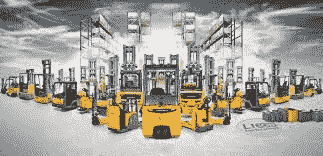

# 可用的 Jungheinrich 4.0 技术

> 原文：<https://medium.com/nerd-for-tech/jungheinrich-4-0-technologies-available-1afa5d86fec5?source=collection_archive---------11----------------------->

## 描述

Jungheinrich 是物料搬运设备领域的一家知名德国公司，用于在工程、交付、消耗和处置过程中驱动、存储、控制和保护物料、货物和产品。由于其巨大的技术进步和智能解决方案，该公司在这些领域的全球公司中名列前茅。

# 重要亮点

*   创始人:弗里德里希·容格海因里希博士
*   成立时间:1953 年 8 月 7 日
*   总部:德国汉堡
*   产品:叉车
*   全球员工:超过 16，000 人
*   业务(租赁和二手卡车)开始于:1974 年
*   新工厂建于吕内堡:1989 年
*   荣格海因里希获得的斯坦博克与博斯集团:1994
*   集团品牌 MIC、Steinbock 和 Boss 于 2002 年被放弃。只有卡车以 Jungheinrich 品牌出售。
*   在 2004 年建立了 Friedrich Jungheinrich 博士基金会，为学生提供奖学金。
*   该公司在 2005 年展示了世界上第一台带有旋转驾驶室的叉车。
*   2009 年开始对二手卡车进行翻新。
*   2015 年 10 月，莫斯科附近库扎耶沃的仓库作业。
*   Jungheinrich 在 2018 年以 17，877 名员工实现了 37.96 亿欧元的销售收入。

# 产品和服务

Jungheinrich 的产品可分为四大支柱:

1.  工业卡车，例如叉车、高架堆垛机和拖拉机。著名的产品是 Ameise。Ameise 是 Jungheinrich Profishop 的注册商标，通常用于替代手动或电动托盘车。
2.  荣格海因里希齿轮齿条系统。这些分为手动，半自动和自动存储系统。[自动高架仓库(HRL)、托盘仓库、自动小零件仓库(AKL)和组合系统是齿轮齿条系统的例子](https://www.technologiesinindustry4.com/)。
3.  该集团包括完整的内部物流解决方案。这是对现有仓库的新规划和优化。范围从分析、计划、项目规划和实施到售后服务。适用于所有程度的自动化。
4.  Jungheinrich AG 是一家现代化的、可靠的生产商和服务商，该公司提供手动仓库系统、仓库管理系统(WMS)、无线电数据传输服务和无线电数据传输设备。那是带有存储和回收机器的完全自动化的仓库系统。此外，该公司还提供仓储物流服务。
5.  这些服务包括设备的检查、维护和修理、驾驶员培训、产品的租赁和销售融资、二手设备的修复和销售。

# 撼动工业 4.0 和未来

Jungheinrich 将自动化、数字化和网络化等大趋势与新的创新产品、IT 和软件解决方案相结合。他们将内部流程提升到了一个全新的水平。他们生活和呼吸着内部物流 4.0。

# 内部物流 4.0 的挑战

这对于优化 Jungheinrich 仓库的高要求流程以满足要求具有重要意义。这就是为什么；Jungheinrich 通过单一来源为客户提供完美的解决方案。他们一次又一次地创造出革命性的创新，例如电池技术、部分和全自动汽车、智能辅助系统以及能源回收领域的创新。

# 创新走廊

在荣格里奇，他们将机械工程的数据与创新和解决问题的能力结合起来。以下是一些技术进步，展示了他们如何创建智能解决方案来优化客户的流程。

# 创新者 Umfeld Schlepper

他们在牵引车技术方面有丰富的经验。20 世纪 50 年代，第一批车辆配备了电动机。在经历了 20 世纪 80 年代和 90 年代的短暂停顿后，牵引车经历了重生。Jungheinrich EZS 350 是一款创新产品，于 2016 年上市。那是一辆重型牵引车。目前也可以作为自动叉车使用。

# 创新 Umfeld 委员会

他们开发了低级订单拣货员 ECD 320，以便进行人工订单拣货。这是仓库中对体力要求最高的活动之一。他们增加了一部符合人体工程学的电梯。这是一个没有边缘的低入口台阶和一个放松的操作员座椅。

# 创新 Umfeld easyPILOT 跟进

新的 easyPILOT 操作员辅助系统允许操作员转移卡车。这使得工人可以腾出手来拣货。这也节省了时间，因为没有必要不断爬上爬下的车辆。

# 锂离子技术的先驱

## 内容锂离子 50_50

他们已经处于领先地位，在锂离子技术方面比任何竞争对手都更有能力。首款量产锂离子卡车始于 2011 年的“EJE 112i”。他们可靠地开发了这项技术。几乎他们的整个舰队现在都是“锂离子就绪”。

## 全息透镜

在混合现实中，数字元素直接与真实空间融合。他们与技术合作伙伴 Zühlke 合作，将 HoloLens 应用程序产业化。通过在待修理的叉车上方突出的交互式全息图，这可以帮助服务工程师进行修理和维护。

## SLH 300 电池充电器系统

在集团运营技术方面，荣格海因里希 SLH 300 电池充电器系统获得了最佳行业奖。它标志着一批新的高频电池充电器。这些都适用于铅酸电池和锂离子电池。[SLH 300 是 Jungheinrich 的内部开发产品。](https://www.technologiesinindustry4.com/)这是在其 Norderstedt 生产厂生产的。这是 Jungheinrich 系统解决方案的重要组成部分。SLH 300 集合了一个完美的解决方案来满足快速发展的锂离子市场的需求。这对于当前的铅酸市场来说是一个新的顺畅的解决方案。

## Jungheinrich 的充电器系统

现有的 SLH 300 提供 15-320 a。它提供了太多的卡车电压等级和许多不同的国家电压标准。它为用户提供了极大的灵活性，并提供了许多精心设计的选项。这是同类产品中独一无二的特点。充电器系统也非常容易设置和使用。SLH 300 是一个联动系统。总的来说，该系列中的设备设计为壁挂式，并安装在直立位置。密度大、重量轻的电池充电器可以在安装或安装后直接使用。智能操作理念确保设备易于使用，LED 状态指示灯即使在很远的地方也很明显。

更多详情请访问:[https://www . technologiesinindustry 4 . com/jung Heinrich-4-0-technologies-available/](https://www.technologiesinindustry4.com/jungheinrich-4-0-technologies-available/)