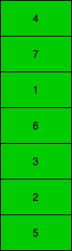
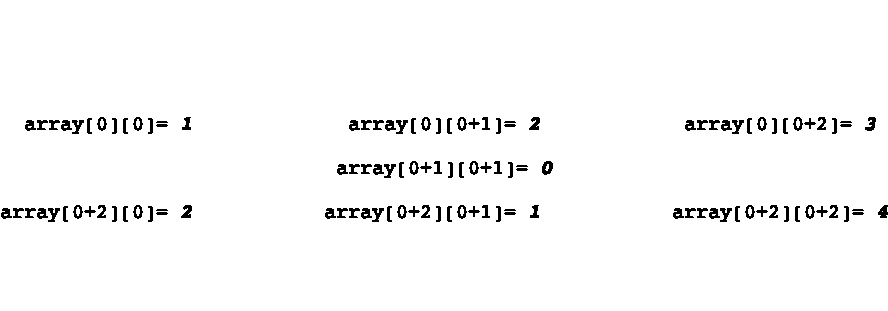

# 初级开发人员—编写面试问题和答案—第 2 部分

> 原文：<https://medium.com/nerd-for-tech/junior-dev-coding-interview-questions-answers-part-2-b416f956ce5a?source=collection_archive---------10----------------------->

## 面试指南


大家好，

欢迎回到编码面试问题和答案。

这是文章的延续- [初级开发人员-编码面试问题&答案-第一部分](/nerd-for-tech/junior-dev-coding-interview-questions-answers-part-1-4bfd9e8e9374)

到目前为止，我们已经讨论了阶乘和回文。现在我们要覆盖

1.  沙漏的最大总和
2.  找出数组中最大和最小的数字

# **一沙漏的最大**总和。

**问题:在给定的 2D 数组中找出沙漏的最大和。**

看起来像一个简单的问题不是吗？如果你真的知道它简单还是它繁琐。

让我们问并回答两个子问题:

1.  **什么是二维数组？**

只不过是数组的数组。不要再迷茫了。让我们看一个插图。



这是一个单一的数组


这是另一个数组中的同一数组。

**2。这里的沙漏是什么？**


假设这是我们的输入。

```
 1 1 1 0 0 
        0 1 0 0 0 
        1 1 1 0 0 
        0 0 0 0 0 
        0 0 0 0 0
```

那么我们的沙漏看起来像这样


现在我们知道在给定的 2d 阵列中有九个沙漏。还有其他方法可以得到这个数字。

> (第 2 行)*(第 2 列)

因为列和行的最后两个(从任一侧)自己都做不出沙漏。他们需要另一行或另一列来完成。

我们将得到所有左上角的元素，找到属于沙漏的元素，并对它们求和。

然后我们将找到所有沙漏总和之间的最大值。

**现在让我们看看代码:**

```
**///Declare properties** int array2D[5][5]={{1, 2, 3, 0, 0},{0, 0, 0, 0, 0},{2, 1, 4, 0, 0},{0, 0, 0, 0, 0},{1, 1, 0, 1, 0}};int rows = 5;int columns = 5;**///Find max sum of the hour glass**int maxSumOfHourGlassfor(int array[5][5]){int maxSum = INT_MIN;for(int i=0;i<rows-2;i++){ **//To move from one row to another**for (int j=0; j<columns-2; j++) { **//To move from one column to another**int sum = array[i][j]+array[i][j+1]+array[i][j+2]+array[i+1][j+2]+array[i+2][j]+array[i+2][j+1]+array[i+2][j+2];maxSum = max(maxSum,sum);}}return maxSum;}static void handleMaxSumOfHourGlass(){cout<<"Maximum sum of the hour glass : "<<maxSumOfHourGlassfor(array2D)<<"\n";}
```

**输出:**

*沙漏的最大总和:13*

在我们添加所有元素的行中放置一个断点，并用它们制作一个沙漏来可视化正在发生的事情。

使用这个来手动可视化它。

```
***Input:***1, 2, 3, 0, 00, 0, 0, 0, 02, 1, 4, 0, 00, 0, 0, 0, 01, 1, 0, 1, 0
```

那么结构将会是



# 找出数组中最大和最小的数字

**问题:求给定数组中最大和最小的数。**

让我们使用之前看到的相同数组。


**方法:**

为了找到最大的和最小的，我们几乎应用相同的方法。

我们将假设我们的第一个元素是最小/最大的，并将其存储在变量 X 中。然后，我们转到其他节点，查看它们是否小于/大于我们的变量 X 中存储的值。如果它们通过检查，则将它们存储在变量 X 中，或者如果失败，则移动到下一个，重复此操作，直到到达末尾。

**例子:**

我们首先假设

> smallestElement = array[0]

在我们的例子中，smallestElement = 4，那么我们看到

> 如果 array[1]<smallestelement></smallestelement>

if the above check succeeds then store it the variable **small est element**失败，则移动到下一个(array[2])。

在我们的例子中，当我们到达数组[2]时，我们得到 1，由于 1 小于 4，我们将数组[2]存储在 **smallestElement** 中。

应用相同的逻辑找出数组中最大的数字。

**现在让我们看看代码:**

```
**///Find the smallest number**int findSmallest(int *array,long length){int smallestElement = array[0];for (int i=0;i<length;i++){if(array[i]<smallestElement){smallestElement=array[i];}}return smallestElement;}**///Find the biggest number**int findBiggest(int *array, long length){int biggestElement = array[0];for(int i=0;i<length;i++){if (array[i]>biggestElement){biggestElement = array[i];}}**return biggestElement;****}****///Handle input and output**static void handleFindtheBiggestAndSmallestNumber(){int array[5];cout<<"Enter integer numbers to create an array: ";for(int i=0;i<5;i++){cin>>array[i];}int length = *(&array+1) - array;cout<<"Biggest number in the given array is : "<<findBiggest(array, length)<<"\n";cout<<"Smallest number in the given array is : "<<findSmallest(array, length)<<"\n";}
```

**输出:**

输入整数创建数组:4 7 5 2 3

给定数组中的最大数字是:7

给定数组中的最小数字是:2

***就这样了伙计们，我该离开了。***

如果你发现任何问题，或者如果你想改善这一点，让我知道，我愿意接受任何事情。

请在这份报告中找到密码-

[https://github . com/Rajaikumar-IOs dev/Coding-challenges-for-junior-devs](https://github.com/Rajaikumar-iOSDev/Coding-challenges-for-junior-devs)

[](https://github.com/Rajaikumar-iOSDev/Coding-challenges-for-junior-devs) [## rajaikumar-IOs dev/初级开发人员的编码挑战

### ⌨️:我整理了一些我遇到的问题和我提出的一些问题。这种编程语言的选择…

github.com](https://github.com/Rajaikumar-iOSDev/Coding-challenges-for-junior-devs) 

***注意*** :对于不使用 Xcode 的人，使用“main.cpp”文件即可。