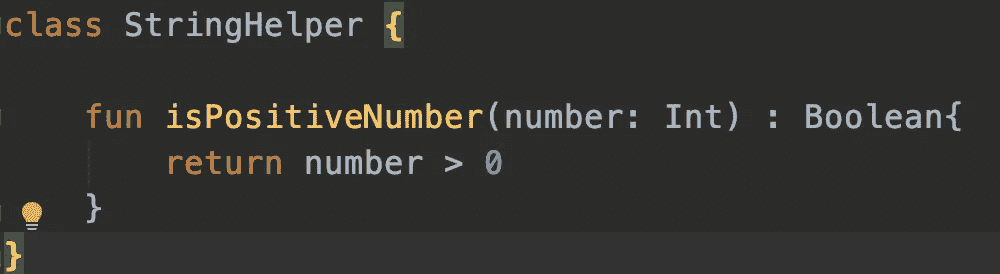
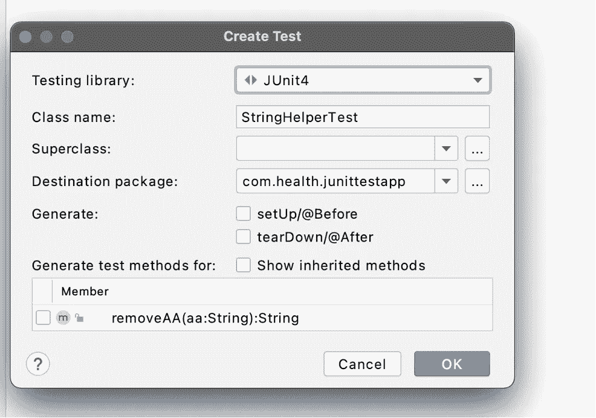
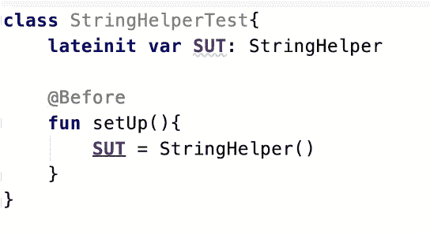
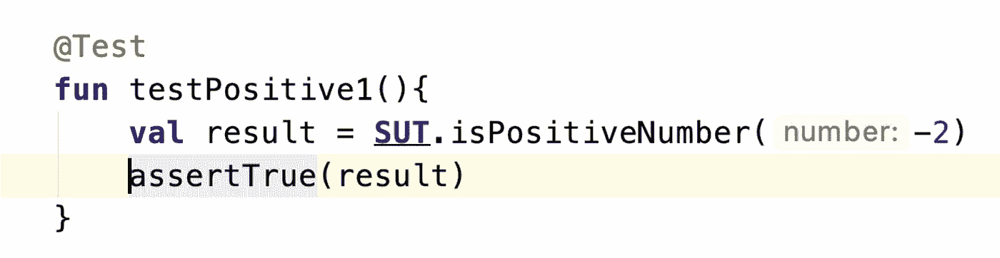
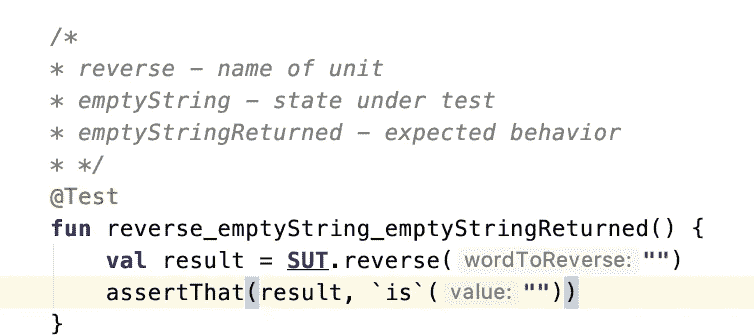
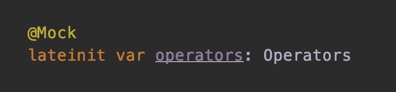
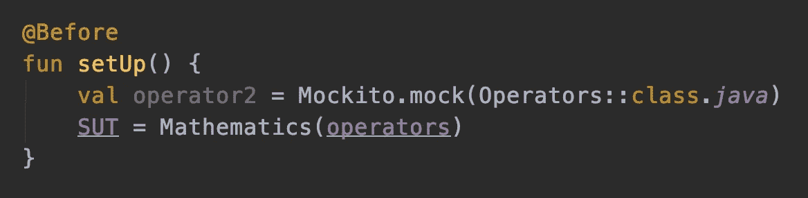
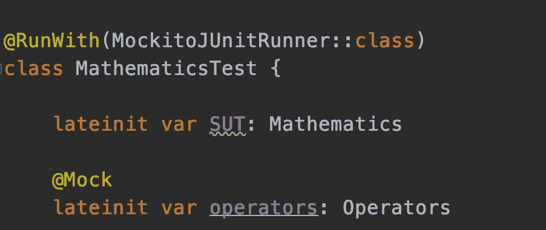

# 在 Android 中使用 Kotlin 对初学者进行 JUnit 测试| Hemcrest 和 Mockito

> 原文：<https://medium.com/nerd-for-tech/junit-testing-in-android-with-kotlin-for-beginners-hemcrest-and-mockito-b731a74abaea?source=collection_archive---------0----------------------->

## ~您编写的未经测试的代码越多，您需要检查错误的路径就越多

作为一名 Android 开发人员，当我开始学习 JUnit 测试用例时，我不得不访问许多网站来学习它，每个内容都有自己独特的表示单元测试的风格，但是我还没有找到一个地方可以一步一步地学习 JUnit 测试用例，但是不要担心，这就是我在这里讨论这个主题的原因

在这里，我将只涉及 JUnit 测试，但请继续关注下一个主题，即使用 Expresso 进行 UI 测试

好了，不要再讨论了，让我们一步一步来

# 什么是单元测试？

*   尝试和测试特定的单元(特定的边界)
*   单元可以是单个方法，或者一组方法，或者一组类

# **单元测试的优势**

一旦我编写了单元测试，我将能够在几毫秒内自动运行单元测试，并检查特定方法的所有条件是否通过/或者我们可以说确保一个函数做它应该做的事情

# 创建第一个 Junit 测试用例

让我们以一个我们想要为其编写测试用例的类为例，它有一个方法 isPositiveNumber，如果 Number 为正，则返回 true，否则返回 false

*   右键单击您想要编写测试用例的文件，导航到 GoTo-> Test

# **注解**

让我们先了解一下注释

## 之前:-

*   如果我们想在测试开始前执行一些操作，比如初始化一些变量等等
*   它告诉 Junit 这个方法必须在每个测试用例之前运行

## @测试:-

*   Junit 中的测试是带有@Test 注释的方法注释
*   在这里，我将编写实际的测试—如何进行？
*   我需要调用方法 SUT &确保它产生预期的输出

> 注意:- SUT =被测系统，为你正在编写的测试用例命名类的标准方式

*   使用@test 注释调用该类方法(isPositiveNumber())进行测试
*   我可以用条件断言/检查该方法，以查看预期的输出是否出现
*   在上面的示例中，负数作为参数传递
*   **assertTrue()** 检查输出是否为真，这意味着测试通过，否则测试失败
*   测试将失败，因为输出将为假

# 单元测试的命名

这就是我们应该如何命名我们的功能/单元测试用例，虽然不是强制性的，但这是命名测试用例的标准方式

**<工作单元> _ <状态下测试> _ <预期行为>**

# 哈姆克雷斯特图书馆

*   Hamcrest 是用于单元测试的著名框架
*   它被捆绑在 JUnit 中，简单地说，它使用现有的谓词——称为匹配器类——来生成断言

## 示例:-

*   使用 reverseString()方法创建了类 StringReverser
*   创建了一个测试用例，并使用 hamcrest 库来断言响应
*   如你所见，我们使用了带有参数的 assertThat()函数，该函数包含“is ”,它是以下包的一部分:-
    ***“import org . ham crest . corematchers . * "***
*   因此，这个测试测试当空字符串被输入到 reverse 方法中时，空字符串被返回，因为空字符串的反转也是空字符串

使用 hamcrest 进行 JUnit 测试

我希望你对我们如何在 android 中编写单元测试用例有所了解🤘

我们去莫奇托吧

# 使用 Kotlin 的 Android 中的 Mockito

*   Mockito 是 android 中的一个框架，它帮助你初始化你想要测试的类，也就是创建你的 mocks
*   基本上，在真实的场景中，我们可能有复杂的类，其中可能包含许多依赖关系，所以手动初始化一个类并不总是可能的，这里 Mockito 来拯救

# 模仿一个类/对象的两种方法

## 一种是使用@Mock 注释

## 其次是使用模拟功能

它创建一个类/接口的模拟对象，该对象以 classToMock 作为参数

# 莫奇托测试赛跑运动员

*   用 JUnit special @RunWith 注释测试。然后将 MockitoJUnitRunner 定义为其参数

*   此后，我不必显式初始化对象/模拟——只需用@Mock 对它们进行注释
*   Mockito 是一个特殊的框架，它减少了实现测试加倍所涉及的工作

> 具有外部依赖性的单元测试类称为测试双精度测试

希望你能抓住一些东西，我已经用了非常简单的步骤让你明白——我唯一需要的是一些耐心，但是相信我，在这之后你将不必去任何其他网站的任何地方开始你的测试用例

让我们互相学习 Mockito 最重要的用法

# **在 mockito 中验证**

verify 是 Mockito 的断言，它验证在特定的 mock 上调用了某个方法

*   示例-验证(运算符)。添加(a，b)
*   这意味着在 operators 对象上验证是否调用了 add 方法

所以有时我们不需要方法的响应，我们只是想知道函数是否被调用取决于我们的条件，这里验证方法进入图片

*   我们也有更多的 mockito 函数，比如 when，然后返回一些方法来测试我们的单元

# 示例— Mockito 测试用例网络助手类

我写了一个名为 NetworkHelper 的类，它有一个总是返回 true 的方法 isConnectedToNetwork

让我们使用 Mockito 来看看 NetworkHelperTest

# 参考资料:-

*   [https://github.com/mockito/mockito/wiki](https://github.com/mockito/mockito/wiki)
*   [https://www . raywenderlich . com/195-Android-unit-testing-with-mock ITO](https://www.raywenderlich.com/195-android-unit-testing-with-mockito)

就这样伙计们！我希望并且希望你们都已经很好地了解了如何编写单元测试用例，我知道这有点冗长，但是也值得一读

下节课再见，别忘了继续关注我

[媒体](https://puneet-grover.medium.com/)、[领英](http://www.linkedin.com/in/puneet-grover-android-soft)和[推特](https://twitter.com/puneetgrover_)

编码快乐！