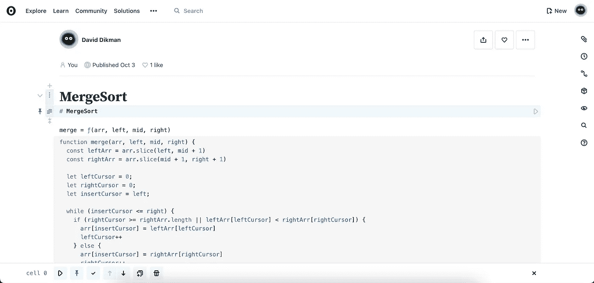
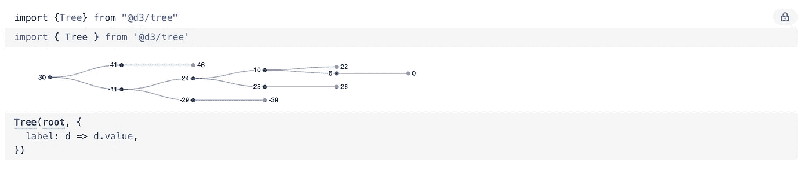

# Javascript 的 Jupyter

> 原文：<https://medium.com/nerd-for-tech/jupyter-for-javascript-b7eba469a066?source=collection_archive---------6----------------------->

Q 是一个 javascript 的在线脚本笔记本。使用 ObservableHQ，您可以快速运行和重新运行每一行。并排记录或解释并显示生成的输出。

这就像在概念中运行节点一样。

在 ObservableHQ 中写笔记本的例子

# 拥有笔记本有助于大声思考

好的写作是好的思考。当您使用笔记本工具编写代码时，就像用代码大声思考一样。

更好的是，一旦你想追溯和重新思考某些东西，你可以重新运行你的脚本的单个部分或全部。

这就像有一个时间机器，你可以回到过去，改变一个事件，看看未来如何变化。

# ObservableHQ 类似于 Javascript 的 Jupyter

如果你写过 Python，你很可能用过 [Jupyter](https://jupyter.org/) 。如果没有，那就去看看。Jupyter 在数据科学方面非常优秀。使用像[熊猫](https://pandas.pydata.org/)这样的库使得解析文件、查询数据和输出一些结果变得非常简单。

你想用不同的输入来试一下，只是调整一下，然后再运行一次吗？它就像你最喜欢的 IDE 中的一步一步的调试器，但是你也可以后退。

# ObservableHQ 如何工作

你注册/登录。可能用的是你的 GitHub 账号。然后你加笔记本。你可以在需要的地方添加一些标记，或者只是一行行的代码，一个接一个。

执行整个脚本或重新运行单个步骤，该步骤的输出将用于重新运行后续步骤。

查看[我发布的笔记本](https://observablehq.com/@ddikman)或者一个实现[合并排序](https://observablehq.com/@ddikman/mergesort)

ObservableHQ 中 mergesort 的实现

使用像 d3 这样的 javascript 库，我们也可以像在 Jupyter 中使用 plotly 一样在笔记本中绘图

使用 d3 渲染二叉查找树

在 ObservableHQ 上或 ObservableHQ 本身有很多例子，例如，他们的 [d3 可视化图库](https://observablehq.com/@d3/gallery?collection=@observablehq/observable-libraries-for-visualization)。

## 其他替代笔记本电脑

我想在这里强调一下 ObservableHQ，因为我在谷歌上搜索这个确切的标题时只得到几个点击。只有这个 [quora 线程](https://www.quora.com/Is-there-a-notebook-like-environment-for-JavaScript-similar-to-IPython-Notebook)，是我发现 ObservableHQ 的地方。

我还在结果中找到了 [notebookJS](https://medium.com/r?url=https%3A%2F%2Ftowardsdatascience.com%2Fintroducing-notebookjs-seamless-integration-between-python-and-javascript-in-computational-e654ec3fbd18) ，但这是为了在 jupyter 中运行 javascript *而构建的，与我要找的*不同。**

ObservableHQ 是一颗隐藏的宝石。或许在其他圈子(数据科学家)更为知名。

我希望你能尝试一下，这将有助于简化你的脚本经验。