# Jupyter 笔记本—提示和技巧

> 原文：<https://medium.com/nerd-for-tech/jupyter-notebook-tips-tricks-73ec6cbe4a7?source=collection_archive---------3----------------------->

在我目前的项目中，我们收集了大量数据并对其进行分析。它的范围从识别趋势到回答非常具体的业务问题。我们广泛使用 Jupyter 笔记本电脑，因为它提供了一个非常棒的交互分析界面，并能够与他人分享发现或见解。这篇文章记录了我日常使用的一些有用的特性。

在他们的[官方主页](https://jupyter.org/)上定义的 Jupyter 笔记本是

> *一个开源的网络应用程序，允许你创建和分享包含实时代码、方程式、可视化和叙述性文本的文档。用途包括:数据清理和转换、数值模拟、统计建模、数据可视化、机器学习等等。*

JuPyteR 这个名字来源于该工具支持的三种核心编程语言或内核，即 Julia、Python 和 r。Jupyter 笔记本电脑、Jupyter 实验室和 Jupyter Hub 是为交互式处理或分析提供的三种产品。对于安装和使用，您可以遵循 [Jupyter 主页](https://jupyter.org/install)或 [Jupyter 文档](https://jupyter-notebook.readthedocs.io/en/stable/index.html)中提供的步骤

下面是一些有用的技巧，帮助我充分利用这个工具，

# 1.荧光屏宽度

默认情况下，笔记本两侧留有大量空白。这些天，当我在家工作时，我将笔记本电脑连接到外部显示器上，就我个人而言，我更喜欢使用我的屏幕上所有可用的房地产进行开发。

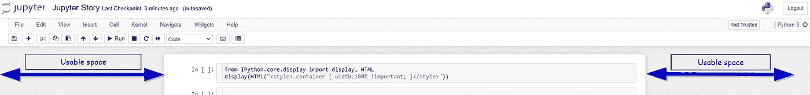

您可以通过执行以下命令来扩展可用笔记本空间的宽度

执行完命令后，您的笔记本将会如下图所示，为您提供更多的单元格空间来编写代码

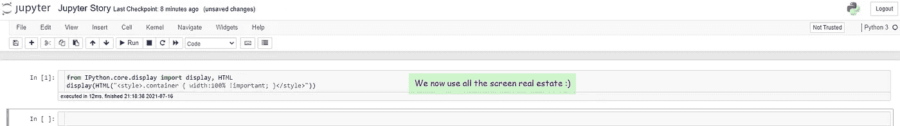

# 2.单元中所有命令的输出

我倾向于将我的许多命令放在一个单元中。如阅读、计数等。默认情况下，只显示最后一个命令的输出。

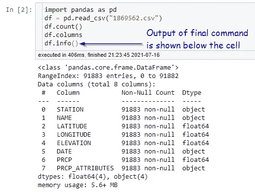

您可以执行以下命令来显示所有命令的输出。

执行后，单元的所有相关输出将按顺序显示。

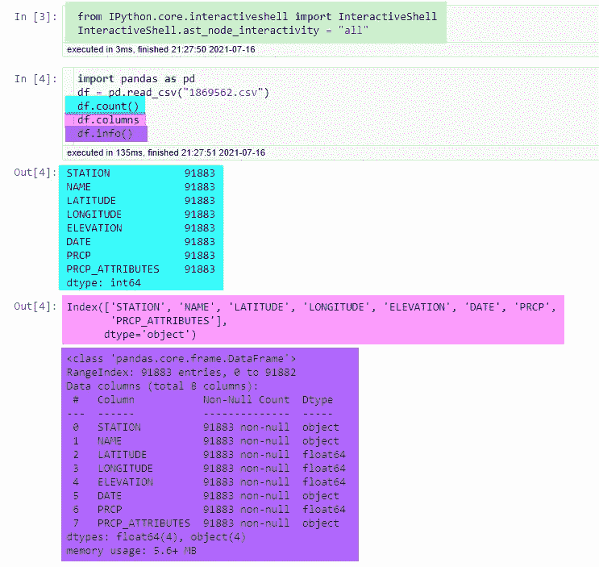

# 3.熊猫设置

当处理一个宽的和/或大的数据集时，Pandas 会隐藏一些列和行以适应显示。“隐藏”的行/列在下图中显示为圆点并以绿色突出显示

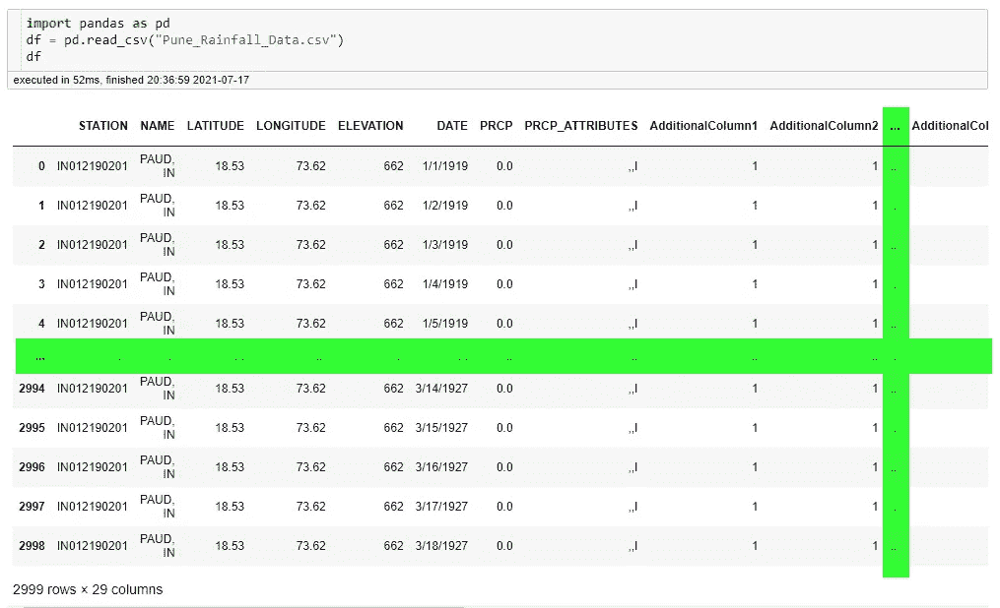

您可以设置以下两个属性来强制熊猫显示所需的列数和行数，

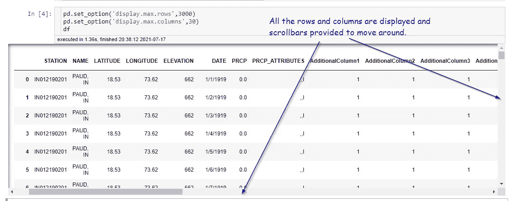

此外，可能有一个场景，其中一个特定的列有一个很大的值，显示为被熊猫截断。这里你可以使用 max_colwidth 选项来设置显示长度

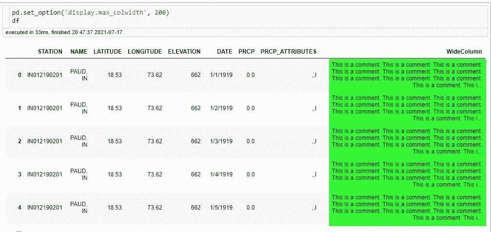

你可以在[熊猫文档](https://pandas.pydata.org/pandas-docs/stable/user_guide/options.html)阅读关于熊猫的可用选项

# 4.执行 shell 命令

直接从笔记本上运行 shell 命令非常简单，只需在它们前面加上感叹号(！idspnonenote)即可。).在 shell 提示符下运行的所有命令都可以工作

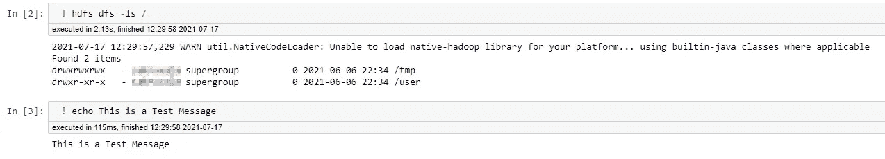

您也可以使用这种方法来安装任何缺失的依赖项

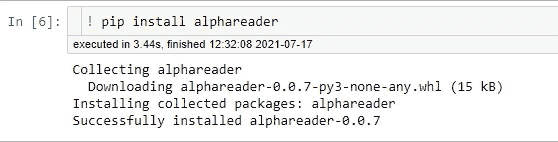

shell 命令的输出可以存储在一个变量中，并在笔记本中用于处理。

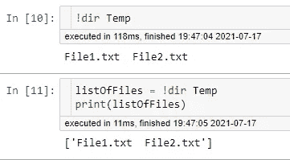

# 5.魔法命令

对于日常事务，IPython 提供了被称为*魔法*命令的快捷方式。你可以参考 [IPython Docs](https://ipython.readthedocs.io/en/stable/interactive/magics.html) 的文档。

这些命令以 **%** 符号为前缀。A **single %** 如果你想让命令**在单行**上操作，而**double %**到**在多行**或整个单元上操作。

少数常用的是，

**A)从笔记本中执行外部脚本。**

可能会有这样的情况，您有一个脚本来准备数据或执行一些任务，作为运行当前笔记本的前奏。您可以使用 **%run** 从当前笔记本中调用这些脚本和/或笔记本

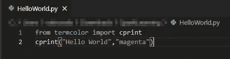

测量执行时间

您可以使用**%对于小段代码，它甚至会运行多次，并显示最佳时间。**

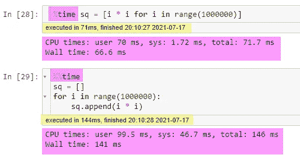

*有扩展可以自动显示单元格执行时间(黄色高亮)*

有许多神奇的命令，你可以用 **%lsmagic** 列出它们

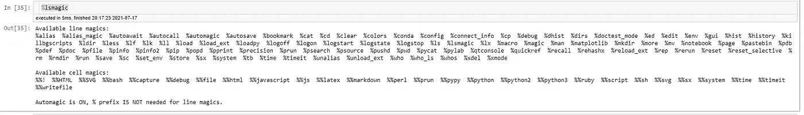

# 6.使用扩展的附加功能

关于扩展的详细文档可从[这里](https://jupyter-contrib-nbextensions.readthedocs.io/en/latest/)获得

在您的 CLI 上执行以下两个命令来安装扩展

然后在你的 Jupyter 主页上，你会看到新的扩展标签。在这里，您可以启用和禁用它们。在下图中突出显示了几个常用的

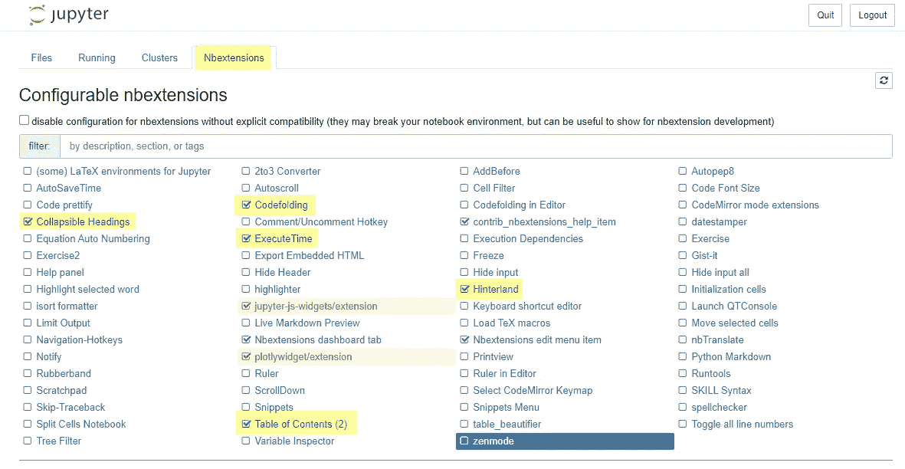

# 7.快捷键

Jupyter 里有很多键盘快捷键可以加快你的开发速度。要查看它们，您可以**按 ESC** 启用命令模式，然后按 **h** 打开快捷窗口。

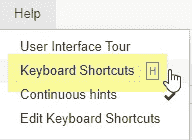

# 8.从 CLI 运行笔记本

最后，您还可以使用下面的命令从命令行界面执行整个笔记本

Jupyter 笔记本提供了更多功能，值得一读它们的文档

感谢你花时间阅读这篇文章。过得精彩！

# 参考

*   [Stackoverflow](https://stackoverflow.com/questions/21971449/how-do-i-increase-the-cell-width-of-the-jupyter-ipython-notebook-in-my-browser)
*   [熊猫文献](https://pandas.pydata.org/pandas-docs/stable/user_guide/options.html)
*   [IPython 文档](https://ipython.readthedocs.io/en/stable/interactive/magics.html#cell-magics)

*最初发表于*[*https://www.linkedin.com*](https://www.linkedin.com/pulse/jupyter-notebook-tips-tricks-shyamal-akruvala)*。*