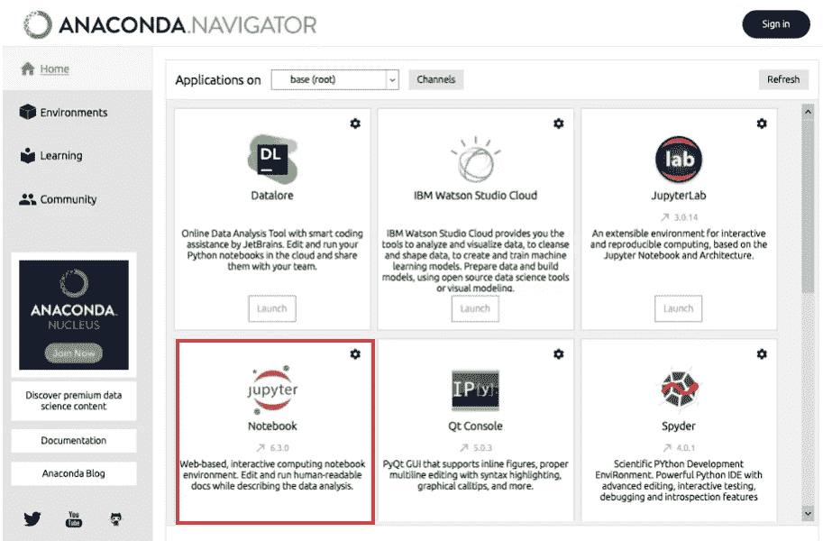
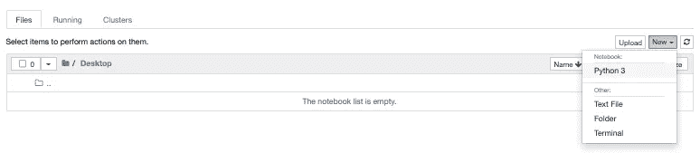
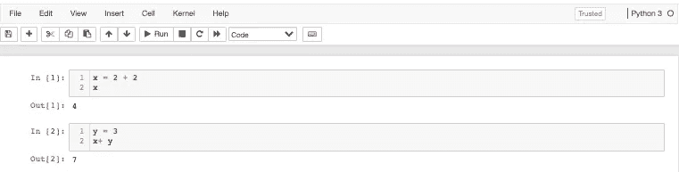

# 只需遵循以下几个步骤来编写第一行代码

> 原文：<https://medium.com/nerd-for-tech/just-follow-these-steps-to-write-your-first-line-of-code-c0cbd6474838?source=collection_archive---------18----------------------->

您想尝试编写代码，但不知道从哪里开始？只需遵循这几个步骤。


由[大卫·伊斯坎德尔](https://unsplash.com/@diskander?utm_source=unsplash&utm_medium=referral&utm_content=creditCopyText)在 [Unsplash](https://unsplash.com/s/photos/getting-started?utm_source=unsplash&utm_medium=referral&utm_content=creditCopyText) 上拍摄

当我第一次开始编码时，我花了很长时间才找到确切的开始方法。是的，互联网上有大量的信息试图解释这是怎么回事。但是大部分信息都不够具体，忽略了如何开始的一些重要部分。与此同时，一些信息相互冲突，使它变得极其混乱。我只是想试着开始编码，但是开始太难了。

我决定写这篇博客来帮助那些只想尝试并立即开始编码的人。你可以选择你的语言和你以后想专注的领域。只需遵循这几个步骤来编写您的前几行代码。

我们将使用的编码语言是“Python ”,我们的 IDE 将是“Jupyter Notebook”。你可以把 IDE 看作是一个用来编写代码的软件。可以这样想:如果你用微软的 Word 来写你的文章，我们将会用 Jupter Notebook 来写你的 Python 代码。

**第一步:下载‘蟒蛇’**


图片来自 Anaconda 网站

 [## 安装— Anaconda 文档

### 在安装 Anaconda 个人版之前，请阅读下面列出的系统要求。如果你不想要…

docs.anaconda.com](https://docs.anaconda.com/anaconda/install/index.html) 

Anaconda 基本上是一个软件包和语言，可以让您开始用 python 或 R(这两种语言在数据分析中都很有用)编写代码。有很多有用的软件可以用来分析数据。你可以从上面的链接下载。

**第二步:打开“Anaconda”并选择“Jupyter 笔记本”**



来自 Anaconda 的截图

一旦你下载了 Anaconda，你必须打开它。一旦你打开它，你会遇到一堆软件，你可以在以后探索。现在，只需选择“Jupyter 笔记本”。

**第三步:制作一个 python 文件**



来自 Jupyter 笔记本的截图

一旦你选择了 Jupyter Notebook，你会看到你的终端弹出，吐出一堆外星语言，突然一个标签出现在你的互联网浏览器上。不要慌；这是完全正常的。

你将看到的是你的文件目录。为了使事情变得简单，只需转到你的“桌面”文件并创建一个新的 python 文件。

**第四步:开始编码！**



来自 Jupyter 笔记本的截图

```
x = 2 + 2
xy = 3
x + y
```

太好了，现在你终于可以开始编码了。我们会让它变得超级简单。只要复制上面的代码，恭喜你！您已经编写了前几行代码。

希望这能帮助任何想快速开始写代码的人。有很多信息可以帮助你开始编写更复杂的代码。这篇博客更侧重于让你开始，因为对于任何想开始的人来说，设置好一切实际上是一个很大的障碍。干杯:)