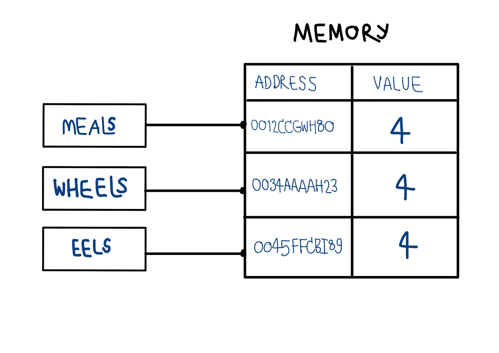
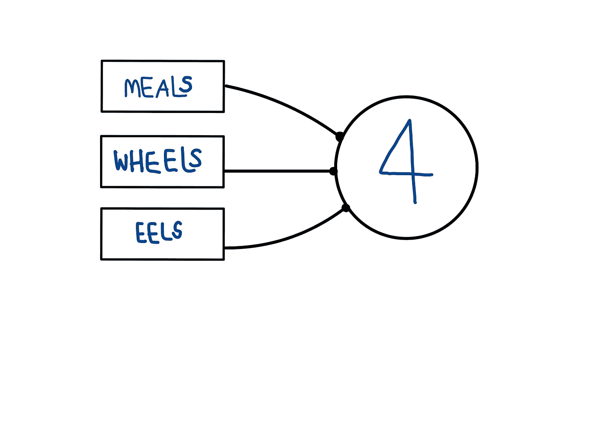

# 只是 JavaScript:我从中学到了什么？

> 原文：<https://medium.com/nerd-for-tech/just-javascript-what-i-learnt-from-fa91a1400858?source=collection_archive---------2----------------------->

[**Just JavaScript**](https://justjavascript.com/) 是由 [**丹·阿布拉莫夫**](https://twitter.com/dan_abramov) 提供的课程，号称 React 团队的一员，也是 Redux 和 Create React App 的合著者。


天空中漂浮的星星类似于 Javascript 的原始值和非原始值

**免责声明**:本文的目的不是总结课程内容，也不是回顾它，而是记录它对我的影响。

我发现 [Just JavaScript](https://justjavascript.com/) 的主要目标是(重新)创建我如何感知 JavaScript 原始值和非原始值的心理模型。

作者用天空中漂浮的星星来说明 Javascript 原始值和非原始值的概念，即**原始值**是遥远的星星，我们可以指向它们，但它们不能被创建、改变或破坏，而**非原始值**就像漂浮在地球附近的小行星，我们可以触及并操纵它们。这个心智模型将贯穿整个课程。

带着疑问，我从好奇心开始——我将从这门课程中获得什么。然而，这种类比与我以前所了解的相矛盾。从课程中选一个例子作为例子。

```
let meals = 4;
let wheels = meals;
let eels = 2 + 2;
```



**我之前的心智模型** : 3 个变量指向 3 个不同的记忆位置。它们中的每一个都存储相同的值



我的新心智模型:3 个变量连接到同一个包含 4 个 as 值的星星上

作者建议有两种方法来学习 JavaScript，从外部的**和从内部的**。第一个心理模型是我如何试图从外部感知 JavaScript**——值是存储在内存位置某处的字节序列，由这些变量指向。后一个忽略了实现细节，试图从“他所谓的”JavaScript 宇宙内部解释 JavaScript。******

****从一开始，我就发现自己在挣扎，因为我忍不住用这两个模型来来回回地映射概念。****

****后来，我发现在这个新模型中，我之前一直在纠结的以下 JavaScript 概念更容易推理。像**不可变**这样的概念——原始值不能改变，(当给一个变量赋值时)我们只需改变连线(变量)指向新值，**对象突变——第一个对象的**属性可以连线到第二个对象(在这种情况下，我们通常称之为*中的**嵌套对象**从外*模型)， 并且只有当有一个新的连线指向同一个对象并且改变了它的属性时，新的值才会在两条连线上都可见(大多数时候这会导致意想不到的行为！ )，而 **prototype —** JavaScript 对象可以有另一个对象作为原型，链接是通过 __proto__ wire 完成的。****

****你可以在[上找到这个课程，只是 Javascript](https://justjavascript.com/) 仍然在**出售**！！****