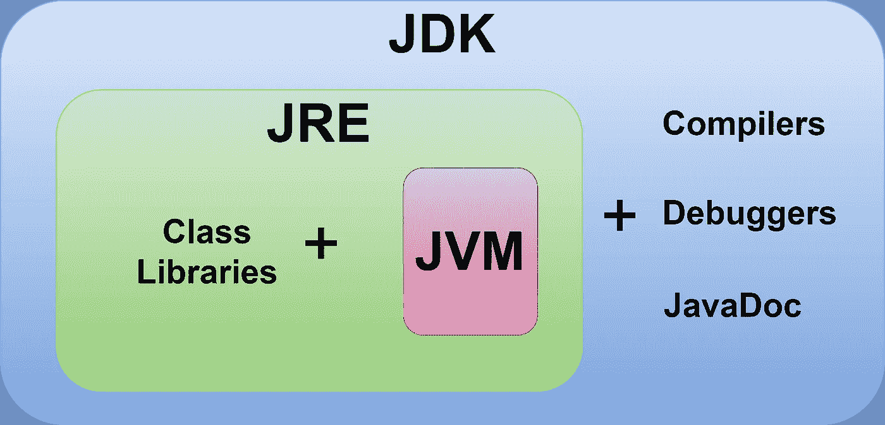
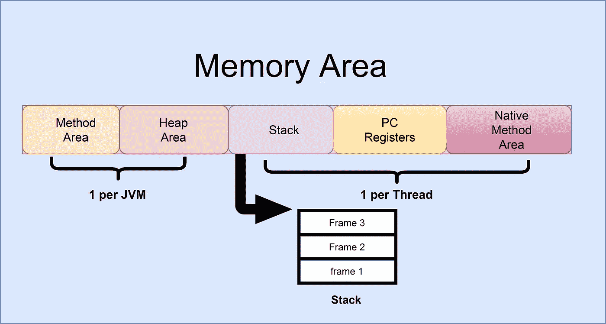

# JVM 架构

> 原文：<https://medium.com/nerd-for-tech/jvm-architecture-8898cc86ad83?source=collection_archive---------8----------------------->

在我们学习一项新技术之前，我们必须首先了解和理解它的基本原理。每个 Java 开发人员都必须理解一些基础知识，比如 Java 如何工作和 JVM 体系结构，以便在实际场景中有效地创建 Java 程序并对其进行故障排除。本文将为您提供理解 JVM 架构所需的知识，希望对您有用。

# **JAVA 环境**

JDK 建筑

在深入 JVM 体系结构之前，让我们先看一下 Java 环境的概述，比如 JVM 附带的 JDK 和 JRE。

## JDK

*   作为 Java 开发人员，我们必须在我们的生产环境中安装和配置 **JDK (Java 开发工具包)**，以便构建和运行 Java 程序。JDK 是完整的开发环境。它包括 JRE 和开发工具，如编译器(javac)、归档器(jar)、文档生成器(Javadoc)等。

## Java 运行时环境

*   **JRE** 是**“Java 运行时环境”的缩写。JRE 提供了运行 Java 程序的最低要求。没有 JRE，任何 java 应用程序都无法运行。JRE 包含 Java 虚拟机(JVM)、核心类和支持文件。**
*   通常 JRE 和 JDK 是捆绑在一起的。但是如果我们的目的只是执行一个 java 应用程序，那么我们可以在没有 JDK 的情况下安装 JRE。

> 注意:- JDK 是给开发者的，JRE 是给用户的。

# JVM 是什么？

**JVM** 代表**“Java 虚拟机”**。**JVM 的职责是将 java 字节码作为输入，并将其转换为底层操作系统(OS)可以理解的机器码。**

*****JVM 真的存在吗？*** 答案是 ***不是*** ，顾名思义是虚拟机。我们不能安装或卸载 JVM，因为 JVM 完全是一个规范。当我们下载 JRE 时，JVM 与 JRE 一起提供。当我们安装 JRE 时，它会部署所需的代码来创建一个 JVM 实例。**

> **注意:- JRE 与平台紧密相关，而 JVM 与平台无关，因为 JVM 是一种规范。例如:如果我们在 windows 平台上安装 JRE 的 windows 版本，JRE 会部署所需的代码，以便在 windows 平台上创建一个 JVM 实例。如果我们在 Linux 平台上安装 Linux 版本的 JRE，JRE 会部署所需的代码，以便在 Linux 平台上创建一个 JVM 实例。**

**因此，当我们执行一个 java 应用程序时，一个全新的 JVM 实例被创建，当应用程序结束时，JVM 也被销毁。因此 JVM 驻留在 RAM 上。为了更容易理解，假设我们的系统中有三个 Java 应用程序同时运行，那么我们的系统中将有 3 个 JVM 在运行，如果这三个中的一个结束了它的执行，那么我们的系统中将只剩下 2 个 JVM。如果我们的系统上没有运行 java 应用程序，这意味着我们的系统中没有可用的 JVM 实例。**

**所以现在你可能想知道 ***当一个 Java 应用程序被执行时，一个 JVM 实例是如何被创建的，当应用程序结束执行时，这个 JVM 实例是如何被销毁的？。*** 嗯，这是怎么回事。**

*   **当您执行一个 java 类文件(。class)使用 java 关键字，*(例如:Java hello world)*Java 关键字将请求您的底层操作系统创建一个 JVM 实例。因此，将创建一个 JVM 实例和一个非守护线程(用户线程)来执行 java 应用程序。**
*   **JVM 有一条规则，规定如果发生以下任何事件，JVM 必须被销毁。**

> **1)如果所有非守护进程线程(用户线程)都结束了它的执行(如果没有可用的非守护进程线程)，那么应该销毁 JVM 实例。**
> 
> **2)如果 java 应用程序使用 *System.exit()方法*杀死自己，那么 JVM 实例应该被销毁。**

**你有没有想过 Java 中的**“编写一次，随处运行”(WORA)** 概念是如何工作的？以上是它的理由。编译后的 Java 字节码将由 JVM 执行。因为 JVM 是独立于平台的，所以 java 应用程序也可以在任何能够启动 JVM 实例的平台上运行。**

# **JVM 的组件**

**JVM 由三个组件组成，它们是**

1.  **类加载器。**
2.  **记忆区。**
3.  **执行引擎。**

**让我们更深入地了解一下每个组件。**

# **类加载器**

**类装入器的主要职责有三。**

1.  **装货**
2.  **连接**
3.  **初始化**

## **装货**

**JVM 的 Classloader 子系统负责**加载类文件**(。class)存储在**存储区**中。每当我们运行 java 程序时，类装入器首先装入它。每当 JVM 加载一个类时，它都会在**方法区**中存储以下信息。**

*   **加载的类的完全限定名。**
*   **加载的类的直接父类。(如果没有父类，JVM 会将加载的类作为父类)**
*   **是否该”。“class”文件是一个类、接口或枚举。**
*   **关于修饰符、变量和方法信息的细节，等等。**

**当 JVM 第一次加载用户定义的类时，JVM 会生成一个类类型对象，并将用户定义的对象分配给它，并将其存储在堆内存中。这个类类型对象是在 **java.lang 包**中预定义的类的对象。程序员将使用这些类对象来获取类级别的信息，如类名、父名、方法和变量信息等等。在加载过程之后，将进行链接过程。**

## **连接**

**我们可以把链接分为三个主要部分。他们是，**

1.  **确认**
2.  **准备**
3.  **解决**

**让我们更深入地看看每个主题**

## ****1。验证****

**Java 为其应用提供了安全性。JVM 有一个**字节码验证器**来确保安全。这个字节码检验器检查加载的类是否是用合法的编译器编译的，加载的类的结构和格式是否正确，等等。在验证过程中。如果这些测试中的任何一个失败，JVM 都会抛出一个 **"java.lang.VerifyError"** 错误。如果加载的类通过了验证过程，那么准备过程将开始。**

## **2.准备**

**Java 的数据类型有一个默认值。例如:一个对象的默认值是 null，对于 int 它是零，对于 boolean 默认值是 false 等等。在准备过程中，JVM 为每个实例和静态变量分配默认值**和**。**

> **注意:请注意，在准备阶段，JVM 为变量分配默认值，而不是初始值。比如:*int a = 10；*对于这段代码，JVM 没有给变量“a”赋 10，而是赋零，因为 Int 的缺省值是零。**

## **3.解决**

**在解析过程中，JVM 将加载的类的符号链接转换成直接链接。换句话说，它替换了类和变量等的符号名。用直接分配的内存地址。**

**在链接过程之后，将进行初始化。**

## **初始化**

**在这个阶段，JVM 将为每个变量分配实际(初始)值。此外，如果该类包含一个静态块，它将被执行。**

> **JVM 有一个规则，声明在一个类成为活动使用之前，初始化过程必须发生。一个类有 6 种方法可以被激活使用。**
> 
> **1.使用“new”关键字(for ex:Employee = new Employee()；)**
> 
> **2.调用静态方法**
> 
> **3.给静态变量赋值**

**注意:如果我们将“ **final** ”关键字与“static”关键字一起使用，那么 JVM 不会将该类视为“活动使用”。**

> **4.有主要方法的**
> 
> **5.实例化子类**
> 
> **6.使用反射 API &通过获取对象类型方法返回一个对象**

# **存储区**

**内存区域是 JVM 用来存储数据的地方。存储区分为 5 个子区。**

****

**存储区**

## **方法区域**

**所有类级别的信息，如类名、直接父类名、方法和变量信息(包括静态变量等)都存储在方法区域中。方法区域是共享资源，每个 JVM 只有一个方法区域。**

## **堆区域**

**堆区域存储所有对象信息。每个 JVM 将有一个堆区域。这也是一种共享资源。**

## **堆**

**堆栈保存方法信息，如局部变量。JVM 为每个线程创建一个运行时堆栈。每次调用方法时，都会在堆栈中创建一个新的框架(push ),用于存储方法调用。一个方法的所有局部变量都将存储在它们对应的框架中。当方法调用结束时，框架也被销毁(pop)。当相应的线程 get 终止时，堆栈被 JVM 销毁。这不是共享资源。**

## **PC 寄存器**

**线程的执行指令存储在 PC 寄存器中。如果该方法是非本机方法，PC 寄存器将保存关于下一次执行的信息。Pc 寄存器是为每个线程创建的。**

## **本机方法区域**

**如果 JVM 访问任何本机方法，则本机方法信息存储在本机方法区域中。**

> **本地方法是用 Java 以外的语言(通常是 C/C++)编写的方法。**

**每个线程都会创建一个本机方法区域。**

# **执行引擎**

**加载之后，字节码在执行引擎中执行。执行引擎包含 3 个主要组件。**

1.  **解释者**
2.  **JIT 编译器(实时编译器)**
3.  **垃圾收集器**

## **解释者**

**解释器读取字节码并逐行执行。解释器的缺点是当一个方法被调用多次时，解释器每次都必须执行新的解释，导致执行速度变慢。**

## **JIT 编译器(实时编译器)**

**JIT 编译器克服了解释器执行缓慢的问题。它首先将所有字节码编译成本机代码(机器码)。那么将为重复的方法调用的执行提供本机代码。执行本机代码比逐行解释指令要容易得多。由于本机代码存储在缓存中，编译后的代码运行速度会更快。**

## **垃圾收集器**

**如果没有对一个对象的引用，就说它是不可达的。当对象不再被引用并且不能被 JVM 直接访问时，垃圾收集器从堆中移除对象并回收未使用的内存。通常，垃圾收集由后台守护线程处理。**

**除了上面提到的之外，JVM 中还有另外两个组件。分别是 **Java 原生接口(JNI)** 和**原生方法库。****

## **Java 本地接口(JNI)**

**用于与本地方法库交互的 Java 本地接口，这是程序执行所必需的。**

## ****本地方法库。****

**这是执行引擎执行程序所需的 C/C++本地库的集合。这可以通过提供的本机接口来访问。**

# **参考**

**2016.*什么是 JVM — Java 虚拟机*。[视频]可在:<【https://www.youtube.com/watch?v=bUtIIWbaFKc &list = RDCMUCi5H-zh 48 t5tjsax 636 dn2a&index = 2>【2021 年 5 月 6 日访问】。**

**极客之福。2021.*JVM 是如何工作的——JVM 架构？— GeeksforGeeks* 。[在线]可在:<[https://www.geeksforgeeks.org/jvm-works-jvm-architecture/](https://www.geeksforgeeks.org/jvm-works-jvm-architecture/)>【2021 年 5 月 6 日访问】。**

**[www.javatpoint.com。2021 年。 *JVM | Java 虚拟机—Java point*。[在线]可在:<](http://www.javatpoint.com.)[【https://www.javatpoint.com/jvm-java-virtual-machine](https://www.javatpoint.com/jvm-java-virtual-machine)>【2021 年 5 月 6 日访问】。**