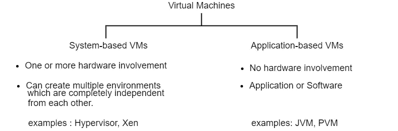
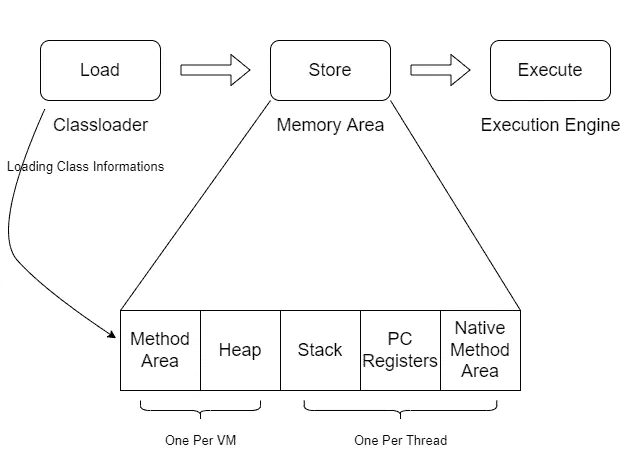

# JVM 解释🤔

> 原文：<https://medium.com/nerd-for-tech/jvm-explanation-85733bccd8df?source=collection_archive---------1----------------------->

[https://D1 ry TVR 7 gmk 1 sx . cloudfront . net/WP-content/uploads/2019/02/istock-954641818 . jpg](https://d1rytvr7gmk1sx.cloudfront.net/wp-content/uploads/2019/02/istock-954641818.jpg)

J ava 是 Oracle 于 1995 年创建的一种高级、平台独立和面向对象的编程语言。

> 在深入研究 Java 之前，我们必须了解 JDK、JRE 和 JVM 之间的区别。

**JDK** :- Java 开发套件(JDK)是一个软件开发套件，包括开发工具。它提供了一个开发和执行 java 代码的环境。

**JRE** :- Java 运行时环境是 JVM 的**实现。它为 java 程序提供了一个运行时环境。**

**JVM** :- Java 虚拟机是物理上不存在的抽象机器。因此，它既不能像其他软件一样安装，也不能卸载。JVM 是一个**规范**，它规定了事情应该如何完成。

# **虚拟机的类型**

有两种类型的虚拟机。

1.  基于系统的虚拟机
2.  基于应用的虚拟机(基于流程的虚拟机)

虚拟机的类型及其差异

此外，执行 java 程序将在您的计算机上创建一个 JVM 实例。

> 示例:当有两个 java 程序同时执行时，有两个 JVM 实例。

当有一个 JVM 实例时，一个[非守护线程](https://www.geeksforgeeks.org/difference-between-daemon-threads-and-user-threads-in-java/#:~:text=Daemon%20threads%20are%20low%20priority,used%20to%20perform%20supporting%20tasks.)也在那里。JVM 实例有两种被销毁的方式。

1.  当不存在非守护线程时。
2.  当程序调用 system.exit()方法时。

> 因此，只有当应用程序运行或者至少有一个非守护线程存在时，JVM 才存在。

# JVM 组件

想象一个孩子想把球扔到网里。首先，他需要从很多球中取出一些球，然后把它们存放在一个篮子里，最后，他可以把球扔到网上。当我们将这个场景应用于 JVM 时，JVM 首先将类加载到区域中，然后将它们存储在内存区域中，最后通过执行引擎执行它们。

> JVM 有三个组成部分。那些是，

1.  类加载器
2.  存储区
3.  执行引擎

> 现在让我们关注 JVM 的结构

JVM 的结构

## 类加载器

类加载器的主要职责是将类信息加载到内存区域。有两种类型的类装入器。

1.  引导类装入器
2.  自定义类加载器

类加载器有三个阶段，即**加载、链接、初始化。**

1.  **装载**

在加载类之前，JVM 在加载阶段会读取一些东西。

*   读取完全限定的类名。
*   读取直接父信息。
*   读取可变信息。
*   读取它是类、接口还是枚举。

JVM 读取上述事实后，类文件加载到内存区域。此外，当加载一个类时，JVM 第一次创建类类型对象并将其存储在堆中。

**2。链接**

链接又可以分为三个阶段——**验证、准备、解决。**

*   验证—在这里，一个名为**“字节码验证器”**的子程序检查该类是否来自**有效的编译器**，它是否具有**正确的格式**以及它是否具有**正确的结构**。要成功完成验证阶段，需要满足上述所有条件，否则将抛出“VerifierException”。
*   准备——在这个阶段，如果我们在类中使用任何静态变量或实例变量，它将分配一个默认值。
*   resolution——在 java 中，它允许我们在程序中使用特定领域的对象(业务对象),但是在进入机器级之前，JVM 用直接链接代替了符号链接。

**3。初始化**

在这个阶段，它分配实数值，并且执行静态块。**每个类在使用前必须被初始化。**

下面是考虑积极使用类的一些事情。在下面提到的任何活动使用之前，它必须经过初始化。

*   “新建”关键字。
*   静态方法的调用。
*   使用反射 API 加载类(getInstance)。
*   给静态字段赋值。
*   如果类是初始的(main 方法)。
*   实例化子类。

有四种方法可以初始化一个类。这些方法是使用“new”关键字、clone()方法、反射 API 和 IO。ObjectInputStram 类。

## 存储区

1.  方法区域—保存类信息的区域。
2.  堆—保存对象信息的区域。
3.  堆栈—保存局部变量信息的区域。
4.  PC 寄存器—保存下一次执行信息的区域(如果不是本机方法)
5.  本机方法区域—保存本机方法和方法信息的区域。

## 执行引擎

执行引擎由三个主要组件组成。**解释器，JIT 编译器，垃圾收集器**就是他们。执行引擎完成 JVM 和内存区域之间的通信过程。字节码的执行也发生在这里。

*   解释器——解释器读取字节码，并将其解释为机器码。
*   JIT 编译器——当解释器将字节码解释为机器码时，它每次都解释相同的方法，这提高了系统性能。JIT 编译器可以解决这个问题。它在运行时将字节码编译成本机代码。
*   垃圾收集器——垃圾收集器是一个非常有用的内存管理程序。它销毁堆中不可达的方法，并回收内存区域。

希望这篇文章能有所帮助，谢谢…:)

## 参考

[https://youtu.be/GzFdNzLB7iI](https://youtu.be/GzFdNzLB7iI)