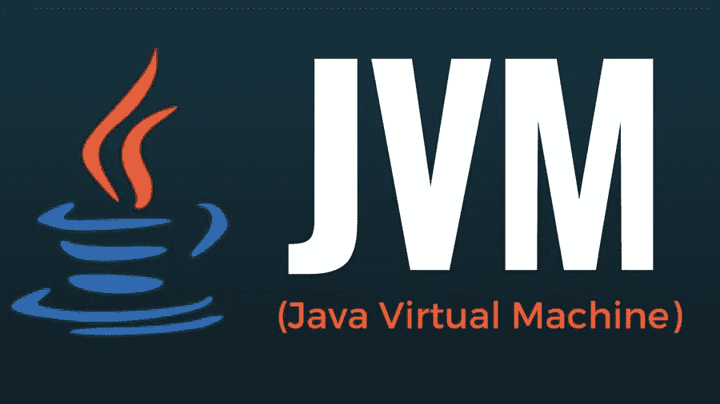
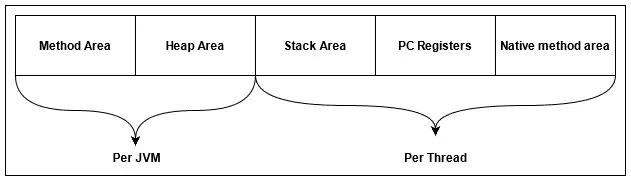
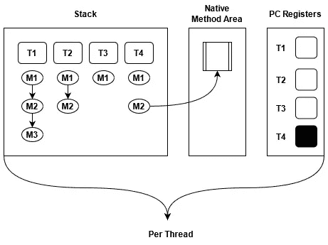
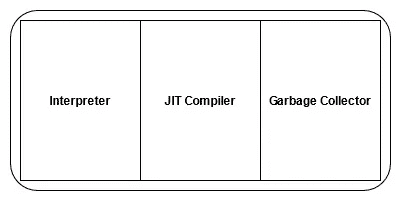

# 为初学者解释的 Java 虚拟机(JVM)架构

> 原文：<https://medium.com/nerd-for-tech/jvm-java-virtual-machine-architecture-explained-for-beginners-776eea4215ab?source=collection_archive---------2----------------------->



图片:signifytechnology.com

作为一名 Java 开发人员，理解 Java 虚拟机(JVM)架构以及 Java 如何高效地发挥其最大作用非常重要。看完这篇文章你会对 JVM 有一个基本的了解。

# Java 是什么？

Java 是一种跨平台面向对象的编程语言，由太阳微系统公司于 1995 年发布。现在，Java 应用于各个领域，如 Android 应用程序、Java Web 应用程序、交易应用程序、大数据技术等等。

它首先将源代码编译成字节码。然后在 Java 虚拟机(JVM)中，将字节码编译成机器码。


Java 架构(图片:javacodemonk.com)

JAVA 架构包括上图中提到的 3 个主要组件，

*   Java 开发工具包(JDK)
*   Java 运行时环境
*   Java 虚拟机(JVM)

## **Java 开发工具包(JDK)**

它是一个用于开发 java 应用程序的软件开发环境。包含 JRE 和 javac、jheap、jconsole 等开发工具。

## Java 运行时环境

JRE 是 JDK 的一部分，它构建了一个可以执行 Java 程序的运行时环境。它包含 Java 程序运行所需的库和软件。它获取 Java 代码并与所需的库集成，然后启动 JVM 来执行它。基于操作系统，JRE 将部署 JVM 的相关代码。

## Java 虚拟机(JVM)


虚拟机的类型

在进入 JVM 之前，我们先来看看 VM(虚拟机)。基本上，在物理硬件系统上，虚拟机(VM)是一个虚拟环境，充当虚拟操作系统，拥有自己的 CPU、内存、网络接口和存储。VM 中主要有两个类别，如上图所示，

1.  基于系统的虚拟机(SVM)

*   它是一个系统平台，允许共享主机的物理资源，同时各自运行自己的操作系统副本。

2.基于应用程序的虚拟机(AVM)或基于流程的虚拟机

*   在这里，它将允许在主机上作为应用程序运行单个进程。

# JVM 是什么？

它是一个引擎，提供运行 Java 应用程序的运行时环境，是 JRE 的一部分。我们都知道像 **C/C++** 这样的编程语言被称为**编译语言**是因为在这里，代码首先被编译成机器码。当我们谈到像 **JavaScript** 和 **Python** 这样的语言时，系统执行指令而不编译，所以这些被称为**解释语言。**

但是在 Java 中，使用两者的组合(编译器和解释器)。源代码(`.java`文件)先编译成字节码，生成一个类文件(`.class` 文件)。然后 JVM 将编译好的二进制字节码转换成特定的机器语言。最终，JVM 是一个软件程序的**规范**，它执行代码并为代码提供运行时环境。

例如，考虑有一个名为“***【Test.java】***”的 Java 文件。为了编译这个源代码文件，我们需要使用下面的命令。

```
javac Test.java
```

这里，当在命令提示符中调用“ **javac** ”时，它将读取 java 代码，然后编译成字节码类文件。所以要运行这段代码，我们需要使用如下带有关键字“ **java** ”的类名。

```
java Test
```

当“ **java** 关键字被调用时，它会请求操作系统创建一个 JVM 实例(**类应该是**`**public**`**`**void**`)并在 JVM 中，进入各个步骤，最后在执行引擎中，字节码会被编译成机器码。**

**对于每个程序，将有一个 JVM 实例将被创建。所以当程序结束时，JVM 实例将被销毁。与此同时，JVM 将创建一个非守护进程(用户线程)线程来执行 java 应用程序。**

**JVM 将在两种情况下被销毁，例如:**

1.  **如果没有运行非守护线程。此时，JVM 将强制终止所有活动的守护进程线程。**
2.  **如果 Java app 杀了自己(通过调用 System.exit()方法)。**

**而且很明显，JVM 一旦崩溃就会被摧毁。**

# **JVM 架构**

****

**JVM 架构图(图片:dzone.com)**

**JVM 中主要有三个子系统，如上图所示，**

1.  **类加载器**
2.  **运行时内存/数据区**
3.  **执行引擎**

# **类加载器**

**这个组件负责将类文件放到 RAM 中，因为 JVM 驻留在 RAM 中，它执行三个功能，比如加载、链接和初始化。**

# **装货**

**这个过程通常从加载主类开始(使用`main()`方法的类)。ClassLoader 读取`.class`文件，然后 JVM 在方法区域存储以下信息。**

*   **加载的类的完全限定名**
*   **可变信息**
*   **直接父信息**
*   **无论是类、接口还是枚举**

> **注意——JVM 第一次从一个**类**类型的对象为每个加载的 java 类创建一个对象，并将该对象存储在堆中。**

**JVM 中的三个主要的类装入器，**

1.  ****引导类加载器—** 这是根类加载器，是扩展类加载器的超类。这将加载位于`rt.jar`文件和一些其他核心库内的标准 java 包。**
2.  ****扩展类加载器—** 这是引导类加载器的子类，也是应用类加载器的超类。这负责加载目录中存在的类(`jre/lib/ext`)**
3.  ****应用程序类加载器—** 这是扩展类加载器的子类，负责从类路径加载类文件(类路径可以通过添加`-classpath` 命令行选项来修改)**

****JVM 中的四个主要原则，****

1.  ****可见性原则—** 这个原则规定子类的类加载器可以看到父类加载的类，但是父类的类加载器却找不到子类加载的类。**
2.  ****唯一性原则—** 这个原则声明由父类装入器装入的类不应该被子类再次装入。这确保了没有重复的类。**
3.  ****委托层次原则—** 该规则规定 JVM 遵循委托层次来为每个类加载请求选择类加载器。这里，从最低的子级开始，应用程序类加载器将收到的类加载请求委托给扩展类加载器，然后扩展类加载器将请求委托给引导程序类加载器。如果在引导路径中找到请求的类，则加载该类。否则，请求会再次传输回扩展类加载器级别，从扩展路径或自定义路径中查找类。如果它也失败了，请求返回到应用程序类加载器，从系统类路径中查找类，如果应用程序类加载器也未能加载所请求的类，那么我们得到运行时异常— `ClassNotFoundException`。**
4.  ****无卸载原则—** 这表明类装入器不能卸载一个类，即使它可以装入一个类。可以通过删除现有的类加载器来创建新的类加载器，而不是卸载。**

# **连接**

**这个过程可以分为三个主要部分，它们是:**

## **1.确认**

**这个阶段检查`.class`文件的正确性。字节码检验器将检查以下内容:**

*   **无论它是否来自有效的编译器(因为任何人都可以创建自己的编译器)。**
*   **代码是否具有正确的结构和格式。**

**如果缺少其中任何一个，JVM 将抛出一个名为“`java.lang.VerifyError`”的运行时异常。如果没有，那么将进行准备过程。**

## **2.准备**

**在这一阶段，对于所有静态变量，将根据数据类型分配内存并赋予默认值。**

> **object-null
> int-0
> boolean-false**

**例如，让我们考虑下面的代码行，**

```
boolean status=true;
```

**所以在这个阶段，它将检查布尔类型的代码和变量状态，因此 JVM 将 false 赋给该变量。(如上所述，布尔值的默认值为 false)**

## **3.解决**

**这是用直接引用替换符号引用的过程，它是通过搜索方法区域来定位被引用的实体来完成的。机器不理解我们给创建对象起的名字。因此 JVM 将通过用直接链接替换它们的符号链接来为这些对象分配内存位置。**

# **初始化**

**在这个阶段，原始值将被赋回代码中提到的静态变量，一个静态块将被执行(在 any 中)。在一个类中从上到下执行，在类层次结构中从父级到子级执行。最重要的是，JVM 有一条规则，规定初始化过程必须在类成为**活动使用之前完成。****

**主动使用的一类有，
1。使用`new`关键字。(例如:`Vehicle van=new Vehicle();`)。**

**2.调用静态方法。**

**3.给静态字段赋值。**

**4.如果一个类是初始类(用`main()`方法的类)。**

**5.使用反射 API ( `getInstance()`方法)。**

**6.从当前类初始化子类。**

**有四种初始化类的方法，**

1.  **使用`new`关键字—这将经历初始化过程。**
2.  **使用`clone();`方法——这将从父对象(源对象)获取信息。**
3.  **使用反射 API(getInstance())；)—这将经历初始化过程。**
4.  **使用 IO。ObjectInputStream()；—这将把来自 InputStream 的初始值分配给所有非瞬态变量**

# **运行时数据区**

**JVM 内存基本上分为以下五个部分:**

****

**存储区**

## **方法区域**

**这是在代码执行期间存储类数据的地方，它保存静态变量、静态方法、静态块、实例方法、类名和直接父类名(如果有的话)的信息。这是共享资源。**

## **堆区域**

**这是存储所有对象信息的地方，它是一个共享资源，就像方法区域一样。**

**让我们以下面的代码示例为例，**

```
Book book = new Book();
```

**所以在这里，有一个`Book`的实例被创建，它将被加载到堆区域。**

> **注意——每个 JVM 只有一个方法区域和一个堆区域。**

## **堆栈区**

**所有的局部变量、方法调用和程序的部分结果(不是本地方法)都存储在堆栈区域。对于每个线程，将创建一个运行时堆栈。堆栈区的一块被称为“**堆栈帧**，它保存方法调用的局部变量。因此，只要方法调用完成，框架就会被移除(POP)。因为这是一个堆栈，所以它使用了后进先出的结构。**

## **PC 寄存器(程序计数器寄存器)**

**这将保存线程的执行信息。每个线程都有自己的 PC 寄存器来保存当前执行信息的地址，一旦当前执行完成，它将在下一次执行时更新。**

## **本机方法区域**

**这将保存关于本地方法的信息，这些方法是用 Java 以外的语言编写的，比如 C/C++。就像堆栈和 PC 寄存器一样，将为每个新线程创建一个单独的本机方法堆栈。**

**请看下图，**

****

**让我们看看下面的示例代码，作为线程 1 (T1)的场景，**

```
M1(){
   M2();
}
-----------------
 M2(){
      M3();
 }
```

**当 M1 方法被调用时，第一个框架将在 T1 线程中创建，并从那里转到 M2 方法，此时第二个框架将被创建，并从那里转到 M3 方法，如上面的演示代码所示，因此一个新的框架将在 M2 下创建。**

**每当方法退出时，堆栈帧将被分别销毁。**

**但是在堆栈中的 T4 线程中，方法 M2 正在访问本机方法。因此，此时，PC 寄存器中的 T4 将为空或未定义，但它将保存所有其他 3 个线程的信息，如上图所示。**

# **执行引擎**

**这是执行字节码(`.class`)的地方，它逐行执行字节码。在运行程序之前，字节码应该被转换成机器码。让我们看看哪个部分负责这项任务。**

**主要地，执行引擎有三个主要组件用于执行 Java 类，**

****

**执行引擎的组件**

## **解释者**

**它负责将字节码转换成机器码。这是缓慢的，因为逐行执行，即使这解释字节码很快。解释器的主要缺点是，当同一个方法被多次调用时，每次都需要新的解释，这将降低系统的性能。这就是 JIT 编译器与解释器并行运行的原因。**

## **JIT 编译器(实时编译器)**

**这克服了解释器的缺点。执行引擎首先使用解释器逐行执行字节码，当它发现一些重复的代码时，它将使用 JIT 编译器。(例如:多次调用同一个方法)。那时，JIT 编译器将整个字节码编译成本机代码(机器码)。这些本机代码将存储在缓存中。因此，每当调用重复的方法时，这将提供本机代码。因为用本机代码执行比解释指令更快，所以性能会得到提高。**

## **垃圾收集工**

**这将检查堆区域是否有任何未被引用的对象，并销毁这些对象来回收内存。所以它为新的物体腾出了空间。这在后台运行，它使 Java 内存高效。这个过程包括两个阶段，**

1.  ****标记—** 在这个区域中，垃圾收集器识别堆区域中未被使用的对象。**
2.  ****Sweep —** 在这里，垃圾收集器从**标记中移除对象。****

**这个过程由 JVM 定期完成，也可以通过调用`System.gc()`方法来触发。**

# **Java 本地接口(JNI)**

**这用于与执行所需的本地(非 java)方法库(C/C++)进行交互。这将允许 JVM 调用这些库来克服 Java 中的性能约束和内存管理。**

# **本机方法库**

**这些是用其他编程语言(非 java)编写的库，如执行引擎所需的 C 和 C++。这可以通过 JNI 访问，这些图书馆的藏书大多以`.dll`或`.so`文件扩展名的形式。**

# **参考**

**我参考了下面的 YouTube 播放列表来写这篇文章，它是由 [Krishantha Dinesh](https://medium.com/u/26403c4bd160?source=post_page-----776eea4215ab--------------------------------) 制作的。**

**我还引用了以下内容来完成这篇文章，**

**[](/platform-engineer/understanding-jvm-architecture-22c0ddf09722) [## 理解 JVM 架构

### 理解 JVM 架构和 Java 在幕后是如何工作的，对每个 Java 来说都是一项重要的学习…

medium.com](/platform-engineer/understanding-jvm-architecture-22c0ddf09722) [](https://www.geeksforgeeks.org/jvm-works-jvm-architecture/) [## JVM 如何工作- JVM 架构？- GeeksforGeeks

### JVM(Java 虚拟机)充当运行 Java 应用程序的运行时引擎。JVM 实际上是调用…

www.geeksforgeeks.org](https://www.geeksforgeeks.org/jvm-works-jvm-architecture/) [](https://www.freecodecamp.org/news/jvm-tutorial-java-virtual-machine-architecture-explained-for-beginners/) [## JVM 教程-为初学者讲解的 Java 虚拟机架构

### 无论您是否使用过 Java 开发程序，您都可能听说过 Java 虚拟机(JVM ),网址是…

www.freecodecamp.org](https://www.freecodecamp.org/news/jvm-tutorial-java-virtual-machine-architecture-explained-for-beginners/)**