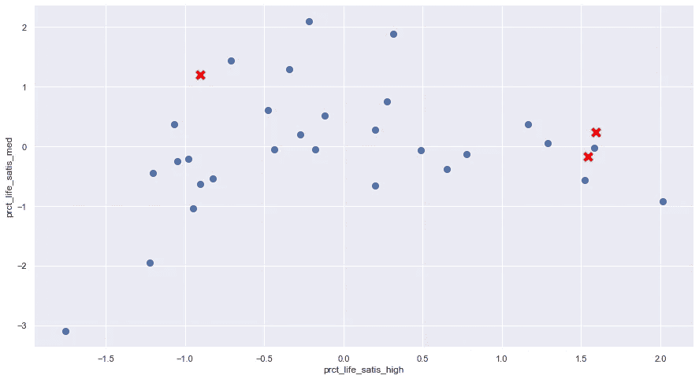
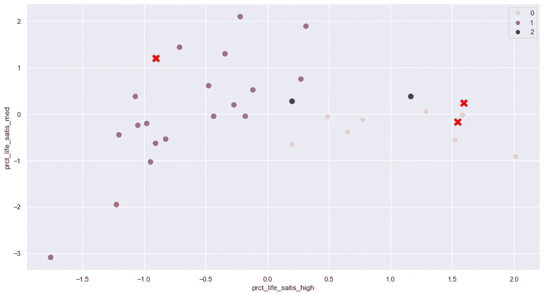
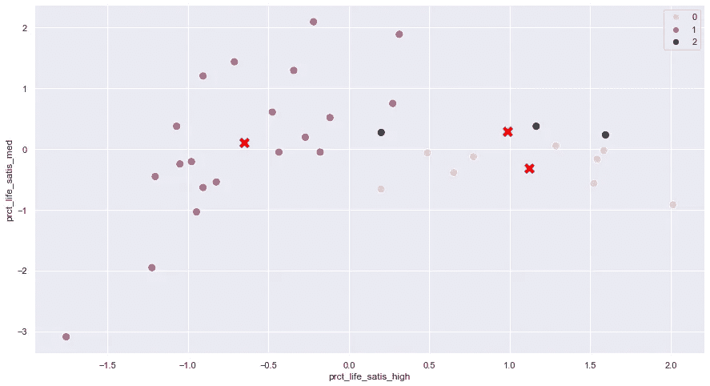
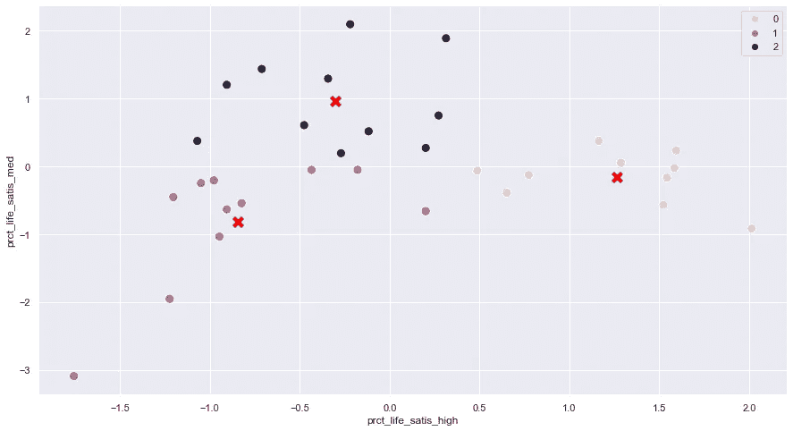

# K-means 算法:一个(非常)简单的 Python 实现

> 原文：<https://medium.com/nerd-for-tech/k-means-algorithm-in-4-parts-5dfe1d773303?source=collection_archive---------5----------------------->


Gert RDA valasevi it 在 [Unsplash](https://unsplash.com?utm_source=medium&utm_medium=referral) 上拍摄的照片

在本系列的中，我们将介绍 K-means 算法，从一个简单的 Python 实现开始，以理解其背后的逻辑。我们将了解如何选择最佳的集群数量，然后我们将转向约束版本，我们希望对集群施加最小或最大的大小限制。最后，我们将为 K-means 的变量选择构建一个简单的贪婪算法，这在我们处理具有许多特征的数据集时特别有用。

**K-means 背后的理念**

K-means 是一种无监督学习聚类算法，它有助于识别数据集中具有某些相似性的组(注意:数据集应该是标准化的)。这相当简单，由 5 个基本步骤组成:

**第一步:**选择聚类数:这里我们选择 k=3。在[第二部分](https://fmarthoz.medium.com/k-means-algorithm-in-4-parts-7540d0f33339)中，我们将看到如何最优选择 k。

```
k = 3
```

**第二步:**从数据集中选取 k 个随机点，作为质心。质心只是一组点的中心点，实际上它是该组中所有点坐标的平均值。

```
centroids=X.sample(k)
```

这可以从下面看出:



红色十字:随机选择 3 个数据点，用作步骤 2 中的质心

**步骤 3:** 将每个数据点分配到其最近的质心，并创建 k 个聚类

```
# for each row we calculate the distance to each centroid
    d=[]
    for i in range(0,k):
        d.append([distance(x[1],centroids.iloc[i,:]) for x in X.iterrows()])

# We assign each point to the nearest centroid
clusters=[]
d=np.asarray(d)
for j in range(0,len(d[0])):
    clusters.append(np.argmin(d[0:k,j]))
```



指定给最近质心的点，创建 3 个簇

**步骤 4:** 重新计算每个聚类的新质心

```
for m in range(0,k):
    centroids.iloc[m,:]=(centroid(X[pd.Series(clusters)==m]))
```

您可以在下面看到结果:



每个簇的新质心

**步骤 5:** 重复步骤 3 和 4，直到达到某些标准。这里我们简单地使用一组迭代次数，在本例中为 10 次:

```
iter=10
for j in range(0,iter):
    ... code ...
```

这不是最好的停止标准，最好是在质心从一次迭代到下一次迭代都没有变化时停止。

这是完整的代码。

在某些情况下，我们最终会得到大小非常不同的集群。有没有办法设置集群大小的上限和下限？这是第 3 部分的主题。



10 次迭代后 k=3 的最终结果