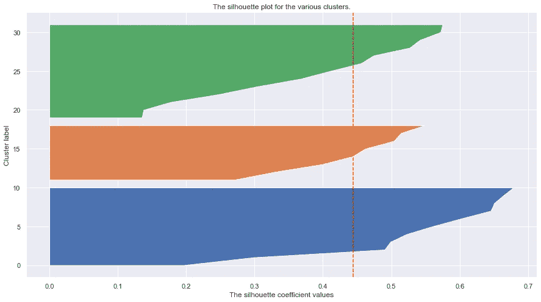
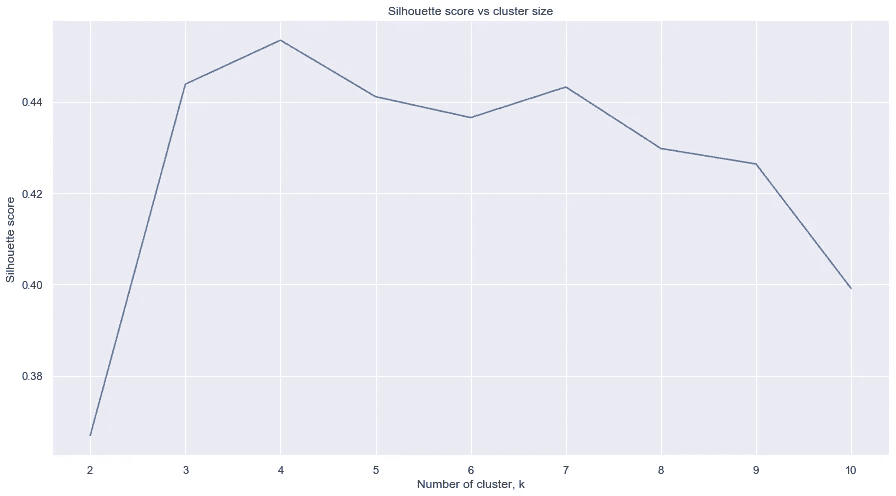

# K-Means:选择正确的聚类数

> 原文：<https://medium.com/nerd-for-tech/k-means-algorithm-in-4-parts-7540d0f33339?source=collection_archive---------8----------------------->

图片来源:吉菲([https://giphy.com/gifs/l41YtZOb9EUABnuqA](https://giphy.com/gifs/l41YtZOb9EUABnuqA))

有两种流行的方法:

1.  肘法
2.  剪影法

在本文中，我们将重点讨论剪影方法。剪影方法如下进行:

对于数据集中的每个数据点 I，我们计算:

a(i) =从该点到其簇中所有其他点的平均距离

b(i) =离最近簇中所有点的平均距离

该点的轮廓值为:

(b(i)-a(i))/max{a(i)，b(i)}

然后，可以将这些轮廓值绘制在数据集中每个点的轮廓图中，并按聚类分组:

```
sample_silhouette_values=silhouette_samples(X, clusters,metric='euclidean')
y_lower=0
for i in range(0,k):
    ith_cluster_silhouette_values = sample_silhouette_values[labels == i]
    ith_cluster_silhouette_values.sort()
    y_upper = y_lower+ith_cluster_silhouette_values.shape[0]plt.fill_betweenx(np.arange(y_lower, y_upper),0, ith_cluster_silhouette_values)
    y_lower=y_upper
plt.show()
```



红色表示每个点的轮廓值和平均值

轮廓分数就是所有点的轮廓值的平均值。

有一个 [sklearn 实现](https://scikit-learn.org/stable/modules/generated/sklearn.metrics.silhouette_score.html)用于剪影评分，非常好用。

# **选择最大化轮廓分数的聚类数**

现在，我们只需循环 k 的一系列值，并选择一个给出最高轮廓分数的值。我们使用 sklearn 中的 KMeans 方法来简化事情。

```
from sklearn.metrics import silhouette_scoresilhouettes = []
kmin = 2
kmax = 10for k in range(kmin, kmax+1):
# We fit the KMeans algo with k clusters kmeans = KMeans(n_clusters = k).fit(X)
    labels = kmeans.labels_# We calculate the silhouette score and append it to the silhouette list
    silhouettes.append(silhouette_score(X, labels, metric = 'euclidean'))plt.plot(range(kmin,kmax+1),silhouettes)
plt.show()
```

我们可以画出结果:



4 似乎是集群的最佳数量

在第 3 部分中，我们将了解如何设置集群大小的上限和下限。

**参考文献:**

[https://sci kit-learn . org/stable/auto _ examples/cluster/plot _ k means _ silhouette _ analysis . html # sphx-glr-auto-examples-cluster-plot-k means-silhouette-analysis-py](https://scikit-learn.org/stable/auto_examples/cluster/plot_kmeans_silhouette_analysis.html#sphx-glr-auto-examples-cluster-plot-kmeans-silhouette-analysis-py)