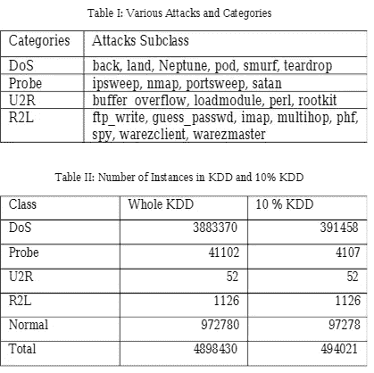
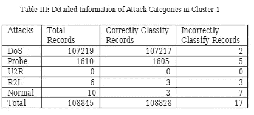
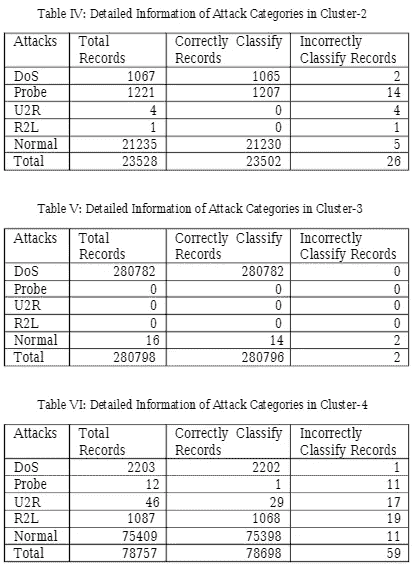
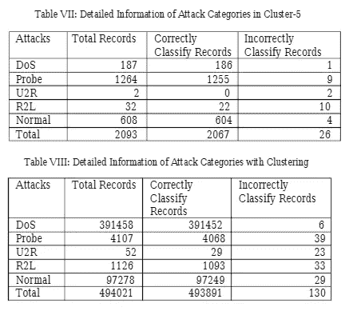

# K-means 聚类算法与网络入侵检测系统

> 原文：<https://medium.com/nerd-for-tech/k-means-clustering-algorithm-and-network-intrusion-detection-system-cd7b8de1ed75?source=collection_archive---------2----------------------->

[连浩曲](https://unsplash.com/@lianhao?utm_source=medium&utm_medium=referral)在 [Unsplash](https://unsplash.com?utm_source=medium&utm_medium=referral) 上拍照

## 目标:

入侵检测是一种计算机和网络安全管理系统。工业设计有许多途径和方法。每种方法都有优点和缺点。我们将在入侵检测系统中使用 K-means 方法。

## k 均值算法；

**K-means** 算法是一种迭代算法，它试图将数据集划分为“K”个预定义的不同非重叠子组(聚类)，其中每个数据点仅属于**一个组**。它试图使簇内数据点尽可能相似，同时保持簇尽可能不同(远)。它将数据点分配给一个聚类，使得数据点和聚类质心(属于该聚类的所有数据点的算术平均值)之间的平方距离之和最小。聚类中的差异越小，同一聚类中的数据点就越相似。

k-means 算法的工作方式如下:

1.  指定集群数量 *K* 。
2.  通过首先混洗数据集，然后为质心随机选择 *K* 个数据点来初始化质心，而无需替换。
3.  继续迭代，直到质心没有变化，即数据点到聚类的分配没有变化。

*   计算数据点和所有质心之间距离的平方和。
*   将每个数据点分配给最近的聚类(质心)。
*   通过取属于每个聚类的所有数据点的平均值来计算聚类的质心。

## IDS 的工作:

基于跟踪过程的 IDS 技术可以分为两种方法:

滥用/签名检测:该技术搜索网络流量中的签名攻击和已知签名，并用作检测未来攻击的参考。定期更新的数据库通常用于存储已知攻击的特征。这种技术控制入侵检测的方式类似于防病毒软件。这种类型的检测的优点是它可以准确有效地检测已知的攻击。

异常检测:该技术基于跟踪流量异常。监控通信量之间的间隙，并测量常规配置文件。基于用于测量流量特征偏差的度量，已经保留了该技术的不同实现。这种检测类型的优势在于它非常适合检测未知攻击。

## 基于网络的 IDS (NIDS):

NIDS 是一种网络方法，它直接从作为数据包监控的网络收集数据，而不是从特定的主机/代理收集数据。大多数 NIDS 都是免费且易于使用的操作系统。基于网络的入侵检测系统具有低成本、易部署、网络攻击检测、证据保存、实时跟踪和快速响应以及检测失败攻击等优点。

## 我们的方法:

基于对对象执行的距离测量的聚类，以及将对象(入侵)分类到聚类中。与分类不同，分类由于没有学习数据标签的信息，是一个无人值守的学习过程。对于异常检测，我们可以使用焊接和深入分析来指导 ID 模型。距离或相似性的度量在将观察值收集到同类组中起着重要的作用。提花亲和力测量，最长的共同秩序规模(LCS)，重要的是，该事件是唤醒大小，以确定是否正常或异常。欧氏距离大约是空间中两个向量 X 和 Y 的欧氏 n 维距离的大小，广泛用于向量空间。欧几里德距离可以定义为相同向量维数的总差的平方根。最后，分组和分类算法需要被有效地、大规模地引导，才有可能处理网络数据的维度和异构性。

因此，K 均值算法中涉及的步骤如下:

1.  将 k 个表示待聚类数据的点放入该空间。这些点表示主群质心。
2.  数据被分配给与质心相邻的组。

3.一旦分配了所有数据，所有 K 个质心的位置将被重新计算。

4.重复步骤 2 和 3，直到质心不变。

## KDDCup 99 数据集:

对任何入侵检测网络数据的评估都是极其困难的，这主要是因为无法获得网络连接样本的正确标记，因为入侵检测数据集被用作验证误用检测模型性能的样本。哥伦比亚大学的 KDDCup'99 数据集是从 DARPA 的入侵军事网络环境中使用 TCP 转储格式从嗅探器网络流量获得的网络连接中排列的。期限为七周。

数据集包括 41 个特征，将数据记录分类为正常攻击或一种类型的攻击。根据攻击的不同性质，特征包括 34 种数字特征和 7 种符号特征。

## 预处理:

为了使 KDDCUP 99 数据集适合数据挖掘学习算法，对其进行了预处理。执行预处理的原因如下。数据集中的每条记录都由分类特征和数字特征组成。文本(普通)数据用于分类特征。K-means 算法需要数值数据(离散或连续)。预处理的第一步是将这种分类特征属性转换为数字属性。为了将符号转换成数字形式，给每个符号分配一个整数代码。例如，在协议类型特征的情况下，0 被分配给 tcp，1 被分配给 udp，2 被分配给 icmp 符号，等等。数据集包含三个分类属性，而其余 38 个属性都是数字属性。属性的每个类别都有一个特定的编号。我们使用 K-means 来定义系统中的正常攻击和攻击。他们需要特定的格式，所以我们将数据集转换为 K-means 兼容格式。

## 实验结果:

K-means 算法用于将异构数据集生成近似同构数据集。K-means 算法的聚类结果如表 III 至表 VIII 所示:

通过分析聚类结果，在 cluster-3 中，拒绝服务(DoS)攻击的特征大多与自身相关。然后，它与 cluster-1 中的探测攻击的性质非常相似。探测攻击也大多与 cluster-1 中的 DoS 攻击有关。然后，在 cluster-5 中观察，这与正常的性质几乎相同。通过在 cluster-4 中的研究，正常攻击与用户到根攻击和远程到本地攻击在本质上非常相似。然后，通过研究 cluster-2 和 cluster-5，将 Normal 与 Probe 联系起来。通过查看所有 5 个集群，正常与所有攻击相关，因为攻击模仿入侵中的正常行为。然后我们应用随机森林算法来识别入侵和正常流量。从表 IX 到表 XIV 可以看出在 5 个 K-均值聚类中使用随机森林算法的攻击类别的性能。正常检测和攻击检测的准确率和召回率都很高，误报率几乎为零。

## 结论:

使用混合机器学习技术检测拒绝服务(DoS)攻击、探测(Probe)攻击、用户到根(U2R)攻击和远程到本地(R2L)攻击的比较分析。利用 K-means 算法可以知道攻击群的相似性。实验表明，KDDCup 99 数据集可以作为一个有效的基准数据集，帮助研究人员比较不同的入侵检测模型以及 K-means 聚类算法在网络安全领域的应用。

## 参考资料:

[https://www . researchgate . net/publication/324155493 _ An _ Analysis _ of _ K-means _ Algorithm _ Based _ Network _ Intrusion _ Detection _ System](https://www.researchgate.net/publication/324155493_An_Analysis_of_K-means_Algorithm_Based_Network_Intrusion_Detection_System)