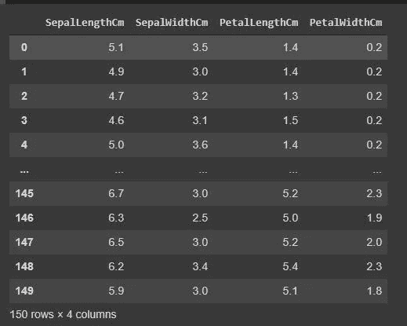
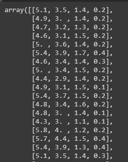
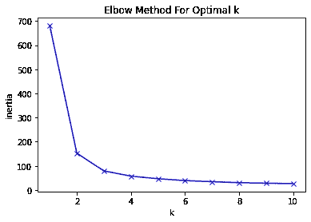
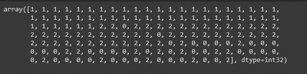
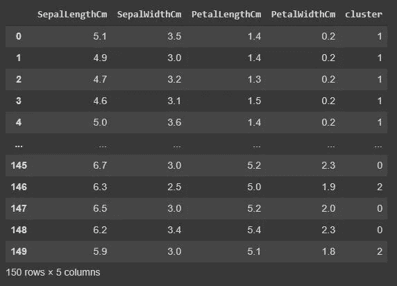
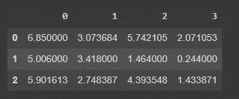
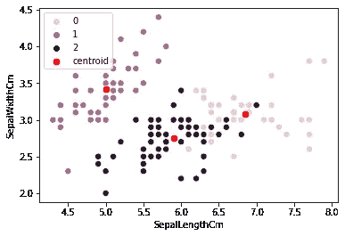

# K-Means 使用 Python 进行聚类

> 原文：<https://medium.com/nerd-for-tech/k-means-clustering-using-python-2150769bd0b9?source=collection_archive---------4----------------------->

以前我写过一个流行的监督学习算法，线性回归，在今天的帖子里我会写关于无监督学习算法，K-means 算法。K-Means 是一种简单且广泛使用的聚类算法。

K-Means 通常用于将特定的数据分组到某些类中，聚类本身属于无监督学习算法，这意味着在我们创建模型时，没有以前被标记的数据，也没有训练过程。

K-means 算法的步骤简单描述如下:

1.  决定将用于对数据分组的簇 k 的数量
2.  随机选择每个簇的中心/质心，显然，需要选择的质心的数量是基于你在步骤 1 中决定的簇的数量
3.  计算所有数据到所有 k 形心/中心聚类之间的距离
4.  将数据分配给与质心距离最近的聚类
5.  通过计算每个聚类的平均值来决定新的质心
6.  从步骤 3 开始重复该过程，直到质心值没有变化，或者当数据保持在同一聚类中时(数据没有移动到其他聚类)

如果有多个变量将被用作聚类的特征，为了计算数据和质心之间的距离，我们可以使用欧几里德距离公式，如果你对它感兴趣，可以谷歌一下，互联网上有很多资源，因为这里我不会解释欧几里德公式。

在这种情况下，我将使用爱尔兰样本数据集，就像往常一样，我将只使用 google colab 作为编码环境。我强烈推荐你使用 google colab 来练习 python 数据科学和分析，因为它非常轻便，易于使用。

我们开始吧…

首先，我们需要导入项目所需的所有库。在这里，我导入熊猫、seaborn、NumPy 和 matplotlib。当我们使用 python 时，这些库非常常见。

```
**#import library**
import pandas as pd
import seaborn as sns
import matplotlib.pyplot as plt
import numpy as np
```

下一步我将使用。熊猫图书馆的 read_csv 函数。

```
**#read Iris dataset**
data = pd.read_csv("/content/Iris.csv")
data
```

这里我们可以看到数据由 150 行和 6 列组成。为了对数据进行聚类，我们将只使用特性列，有 SepalLengthCm、SepalWidthCm、PetalLengthCm 和 PetalWidthCm。我们将放弃物种栏。


爱尔兰数据集

为了只获取特征数据，我将使用。iloc 函数和我会将新的数据帧存储在一个名为 kmeans_data 的变量中。

```
**#get the feature columns only**
kmeans_data = data.iloc[:,1:5]
kmeans_data
```

这里我们最终只得到特性列。



爱尔兰数据集(仅要素)

参考上一节中的 K-Means 算法步骤，我们需要做的第一步是选择聚类数，我们通常称之为 K。实际上有很多方法可以用来找到最佳的聚类数(K)，但在这篇文章中，我将只使用一种简单而流行的方法，称为 Elbow 方法。在肘形法中，选择的聚类数是图上肘形形成的位置。

首先，我们需要从上述特性中获取值，并以数组格式存储它们。

```
**#get the value from the features in array format**
features_value = kmeans_data.values
features_value
```



数组格式的特征值

在肘方法中，有两个度量用于定义 k-最优值，它们是失真和惯性。失真是每个数据点到质心的距离的平方和的平均值，而惯性只是数据点到聚类中心/质心的距离的平方和。这里的距离可以是欧几里德距离。

我们编写下面的代码来找出每个 K 数的惯性和失真。这里 K 值定义为从 1 到 11。为了求惯性，我们可以用函数。惯性 _。

```
**#finding the optimal number of k for clustering using elbow method**from sklearn.cluster import KMeans
inertia = []
K = range(1,11)
for k in K:
    km = KMeans(n_clusters=k)
    km = km.fit(features_value)
    inertia.append(km.inertia_)
    distortions.append(sum(np.min(cdist(features_value,
    km.cluster_centers_, 'euclidean'),axis=1)) /
    features_value.shape[0])
```

为了最终决定 K 的最佳值，我们需要绘制从前面的代码中得到的数据。这里我将给出惯性计算的图片，惯性和扭曲实际上给出相同的结果。

```
**#Plotting the inertia result to find the elbow**plt.plot(K, inertia, 'bx-')
plt.xlabel('k')
plt.ylabel('Sum_of_squared_distances')
plt.title('Elbow Method For Optimal k')
plt.show()
```



如果很难确定图形的哪一部分是肘部，我们可以使用 kneed 定位器库。通过使用 kneed 定位器，我们最终发现当 k = 3 时，肘部被定位。因此，我们将用于构建 K 均值模型的聚类数是三个聚类。

```
**#finding the elbow using kneed locator**from kneed import KneeLocator
kl = KneeLocator(range(1, 11), inertia, curve="convex", direction="decreasing")
kl.elbow
```


最佳聚类数

最后，我们可以像下面的代码一样应用 K 数= 3 的 K 均值聚类。我们得到每个数据点的聚类，以 numpy 数组表示。

```
kmeans = KMeans(n_clusters=3, random_state=100)
kmeans.fit(features_value)
y_kmeans = kmeans.predict(features_value)
y_kmeans
```



现在，我们可以添加一个新列来表示前一个数据框中每个数据的聚类，这里我将添加一个名为 cluster 的列。

```
**#Add new column to store the cluster** 
kmeans_data['cluster'] = y_kmeans
kmeans_data
```



具有簇列的新数据框

在可视化集群之前，我想找到每个集群的质心。

```
**#find the centroid**centers = np.array(kmeans.cluster_centers_)
centers
centroid = pd.DataFrame(centers)
centroid
```



每个聚类的质心

最后，让我们创建可视化。在这里，我基于两个第一特征创建可视化，SepalWidth 和 SepalLength。

```
**#last we will visualizing the clustering result using seaborn based on sepalwidth and sepalLegnth**sns.scatterplot(x = knn_data.SepalLengthCm, y =knn_data.SepalWidthCm, s = 50, c = knn_data.cluster, marker = "o", hue = knn_data.cluster)
sns.scatterplot(x = centers[:,0], y = centers[:,1], marker="o", color='r', s = 70, label="centroid")
```



参考资料:

[https://rubiks code . net/2020/10/05/回到机器学习基础知识聚类/](http://Reference Clustering)