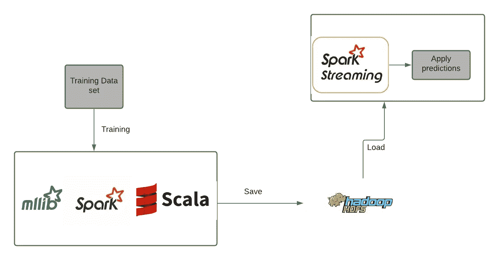
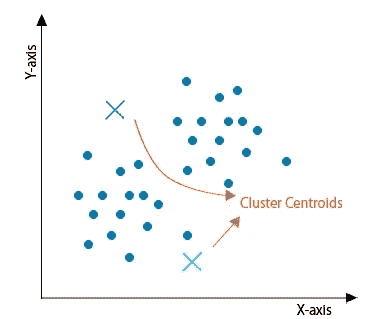
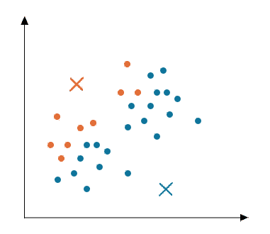
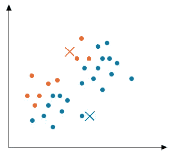
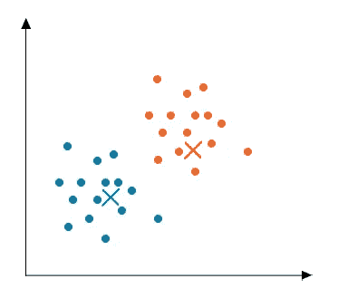
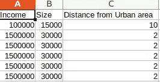

# k 表示使用 scala spark 和 mllib 进行聚类

> 原文：<https://medium.com/nerd-for-tech/k-means-clustering-using-scala-spark-11c1f82394a7?source=collection_archive---------1----------------------->

k 均值聚类是一种矢量量化的方法，用于将 **n** 个观察值划分为 **k** 个簇，每个观察值属于具有最近均值的簇。

在本文中，我们将演示

*   使用 mllib 训练 k 均值聚类模型，ml lib 是作为 apache spark 项目的一部分开发的。
*   在 HDFS 拯救我们训练有素的模特。
*   使用这个经过训练的模型进行预测。



**K 表示聚类**

考虑下面的例子

对于房地产公司，我们需要将他们的潜在客户分为两类。

A 类:愿意花高价购买一处房产。

**B 类**:不想花大价钱买房产。

为了解决上述问题(将所有客户分为两组)，我们收集了以下数据。

*   家庭成员年收入。
*   房子的大小。
*   远离市区。

根据上述特征(收集的数据),所有客户将被分为 A 类或 b 类。

**聚类**

聚类是一种无监督的学习方法，在这种方法中，我们试图找到 **n** 个观察值之间的关系。在上面的例子中，我们试图找出这三个特征之间的关系，并根据这些特征将所有的顾客归为两个组中的一组。

**K 表示算法**

K means 是一种无监督聚类算法，它将给定的数据点划分为一个聚类，其中数据点和质心之间的平方距离最小。


k 表示聚类

**K 步表示聚类**

*   **初始化**

将任意随机点初始化为群集的质心。



初始化

*   **集群分配**

初始化质心后，以质心和数据点之间的距离最小的方式分配数据点。



集群分配

*   **移动质心**

现在我们计算的 centriod 可能没有优化。计算数据点的平均值并移动质心。重复聚类分配，直到质心停止移动，如果质心移动已经停止，我们可以说我们的算法是优化的。



移动质心

*   **收敛**

现在我们可以说算法是收敛的，可以给出一个清晰的结果。



趋同；聚集

**使用 spark 和 Mlllib 训练和保存模型**

出于培训目的，我们采用了上述功能。样本训练集应该是这样的。



使用的样本训练集

> mllib 算法将输入类型作为 type **向量**，因此最初我们需要提取所有需要的特征。

从上述训练集中提取特征后，我们可以使用这些数据来训练我们的 K 均值聚类模型。这里我们取 2 作为我们的集群数。

```
**import** **org.apache.spark.mllib.clustering.KMeans**
**import** **org.apache.spark.mllib.linalg.Vectors****object** **KMeansClustering** {
  **def** main(args**:** **Array**[**String**])**:** **Unit** = {
    **val** conf **=** **new** **SparkConf**().setMaster("local").setAppName("testApp")

    **val** sc **=** **new** **SparkContext**(conf)
    **val** rdd **=** sc.parallelize(**List**(
      **Vectors**.dense(**Array**(**100000.0**, **15000.0**, **10.0**)),
      **Vectors**.dense(**Array**(**1500000.0**, **30000.0**, **2.0**)),
      **Vectors**.dense(**Array**(**1500000.0**,  **30000.0**, **1.0**))))
    **val** numClusters **=** **2**
    **val** numIterations **=** **20**
    **val** clusters **=** **KMeans**.train(rdd, numClusters, numIterations)
}
```

**逐步解释**

*   从 mllib 库中导入 K 均值。
*   将提取的要素转换为弹性分布式数据集(RDD)。
*   将分类数设置为两个(在训练期间，K 均值算法会将训练数据划分为这两个分类中的任何一个)。
*   使用训练集训练模型。

使用 **spark-submit** 运行上面的代码，我们的模型将被训练并准备好使用。现在让我们看看我们可以用这个训练好的模型做些什么。

**应用样本预测**

```
**val** testSet**=Vectors**.dense(**Array**(**100000.0**, **15000.0**, **10.0**))
**val** samplePrediction**=**clusters.predict(testSet)
```

定义一个包含样本数据的测试数据集。对这些样本数据应用预测。

**将训练好的模型保存在 HDFS 并加载以备将来使用**

```
clusters.save(sc,"sample_model")
```

*   save 函数将两个参数作为输入
*   **sc** 是 sparkcontext。
*   下一个参数是 HDFS 路径

```
**import** **org.apache.spark.ml.clustering.KMeansModel**
**val** model**=KMeansModel**.load("sample_model")
```

我们可以使用以 HDFS 路径为参数的加载函数来加载保存的模型。

**火花流**

Spark stream 用于从各种数据源读取流，如 apache kafka、HDFS、kinesis。我们还可以使用我们训练好的模型对流式数据进行预测。

```
**val** inputDF**=** spark.read.option("header",**true**).csv("/project/test/sample.csv").toDF()
**val** k**=**model.transform(inputDF)
```