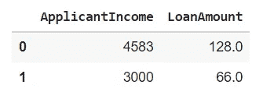
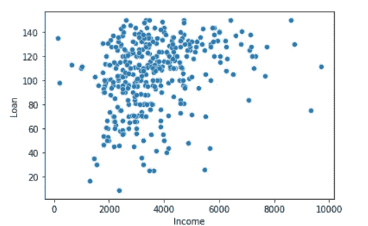
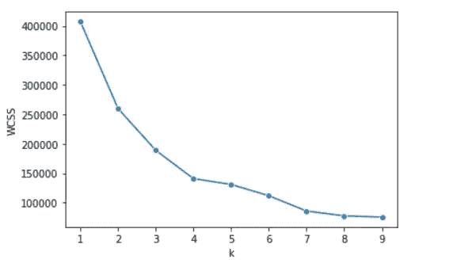
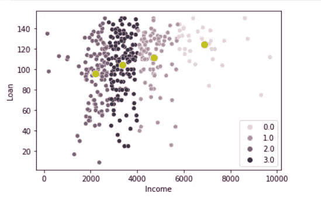

# K-Means 集群:Python 从头实现

> 原文：<https://medium.com/nerd-for-tech/k-means-python-implementation-from-scratch-8400f30b8e5c?source=collection_archive---------0----------------------->


图片来源:[朝向 AI](https://towardsai.net/p/machine-learning/a-simple-and-scalable-clustering-algorithm-for-data-summarization)

**聚类**是根据数据中的模式将整个数据分成组(称为**聚类**)的过程。这是一个无监督的机器学习问题，因为这里我们没有目标变量，我们只根据它们的相似性对数据点进行分组。

**集群的属性**

1.  一个聚类中的所有数据点彼此相似。
2.  来自不同聚类的数据点尽可能不同。

**聚类的应用**

1.  客户细分
2.  推荐系统
3.  图象分割法
4.  文档聚类

**K 均值算法**

> *K-Means 算法的主要目标是最小化数据点与其各自聚类质心之间的距离总和。*

本文的范围只是使用 python 从头开始实现 k-means。如果你是 k-means 聚类的新手，想了解更多，可以参考[这篇](https://www.analyticsvidhya.com/blog/2019/08/comprehensive-guide-k-means-clustering/#k-means-clustering-python-code)惊人的文章。

现在，让我们直接进入实现。您也可以从[这里](https://colab.research.google.com/drive/1xEmSwgKk_VXbI2GBwi56aPbRGk7Uy7Wb?usp=sharing)访问下面给出的代码。点击从[下载数据集。](https://drive.google.com/file/d/16kLeQ2F8Dwj7Oiv3C1Bz7KXUfvXlsKtO/view?usp=sharing)

**导入库**

```
import numpy as npimport pandas as pdimport matplotlib.pyplot as pltimport seaborn as snsimport warningswarnings.filterwarnings('ignore')
```

**导入数据集**

```
data = pd.read_csv('clustering.csv')data.head()
```


这里，我们将只使用两个特征['ApplicantIncome '，' LoanAmount']，以便我们可以在 2D 平面上可视化集群。

```
data = data.loc[:, ['ApplicantIncome', 'LoanAmount']]data.head(2)
```



**转换为 numpy 数组**

```
X = data.values
```

**可视化数据点**

```
sns.scatterplot(X[:,0], X[:, 1])plt.xlabel('Income')plt.ylabel('Loan')plt.show()
```



**计算 WCSS**

```
def calculate_cost(X, centroids, cluster): sum = 0 for i, val in enumerate(X): sum += np.sqrt((centroids[int(cluster[i]), 0]-val[0])**2 +(centroids[int(cluster[i]), 1]-val[1])**2) return sum
```

**执行 K-Means**

```
def kmeans(X, k): diff = 1 cluster = np.zeros(X.shape[0]) centroids = data.sample(n=k).values while diff: # for each observation for i, row in enumerate(X): mn_dist = float('inf') # dist of the point from all centroids for idx, centroid in enumerate(centroids): d = np.sqrt((centroid[0]-row[0])**2 + (centroid[1]-row[1])**2) # store closest centroid if mn_dist > d: mn_dist = d cluster[i] = idx new_centroids = pd.DataFrame(X).groupby(by=cluster).mean().values # if centroids are same then leave if np.count_nonzero(centroids-new_centroids) == 0: diff = 0 else: centroids = new_centroids return centroids, cluster
```

**用肘法求 K 值**

```
cost_list = []for k in range(1, 10): centroids, cluster = kmeans(X, k) # WCSS (Within cluster sum of square) cost = calculate_cost(X, centroids, cluster) cost_list.append(cost)
```

在 WCSS 和 k 之间画一条线

```
sns.lineplot(x=range(1,10), y=cost_list, marker='o')plt.xlabel('k')plt.ylabel('WCSS')plt.show()
```



WCSS 在 k=4 之后没有减少很多，所以形成 4 个集群

**制作集群**

```
k = 4centroids, cluster = kmeans(X, k)
```

**可视化形成的集群**

```
sns.scatterplot(X[:,0], X[:, 1], hue=cluster)sns.scatterplot(centroids[:,0], centroids[:, 1], s=100, color='y')plt.xlabel('Income')plt.ylabel('Loan')plt.show()
```



我们可以清楚地看到四个星团的形成。绿点代表每个聚类的质心。这样我们就完成了 K-Means 算法的实现。这不是很简单吗？

希望你觉得这个博客有用。如果你喜欢它，那么**给它一个掌声，并跟随** **我**阅读我即将发布的博客。也看看我以前的一些博客:

1.  [朴素贝叶斯算法](https://khushijain2810.medium.com/naive-bayes-algorithm-implementation-from-scratch-f9a2a12789b5)
2.  [KNN 算法](/nerd-for-tech/k-nearest-neighbors-aac72032aaea?source=friends_link&sk=84ab45f698fe6bb81494f79f1aa53c7f)
3.  [线性回归](https://khushijain2810.medium.com/linear-regression-9fd219098405)
4.  [OpenCV](https://khushijain2810.medium.com/introduction-to-opencv-586e38d536fd)
5.  [Seaborn](https://khushijain2810.medium.com/seaborn-data-visualization-library-142ac64d5560)
6.  熊猫
7.  [数字价格](https://khushijain2810.medium.com/numpy-day-3-at-internity-foundation-efcef826e549)

快乐学习！