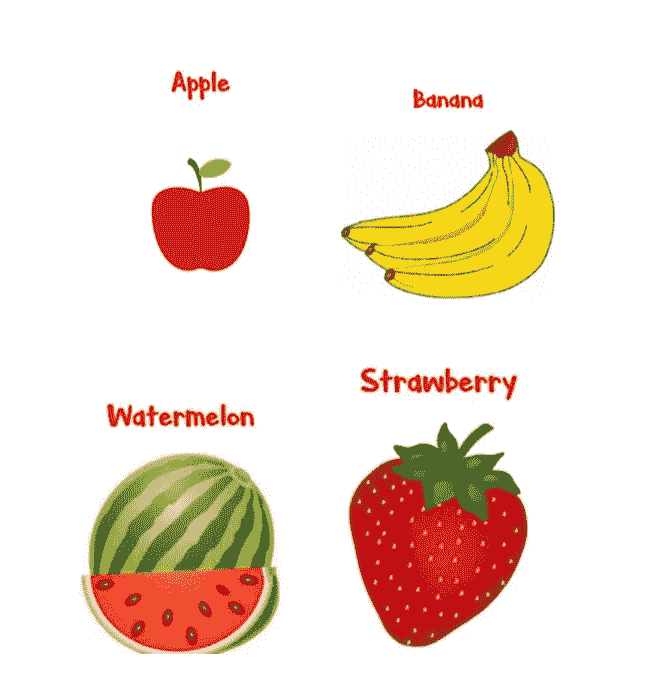
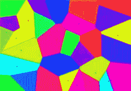
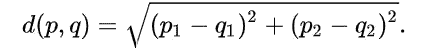
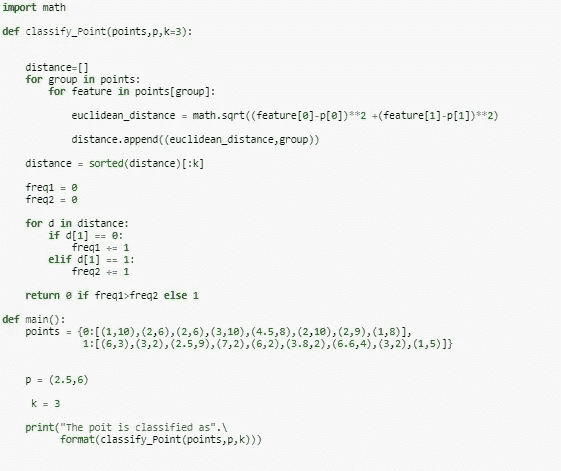
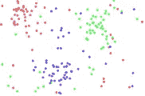
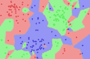
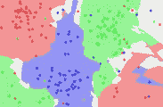

# k 最近邻居

> 原文：<https://medium.com/nerd-for-tech/k-nearest-neighbor-100e764a8809?source=collection_archive---------3----------------------->

**K 最近邻居格言:**

“我发现你最亲密的朋友是在你的团伙！”

k 最近邻是属于非参数学习范畴的最简单算法之一。我们可以将此算法用于回归以及分类问题。

**让我们一起探索 KNN 吧！！！**

k 最近邻(俗称 KNN)是一种监督学习算法，即，它依赖于被标记为能够学习函数的输入数据，当给定的新数据未被标记时，该函数有助于产生合适的输出。回归和分类都可以在监督学习算法下完成。

**理解监督学习的示例:**

让我们假设我们有一个朋友，我们试图向他解释苹果是什么样子的。

那么，我们该怎么办呢？

我们会给他看许多图片，其中一些有一个苹果(告诉他们这是一个苹果)，其余的有一些其他的水果，如西瓜，草莓，香蕉等。(告诉他们这不是苹果)有了这个方法，他就能学会区分苹果和其他水果。瞧。！我们让他知道水果是否是苹果，因此我们监管他们。这种学习被称为监督学习。

如果我们只是让我们的朋友学习，如果水果是一个苹果与否，这将被称为一个分类问题，而如果我们让他学习预测苹果的重量，可以持有的价值，如 75 克，80 克，65 克，70 克等。那么它将被称为回归问题。

**我们还是回到 KNN 吧！**

这个简单却被广泛使用的算法是由 [Thomas Cover](https://en.wikipedia.org/wiki/Thomas_M._Cover) 提出的，它有助于分类和回归，后者相信属于一个群体的事物彼此接近。更具体地说，输出取决于其在[特征空间](https://en.wikipedia.org/wiki/Feature_space)中给出的 *k* 最近的输入训练示例。KNN 也被称为懒惰学习者，因为它是基于实例的学习算法，在这种类型的学习中，已知机器用心学习训练实例，然后基于从所学习的训练数据获取的相似性度量来推广新的数据点。KNN 侧重于从一点到另一点的距离，以给出其结果。

从上面的图像我们可以看到，新的数据点接近第二类，因此，它将被归类为第二类。

从上面的图(称为 Voronoi 图)中，我们可以看到不同的区域用不同的颜色着色，因此新的数据点将根据它属于哪个彩色区域进行分类。

如前所述，KNN 使用测量两点间距离的方法来提供适当的输出结果。

有很多方法可以计算两点之间的距离，这取决于我们的数据和我们正在解决的问题的类型。我们用来计算距离的最常用公式是欧几里德距离:

其中(p1，q1)和(p2，q2)是必须计算其间距离的点。

**对点进行分类的 KNN 的简单实现:**

在上面的代码中:

1.我们创建一个函数 classify_point 来将我们的点 p 分类到其他已经存在的点中。

2.我们创建一个数组距离来存储从我们的点 p 开始的所有距离。

3.为了计算距离，我们使用欧几里得距离公式。

4.然后，我们将所有距离按升序排序并存储。

5.在上述实现中，我们只有两组点，即组 0 或组 1。

6.将检查整个距离阵列，并且如果 p 更接近组 1 中的更多点，则它将被分类到组 1 中，否则被分类到组 0 中。

7.然后，我们预先提到了用于分类的第 1 组点和第 0 组点。

8.p 分是因为被分类了。

9.给出了 k 值，它告诉我们的代码有多少最近邻要被考虑用于分类。

10.我们称我们的函数为点 p 的分类函数。

**在数据集上应用 KNN 时应遵循的一般步骤:**

1.加载数据集。

2.给定 K 值以指定要考虑的最近邻的数量。

3.根据数据计算要给出结果的点和当前点之间的距离。

4.将距离和用于计算的数据点的索引以排序的方式添加到一个数组中(按升序)

5.从排序后的数组中挑选前 K 个条目。

6.我们检查选定的 K 个条目的标签。

7.在回归问题的情况下，我们返回 K 个标签的平均值。

8.在分类问题的情况下；我们返回 K 标签的模式。

**如何选择合适的 K 值？**

为了减少错误数量，选择最合适的 K 值来正确分类我们的样本或在回归的情况下给出最合适的值是很重要的。这是通过用不同的 K 值运行我们的模型几次，直到我们得到满意的结果。

在选择 K 值时，我们需要记住以下几点:

1.不要选择一个非常小的 K 值，例如 K=1 或 K=2 不会给出一个非常令人满意的结果，因为它几乎没有任何点来进行假设。

2.通常一个大的 K 值会给出一个好的结果，但是记住要避免取太大的值，因为它可能会导致过度拟合。

3.如果我们在做一个分类问题，使用 K 值作为一个奇数总是一个好主意，这样我们就可以在其中一个类别中拥有更高的票数，避免出现平局的情况。

第一张图显示了数据集，第二张图显示了 K=1 时的分类，第三张图显示了 K=5 时的分类

**KNN 的利与弊:**

优点:

1.KNN 是一个非常容易理解和实现的算法。

2.由于 KNN 是一种基于记忆的算法，它会立即适应我们输入的新数据。

3.该算法可用于分类和回归。

4.我们只有一个超参数，即要调整的 K 值，因此降低了复杂度。

缺点:

1.KNN 很容易实现，但是随着数据集的增长，该算法的实现速度会变得很慢。

2.KNN 函数在输入变量数量少的情况下运行良好，但是随着变量数量的增加，该算法在预测新数据点的输出时面临困难。

3.为了给出正确的结果，选择正确的 K 值有时成为一个问题。

4.KNN 对异常值非常敏感，在数据不平衡的情况下无法正常工作。

**使用 KNN 的一些具体例子:**

1.它用于概念搜索，即试图搜索相似的文档。

2.它可以有效地用于推荐系统中，在推荐系统中可以向用户推荐相似的电影、产品或视频。

3.它在医学领域有着广泛的应用，如糖尿病比率和乳腺癌的预测。

4.它用于文本分类或文本挖掘。

5.它被用于农业目的，如预测每日降水量和其他重要的天气变量。

**总结:**

KNN 是一个基于实例的易于使用的算法，可用于分类以及回归问题。它使用点之间距离的度量(最常见的是欧几里德距离),选择最接近输入的新数据点的给定数量的示例(即 K ),然后选择找到的最频繁的标签(在分类的情况下)或取标签的平均值(在回归的情况下)。为了得到满意的结果，选择正确的 K 值是很重要的。虽然 KNN 很容易使用，但随着数据量的增加，它会变得很慢。KNN 算法是一种非常流行的算法，在现实生活中有很多应用。

**KNN 的样子:**

**《我给你看真正的邻居》**