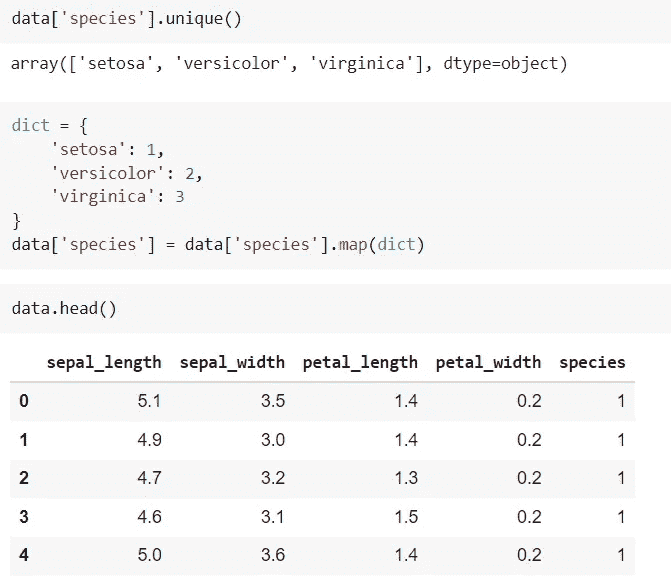
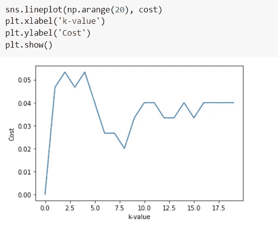
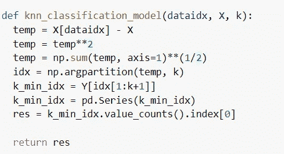
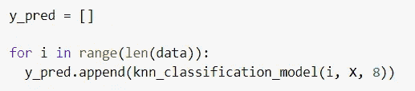
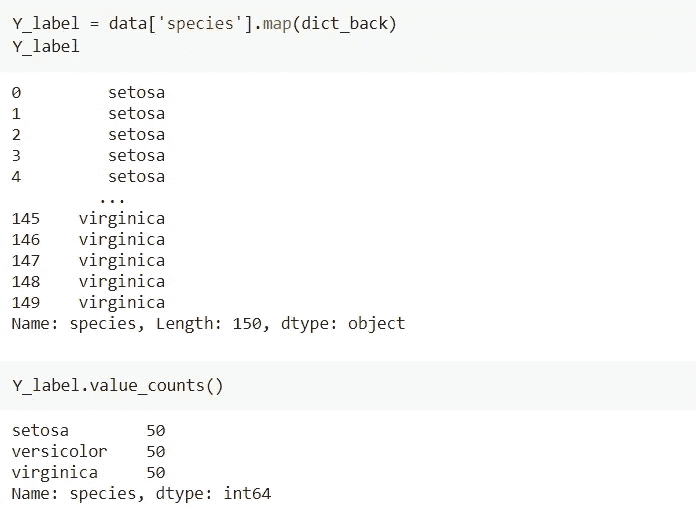

# k-最近邻

> 原文：<https://medium.com/nerd-for-tech/k-nearest-neighbors-aac72032aaea?source=collection_archive---------6----------------------->

k-最近邻是一种有监督的机器学习算法。它用于分类和回归。它根据 k 个最近的数据点预测输出。在该算法中，我们不从训练集学习，而是使用整个训练集来预测新数据点的输出。


让我们举一个分类的例子，其中我们有两个类 A 和 b。为了预测一个新点(用红色显示)的类，我们考虑它的 k-最近邻。如果 k = 3，在最近的三个数据点中，有 2 个点属于 B 类，1 个点属于 a 类，所以，我们可以说新的数据点属于 B 类。

对于回归，我们通过计算 k 个最近数据点的平均值或中值来预测连续输出值。

两点之间的距离可以使用欧几里德距离、曼哈顿距离、汉明距离或闵可夫斯基距离来计算。

**KNN 数据准备**

1.  **特征缩放**是必要的，因为这里我们找出了距离。因此，不同尺度的特征对输出的影响是不同的。
2.  应该没有**丢失值**，因为我们无法定位丢失特征的数据点。
3.  如果有许多功能，KNN 就不能很好地工作。因此，应该使用**降维**技术。

让我们从头开始看看 python 实现。在这里，我们不会使用任何像 sklearn 这样的库。

**导入必要的库**

```
import pandas as pdimport numpy as npimport matplotlib.pyplot as pltimport seaborn as sns
```

**加载数据集**

我们将使用 seaborn 图书馆的 iris 数据集:

```
data = sns.load_dataset('iris')data.head()
```

**编码目标变量**



## 特征缩放

应用规范化:

```
for column in data.columns[:-1]:data[column] = ( data[column]-min(data[column]) ) / ( max(data[column])-min(data[column]) )
```

## 分割独立和从属特征

```
X = data.iloc[:, :-1].valuesY = data.iloc[:, -1].values
```

## Knn 分类模型

**使用成本图找到 k 的最佳值:**

```
def knn_classification_model(dataidx, X, k): temp = X[dataidx] - X temp = temp**2 temp = np.sum(temp, axis=1)**(1/2) idx = np.argpartition(temp, k) k_min_idx = Y[idx[1:k+1]] k_min_idx = pd.Series(k_min_idx) res = k_min_idx.value_counts().index[0] return res# Find costdef find_cost(y_pred, Y):
  t = np.sum((y_pred - Y)**2)/len(Y)
  return t# 
cost = np.zeros(20)
for k in range(1, 20): y_pred = [] for i in range(len(data)): y_pred.append(knn_classification_model(i, X, k)) cost[k] = find_cost(y_pred, Y)
```



k = 8 具有最小成本，即它是最佳值，因此在模型中使用该值:



## 寻找准确性

```
accuracy = len(data.loc[y_pred==Y_label])/len(data)*100accuracy
```

我们模型的准确率达到了 98%。类似地，对于回归，我们将 k 个最近的数据点的平均值/中值。

这样，我们完成了我们的 KNN 算法。希望你觉得有用。如果你喜欢我的博客，那么看看我以前的一些博客:

1.  [线性回归](https://khushijain2810.medium.com/linear-regression-9fd219098405)
2.  [OpenCV](https://khushijain2810.medium.com/introduction-to-opencv-586e38d536fd)
3.  Seaborn
4.  [熊猫](https://khushijain2810.medium.com/pandas-python-data-analysis-library-1d061c982fc8)
5.  [Numpy](https://khushijain2810.medium.com/numpy-day-3-at-internity-foundation-efcef826e549)

快乐学习！