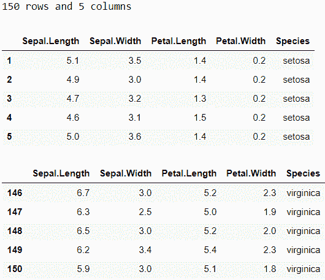
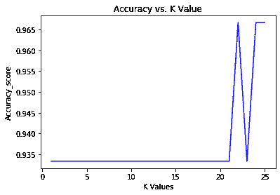
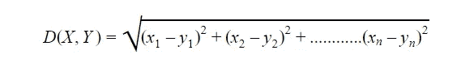

# k-最近邻算法

> 原文：<https://medium.com/nerd-for-tech/k-nearest-neighbors-algorithm-3484893272ee?source=collection_archive---------10----------------------->

K 近邻(K-nearest neighbors，KNN)顾名思义就是根据一个数据点的 K 近邻来标注或预测该数据点的值的机器学习算法。让我们举个例子:一个住在大学宿舍的人每天都会遇到很多人，他有很多朋友，但其中一些是他非常亲密的朋友。假设他有五个亲密的朋友。五个人中，两个非常勤奋好学，而其余三个非常懒惰，根本不学习。所以根据 KNN 算法，你也会被归类为懒惰，因为你周围 K (5)个最近的人中有三个是懒惰的。这是通俗的说法，现在让我们来看看 KNN 的机器学习定义。

KNN 是监督机器学习算法，用于基于 K 个最近邻之间的相似性的分类和回归问题。
*现在问题来了，什么是有监督的机器学习算法？* 有监督的机器学习算法是那些需要输入和输出变量进行训练的算法。在监督学习中，最初应该知道正确的标签或目标值，以便我们可以监督我们的模型拟合数据和预测目标值或类标签的情况。如果模型不能正确预测目标值，我们可以考虑改变参数。无监督算法是那些只需要输入变量来识别数据集的基本分布和聚类的算法。

## ***是怎么回事？***

*   计算新数据点和可用数据点之间的欧几里德距离。
*   然后选择具有最小距离的 K 个数据点。
*   K 个数据点的标签的模式被用于分类问题。
*   如果问题是回归，则取这些数据点的目标值的平均值。

让我们在虹膜数据集上使用 KNN。虹膜数据集包含萼片长度、萼片宽度、花瓣长度和花瓣宽度等特征。标签是物种的名称，即刚毛藻、杂色花和海滨草。

以下是数据集的一瞥:



虹膜数据集

这是一个分类问题，其中需要根据其他特征对给定花的种类进行分类:

*   提取除物种之外的所有列作为 X(自变量)，物种列作为 y(因变量)。并且还使用标签编码器对 y 进行编码。

```
X=df.iloc[:, :4]
from sklearn.preprocessing import LabelEncoder
le=LabelEncoder()
y=le.fit_transform(df['Species'])
```

*   将数据集分为训练集和测试集。

```
from sklearn.model_selection import train_test_split  
X_train, X_test, y_train, y_test= train_test_split(X, y, test_size= 0.2, random_state=42)
```

*   使用 MinMaxScaler 归一化 X_train 和 X_test。

```
from sklearn.preprocessing import MinMaxScaler
scaler = MinMaxScaler()
X_train=scaler.fit_transform(X_train)
X_test=scaler.transform(X_test)
```

*   选择适当的 K 值，稍后，我们将尝试找到 K 的最佳值。在 X_train 和 y_train 上拟合 KNN 模型，并对 X_test 进行预测。计算准确度分数。

```
from sklearn.neighbors import KNeighborsClassifier
from sklearn.metrics import accuracy_score
knn = KNeighborsClassifier(n_neighbors=3)
knn.fit(X_train, y_train)
pred = knn.predict(X_test)
print("accuracy: {}".format(accuracy_score(y_test, pred)))
```

*   要找到 K 的最佳值，请计算不同 K 值的精度。应选择精度最高的 K 值。注意，取 K=1 没有任何帮助，因为有可能最接近我们的测试数据点的数据点属于不同的类，因此我们的测试数据点将被错误分类。

```
import matplotlib.pyplot as plt
accuracies=[]
for i in range(1,26):
    knn = KNeighborsClassifier(n_neighbors=i)
    knn.fit(X_train, y_train)
    pred = knn.predict(X_test)
    acc=accuracy_score(y_test, pred)
    accuracies.append(acc)
plt.plot(range(1,26),accuracies,color = 'blue',)
plt.title('Accuracy vs. K Value')
plt.xlabel('K Values')
plt.ylabel('Accuracy_score')
print("Maximum accuracy:-",max(accuracies),"at K=",accuracies.index(max(accuracies))+1)
```

*   这里可以看到剧情。从图中可以清楚地看出，在 K=22 时，然后在 K=25 时达到最大精度。



## ***为什么 KNN 被称为懒算法？***

KNN 也被称为懒惰算法，因为它不需要任何训练。在训练阶段，它只是记忆数据集，而其他算法开发判别函数，并从训练数据中学习模型权重。

KNN 在测试阶段做了所有艰苦的工作。在测试阶段，需要计算每个测试数据点和所有训练数据点之间的欧几里德距离，然后基于 K 个最近的训练数据点将某个标签分配给测试数据点。这就是为什么它被称为懒惰算法，因为它在训练时不做任何准备，而完整的算法是在测试阶段实现的。

## **KNN 算法背后的数学:**

在 KNN，我们需要找到两点之间的欧几里得距离。使用以下公式可以很容易地计算出该距离:



其中{x1，x2，... ... xn}属于 X，而{y1，y2，... ... yn}属于 Y，这里 X 可以作为单个训练样本，Y 可以解释为测试数据点，两者都具有 n 个特征。将有许多训练样本，我们需要计算我们的数据点与所有训练样本的距离。

也可以使用其他距离，如曼哈顿距离和余弦距离，但欧几里得距离也可以。

在计算距离之后，选择 K 个最低距离和对应于它们的训练数据点。记下这些数据点的标签或类别。具有最大概率的类被分配给我们的测试数据点。任何类别 Ci 的概率可计算如下:


其中 ni 是给定测试数据点 y 时属于 Ci 类的数据点的数量。

**KNN 的优势及应用:**

*   KNN 是一个非常简单易用的算法。
*   KNN 不像其他复杂算法那样需要任何参数调整和昂贵的训练。
*   KNN 可用于需要根据相似性对数据进行分类的地方，如电影推荐系统。

**KNN 的缺点:**

虽然 KNN 是一个非常简单的算法，不需要训练，但当数据量很大时，它会变得更慢。这是因为 KNN 从所有训练数据点计算每个测试数据点的欧几里德距离，因此模型的时间复杂性和运行时间随着数据大小的增加而增加。