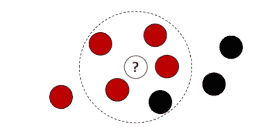
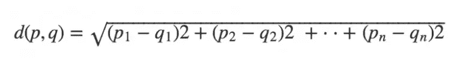
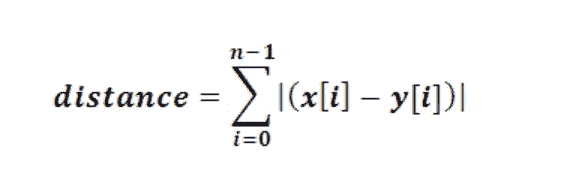
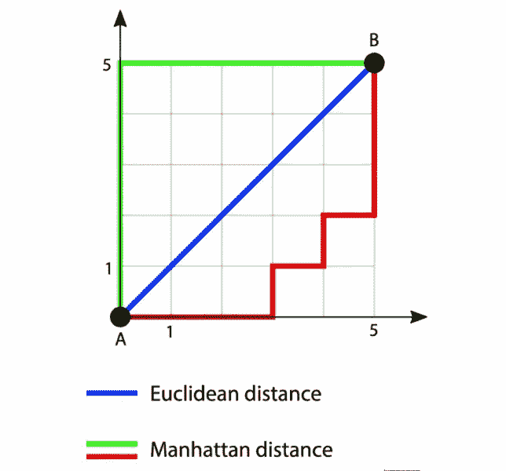

# 用于插补的 k-最近邻

> 原文：<https://medium.com/nerd-for-tech/k-nearest-neighbors-for-imputation-97e85798c2bc?source=collection_archive---------18----------------------->

正如我们所知，特征工程过程的一部分是处理特征中的缺失值，这些缺失值会影响我们模型的预测能力。在某些情况下，缺失的数据本身可能会给我们提供信息。

根据缺失数据的严重程度，我们有各种途径来解决这个问题。这些解决方案在很大程度上取决于数据中变量的类型和缺失值的数量。我们将同时解决这两个问题。

插补是处理缺失值的方法之一；插补简单地说就是用一个与收集到的实际值非常接近的值来代替缺失值。

让我们以缺失值的分类变量为例。处理这些缺失值的最常见方法是用模式替换它们。这是因为在给定模式概率的情况下，缺失值等于模式的概率高于该特征所呈现的任何其他分类值的概率。

对于连续变量来说，情况就不同了，一种方法是用中值或平均值替换缺失值。平均值会受到数据中异常值的影响；较大的异常值会使平均值偏向较高的值，极小的异常值会对平均值产生相反的影响。用缺失值替换这些值将影响预测和作为预测因子的要素的有效性。那么解决办法是什么呢？**K-最近邻插补。**

**K-最近邻插补**通过仅利用特定缺失值的 K 个最近邻的平均值，改进了均值插补的概念。

K = 5

使用 K-最近邻为我们提供了一个很好的估计。有许多方法可以确定哪些点彼此更接近，例如:欧几里德距离、曼哈顿距离和汉明距离。

**欧几里得距离—** 欧几里得距离可以看作是二维平面上两点/向量之间的距离。这遵循两点间最短距离是直线的原理。

点之间的欧几里德距离是笛卡尔点的平方差之和的平方根

需要注意的是，欧几里德距离测量值受所涉及的要素单位的影响，因此最好对所涉及的所有要素进行标准化，以获得更好的结果。

**曼哈顿距离—** 一个简单的方法是将其视为两点之间的垂直和水平距离。

曼哈顿距离

曼哈顿和欧几里德距离的图解

执行 K-最近邻插补时，用于估计点之间距离的方法作为参数传递，需要注意的是默认度量设置为欧几里得。

如上所述，KNN 插补是一种更稳健的缺失数值插补方法，如果可能，应作为简单平均值插补的替代方法。

希望这篇文章对你有所帮助。