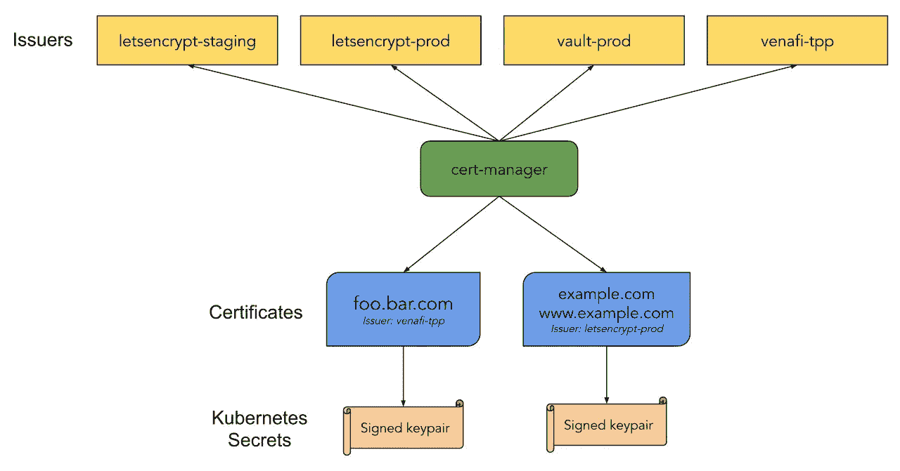

# K8s 证书管理器和让我们加密

> 原文：<https://medium.com/nerd-for-tech/k8s-cert-manager-and-lets-encrypt-a05f4d724927?source=collection_archive---------0----------------------->

> 在这篇文章中，我将解释如何为你的 k8s 服务自动生成一个免费的 SSL 证书

**让我们加密什么**

**让我们加密**是一个开放的自动化认证机构，**使用**ACME(自动证书管理环境)协议向任何兼容的客户端提供免费的 TLS/SSL 证书。这些证书可以用来加密 web 服务器和用户之间的通信。

**让我们如何加密作品**

Let ' s Encrypt and ACME 协议的目标是使建立 HTTPS 服务器成为可能，并让它自动获得浏览器信任的证书，而无需任何人工干预。这是通过在 web 服务器上运行证书管理代理来实现的。

这个过程有两个步骤。首先，代理向 CA 证明 web 服务器控制着一个域。然后，代理可以请求、续订和吊销该域的证书。

**我们如何加密验证域**

让我们用公钥加密识别服务器管理员。代理软件第一次与 Let's Encrypt 交互时，它会生成一个新的密钥对，并向 Let's Encrypt CA 证明服务器控制着一个或多个域。这类似于传统的 CA 创建帐户并向该帐户添加域的过程。

在我们加密解释和它如何工作之后，我们需要了解 cert-manager 及其工作方式，如何安装到我们的 kubernetes 集群中。

**什么是证书管理器？**

cert-manager 是一个本地 Kubernetes 证书管理控制器。它可以帮助从各种来源颁发证书，如 Let's Encrypt、HashiCorp Vault、Venafi、简单签名密钥对或自签名。它将确保证书是有效的和最新的，并尝试在到期前的配置时间续订证书。它大致基于 kube-lego 的工作，并借鉴了其他类似项目(如 kube-cert-manager)的一些智慧。



在安装和使用 cert-manager 之前，我需要解释一些关于 cert-manager 的概念。

**发行人**

是一个 Kubernetes 资源，代表证书颁发机构(ca ),它能够通过接受证书签名请求来生成签名证书。所有证书管理器证书都需要处于就绪状态的引用颁发者来尝试满足请求。

**证书**

cert-manager 具有证书的概念，它定义了所需的 x509 证书，该证书将被更新并保持最新。证书是一种命名空间资源，它引用一个确定什么将接受证书请求的颁发者。

**证书申请**

证书请求是 cert-manager 中的一个名称空间资源，用于向颁发者请求 x509 证书。该资源包含发送给引用的颁发者的 PEM 编码证书请求的 base64 编码字符串。成功的发行将根据证书签名请求返回签名的证书。

**极致秩序与挑战**

cert-manager 支持从自动证书管理环境 **(ACME)** 服务器请求证书，包括使用 ACME 发行者从 Let's Encrypt 请求证书。大多数计算机通常信任公共互联网上的这些证书。要成功请求证书，cert-manager 必须解决 ACME 挑战，完成这些挑战是为了证明客户端拥有所请求的 DNS 地址。

**网钩**

cert-manager 使用 Web-hook 服务器来扩展 K8s API 服务器，以提供对 cert-manager 资源的动态准入控制。这意味着 cert-manager 受益于核心 K8s 资源所具有的大部分相同行为。

**CA 注射器**

CA injector controller 负责将 CA 包注入到 web-hook 的 Validating-web hook-Configuration 和 Mutating-Webhook-Configuration 资源中，以便允许 K8s API 服务器“信任”web-hook API 服务器。

**如何在 K8s 集群上安装 Cert-manager**

在 K8s 上安装证书管理器非常简单

1-为证书管理器创建名称空间

```
**kubectl create namespace cert-manager**
```

2-我们将使用头盔包管理器，如果你没有头盔，你可以按照以下步骤设置头盔[https://helm.sh/docs/intro/install/](https://helm.sh/docs/intro/install/)

3-添加 jetstack helm 存储库

```
**helm repo add jetstack https://charts.jetstack.io**
```

4-更新 helm 存储库

```
**helm repo update**
```

5-使用 helm 软件包管理器安装证书管理器

```
**helm install \
  cert-manager jetstack/cert-manager \
  --namespace cert-manager \
  --version v1.0.4**
```

6-现在我们在 K8s 集群上有了一个证书管理器来检查 pods 状态

```
**kubectl get pods -n cert-manager****NAME                                       READY   STATUS    RESTARTS   AGE
cert-manager-5c6866597-zw7kh               1/1     Running   0          2m
cert-manager-cainjector-577f6d9fd7-tr77l   1/1     Running   0          2m
cert-manager-webhook-787858fcdb-nlzsq      1/1     Running   0          2m**
```

**如何使用证书管理器**

要使用 cert-manager，我们需要为我们的名称空间上的 let's Encrypt 部署一个 cert-manager 发行者。

1-创建一个包含安装发行者 K8s 组件的 yaml 文件

```
apiVersion: cert-manager.io/v1alpha2
kind: ClusterIssuer
metadata:
 name: letsencrypt
spec:
 acme:
 server: [https://acme-v02.api.letsencrypt.org/directory](https://acme-v02.api.letsencrypt.org/directory)
 email: [regoo707@gmail.com](mailto:regoo707@gmail.com)
 privateKeySecretRef:
 name: letsencrypt
 solvers:
 - http01:
 ingress:
 class: nginx
```

2-使用 kubectl 在您的应用程序名称空间上部署发行者

```
kubectl apply -f cert-manager-issuer.yaml -n myapps
```

3-最后，我们需要配置我们的入口规则以使用发行者，并为新生成的证书定义一个名称

```
apiVersion: networking.k8s.io/v1beta1
kind: Ingress
metadata:
 name: ssl-tls-ingress
 annotations:
 kubernetes.io/ingress.class: nginx
 cert-manager.io/cluster-issuer: letsencrypt
spec:
 tls:
 — hosts:
 — backend-app.mohammedragab.com //change this to your dns
 secretName: app-web-cert
 rules:
 — host: backend-app.mohammedragab.com //change this to your dns
 http:
 paths:
 — backend:
 serviceName: backend-app-svc //change this to your app service
 servicePort: 80 // change this to your service running port
 path: /
```

4-最后部署入口规则，你将拥有一个由 Let's Encrypt 发布的 3 个月续订和免费 SSL 证书。

资源:

[](https://letsencrypt.org/docs/) [## 证明文件

### 让我们加密是一个免费的，自动化的，开放的认证机构，由非营利性的互联网安全…

letsencrypt.org](https://letsencrypt.org/docs/)  [## 欢迎使用证书管理器

### cert-manager 是一个本地 Kubernetes 证书管理控制器。它可以帮助从一个…

cert-manager.io](https://cert-manager.io/docs/)