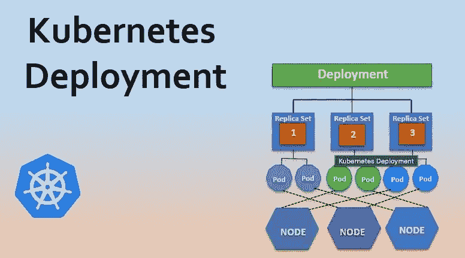

# k8s 部署创建:幕后发生了什么

> 原文：<https://medium.com/nerd-for-tech/k8s-deployment-creation-what-happens-behind-the-scenes-4e7362aee295?source=collection_archive---------2----------------------->

## k8s 部署创建流程的深入探讨

图片来自 [educba](https://educba.com)

作为 k8s 用户，您可能每天都会使用这个命令`kubectl create -f deployment.yaml`来创建一个 k8s 部署对象。但你有没有想过幕后发生了什么？