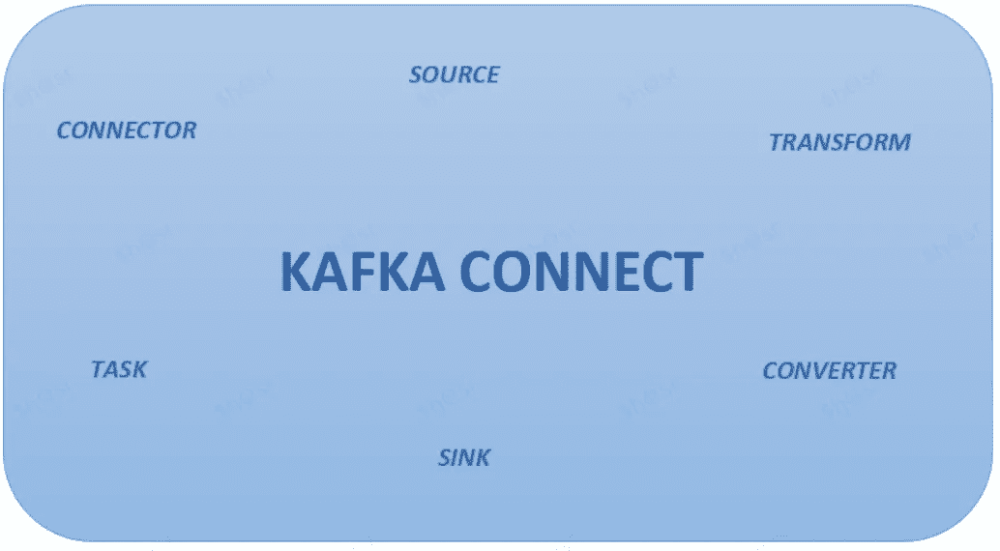
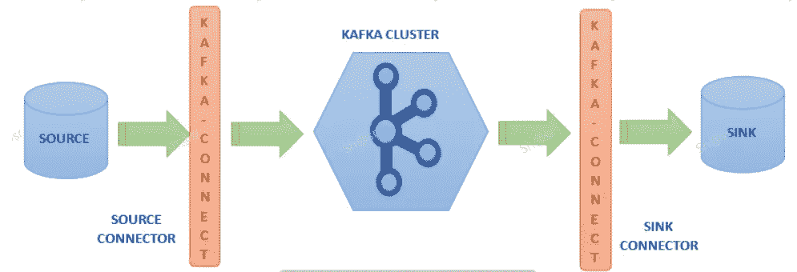
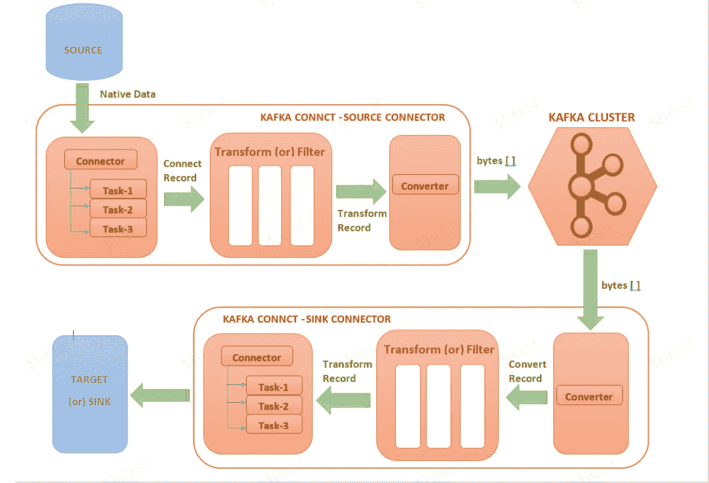

# 卡夫卡连接:快速入门

> 原文：<https://medium.com/nerd-for-tech/kafka-connect-quick-start-e9249ec2bbaa?source=collection_archive---------1----------------------->

在本文中，我们将看到 Kafka Connect 组件，为什么需要它，以及它如何帮助 Kafka 与不同的系统集成。

注:卡夫卡新？？查看"[阿帕奇卡夫卡:快速入门](https://techcolors.medium.com/apache-kafka-quick-start-1edeef53773e)"

卡夫卡连接

***话题涵盖*** :

*   卡夫卡连接
*   连接器
*   工作
*   工人
*   变流器
*   改变

**什么是卡夫卡连接？**

Kafka Connect 是 Apache Kafka 的一个开源组件，它提供了一种可伸缩的、可靠的方式将数据从 Kafka 传输到其他数据系统，如数据库、文件系统、键值存储和搜索索引。它使用连接器将大型数据集移入和移出 Kafka。

Kafka Connect 使用生产者和消费者作为构建模块，并提供更高级别的功能。

***需要卡夫卡式的连接吗？***

Apache Kafka 广泛应用于事件驱动的微服务架构、CDC(变更检测捕获)需求、日志聚合。

*   *源连接器*:

它负责从源系统提取数据并将其发布到 Kafka 集群。Source connector 在内部使用 Kafka Producer API 来实现这一点。

*   *水槽连接器*:

它负责使用 Kafka 集群中的数据，并将其同步到目标系统。Sink 连接器在内部使用 Kafka 消费者 API 来实现这一点。

**卡夫卡连接用例？**

*   从源系统到目标系统的流管道。
*   从 Kafka 将数据从应用程序写入数据存储。
*   处理从 Kafka 的旧应用程序到新系统的数据。

**卡夫卡连接组件:**

卡夫卡连线——深度潜水

***连接器* :**

连接器定义了数据应该从哪里复制到哪里。每个连接器实例都是一个逻辑作业，负责管理 Kafka 和外部系统之间的数据移动。

Confluent 提供[预建连接器](https://www.confluent.io/product/connectors/)，有助于与卡夫卡的融合。我们也可以按照要求从头开始编写新的连接器

***任务*** *:*

任务在 Kafka Connect 的数据模型中起着重要作用。每个连接器实例都有一组实际复制数据的任务。我们有两种类型的任务—源任务和接收器任务。

Source tasks 包含从源系统获取数据的代码，它使用 Kafka producer 将数据推送到 Kafka 主题。

接收器任务使用 Kafka 消费者从 Kafka 主题轮询数据，它包含将数据放入接收器系统的代码。

Kafka connect 通过使用最少的配置将单个作业分解为多个任务，为可扩展的并行数据复制提供了内置支持。

***变换* :**

它在 SMT——单消息转换中起着重要的作用。连接器可以配置转换，以便对单个消息进行简单的修改。我们还可以在连接器配置中配置多个转换。

转换是一个接受一条记录作为输入并返回修改后的记录的函数。Kafka connect 执行简单通用转换，我们也可以通过实现转换接口来编写自己的转换。

***转换器* :**

转换器负责序列化和反序列化数据。

*   当 Kafka Connect 作为源时， *Converter* 序列化从 Connector (or) Transform 接收的数据，并将序列化的数据推送到 Kafka 集群。
*   当 Kafka 作为接收器连接时，*转换器*对从 Kafka 集群读取的数据进行反序列化，并将其发送到 Transform (or)连接器。

常见转换器:

*   *字符串*:org . Apache . Kafka . connect . storage . String converter
*   *JSON*:org . Apache . Kafka . connect . JSON . JSON converter
*   *JSON*Schema:io . confluent . connect . JSON . jsonschemaconverter
*   *Avro*:io . confluent . connect . Avro . Avro converter
*   *proto buf*:io . confluent . connect . proto buf . proto buf converter
*   *ByteArray*:org . Apache . Kafka . connect . converters . ByteArray converter

***工人:***

连接器和任务是工作的逻辑单元，必须被安排在一个流程中执行。Kafka connect 调用这些进程 worker，并且在 Kafka Connect 中有两种运行 worker 的模式—独立模式和分布式模式。我们可以根据需要选择模式。

*   *独立工作者:*

顾名思义，它适合在本地机器上开发和测试 Kafka connect。它适用于轻量级的单代理环境(例如，向 Kafka 发送服务器日志)。

*   *分配的工人:*

分布式模式带来以下好处:

1.  建议将其用于生产环境，因为它具有高可用性和可扩展性，我们可以根据需要添加或删除更多节点来发展。
2.  Kafka Connect 的容错能力更强—如果某个节点由于某种原因死亡/离开集群，Kafka Connect 会自动将该节点的工作负载分配给集群中的其他节点。如果一个新节点加入，工作将再次在集群内重新分配。
3.  分布式模式在多个节点上运行 Connect workers，这些节点进而形成 Connect cluster。Kafka connect 还在集群中分发正在运行的连接器。

**总结**:

在本文中，我们介绍了 Kafka Connect 为我们带来了什么，以及它如何帮助将外部系统与 Kafka 连接器集成在一起。

我们还看到了各种 Kafka Connect 组件以及每个组件负责什么，同时从/向 Kafka cluster 读取和写入数据。

**参考文献**:

*   【https://docs.confluent.io/ 号
*   【https://kafka.apache.org/documentation/#connect 