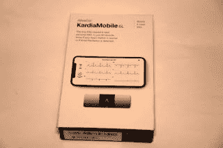
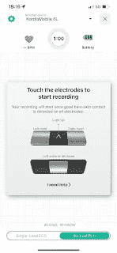
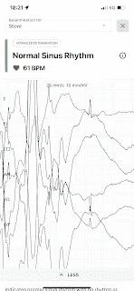
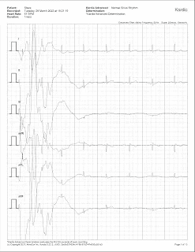
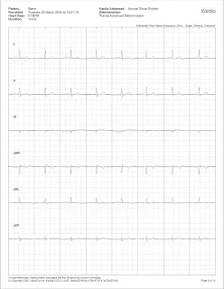
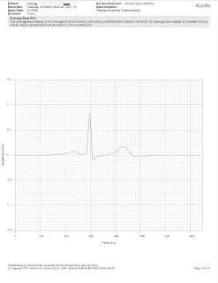

# 卡尔迪亚莫比尔意味着活着的美好时光

> 原文：<https://medium.com/nerd-for-tech/kardiamobile-means-a-great-time-to-be-alive-cor-4ab7c02fa5f2?source=collection_archive---------3----------------------->

Alivecor 生产小型 ECG 监护仪已经有一段时间了，最初的 KardiaMobile 有两个衬垫，使用声音将数据传输到手机，这依赖于将设备放置在手机附近，并保持稳定的位置，使手机麦克风朝向设备。

新的 KardiaMobile 6L 看起来与原来的非常相似，但顶部有两个衬垫，底部有一个衬垫。它使用蓝牙低能量(BLE)将数据传输到手机，心电图将显示在 Kardia 应用程序(苹果 iOS 10.3.3，或至少 Android OS 6.0)中。

盒子是一个纸板套。

内侧部分滑出，上面放着 KardiaMobile 6L 和一本说明手册。

该设备的顶部表面有两个银色的衬垫和 AliveCor 徽标(或箭头)。

底座有一个单独的衬垫(可以拧开并容纳随附的 CR2016 电池)。

应安装应用程序并创建帐户，然后设备与应用程序配对。

如果采用 2 导联读数，将 KardiaMobile 放在桌子或其他稳定的位置，并将每只手的一个手指放在两个垫上。如果读取 3 导联读数，然后坐在舒适稳定的位置，卷起裤子(如果需要)，露出膝盖部位，将设备放在膝盖上，双手各一个手指放在两个顶部衬垫上。同样重要的是尽可能坐着不动。

读取数据后，系统会通知您心电图已经保存到 Apple Health(如果与 Apple Health 同步),并且可以在 Apple Watch 上查看(以便显示给医生或临床医生)。

您还会看到心电图的摘要

这样就可以将心电图以 PDF 格式分享，就像你从医院的心电图机中得到的一样(但是分成几页)。

请注意，当你安定下来并稳定阅读时，第一页在开始时往往会有些奇怪。

接下来的页面会更清晰，只显示正常的心电图

最后一页是平均心率

如前所述，尽可能保持静止以获得清晰的读数是非常必要的。该应用程序将诊断简单的异常，如心房颤动、心动过缓、心动过速和正常的心律。将心电图交给医生可能有助于他们诊断心律不齐和心血管疾病。

该设备经 FDA 批准为医疗设备(与健身追踪器等其他可穿戴设备有很大不同),其作用如同使用心电图导联 I、II、III、aVL、aVR、aVF。

*最初发表于*[*【http://eurotechnews.blogspot.com】*](https://eurotechnews.blogspot.com/2022/04/kardiamobile-means-great-time-to-be.html)*。*