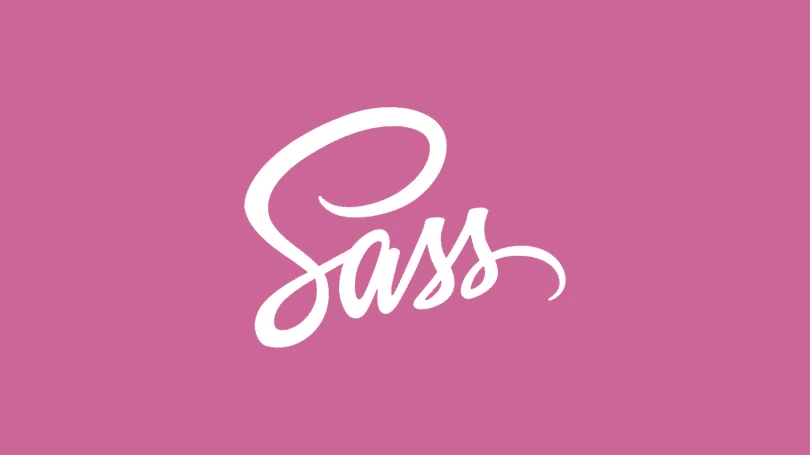

# 保持你的风格干燥，继承萨斯

> 原文：<https://medium.com/nerd-for-tech/keep-your-styles-dry-with-inheritance-from-sass-f94f51e3f9f5?source=collection_archive---------3----------------------->

保持你的 CSS 文件干燥可能是一个麻烦。通常有多个元素共享相似的样式，随着项目的增长和变化，您会发现自己必须搜索数十、数百或数千行样式来覆盖以前的样式。Sass 通过允许您创建占位符类来提供帮助，占位符类使您能够将这些样式扩展到其他选择器，从而帮助您维护、发展和保持这些样式！

# 5 个按钮

假设我们有一个包含 5 个按钮的简单网页。它们会有一些共同的风格，比如宽度、高度、颜色等等。但是它们的背景颜色都是一样的。在我们的 CSS 文件中有几种方法可以做到这一点。

## 天真的方法

天真的方法是为每个按钮创建一个单独的类，手动输入每种样式——复制相同的高度、宽度、颜色等。对于每个按钮。

如果你是 CSS 新手，并认为这很乏味，我同意。有一种更好更快的方法可以做到这一点。

## 方法 2:选择所有按钮

这一次，我们将在类名中添加前缀“button-”，得到红色按钮、蓝色按钮等等。然后，我们将使用 CSS 选择所有的样式，并立即添加相似的样式。之后我们将单独添加背景色。

虽然这很有效，但我认为我们还有改进的空间。让我们稍微重构一下。

## 方法 3:重构为一个新的类

接下来，我们将把共享样式封装到它自己的类“button”中，以遵循关注点分离这一古老的编程原则。在这个过程中，不要忘记更新类名。

这可能是我们用普通 CSS 所能得到的最好的了，我认为它相当不错。

## 方法 4:添加 Sass

如果我们看看我们的 HTML，我们可以看到仍然有一些重复的代码。每个按钮都有一个按钮类。如果你认为“如果我们能把最后几项技术结合起来使用就好了”，那么你是对的。有了 Sass，我们可以进一步重构！

第一步是将我们的风格转换成 Sass。我们将删除大括号和分号。如果你使用的是 Scss，你不需要做任何改变。这是我们剩下的。

接下来我们将选择所有的按钮，并使用 Sass 的 [at-extend](https://sass-lang.com/documentation/at-rules/extend) ( @extend)规则来允许不同的颜色类继承 button 类的样式。

最后，虽然这部分是可选的，我们将通过使用 Sass 的[占位符选择器](https://sass-lang.com/documentation/style-rules/placeholder-selectors) ( %)来隐藏按钮类。这样做有助于通过隐藏 button 类来简化我们处理的 CSS 文件，同时仍然允许继承发生。

# 了解更多信息

要了解有关 Sass / Scss 的更多信息，请查看这里的官方文档:

 [## Sass 基础

### 在使用 Sass 之前，您需要在您的项目中设置它。如果你只是想在这里浏览，请继续，但我们…

sass-lang.com](https://sass-lang.com/guide) 

看看我的其他一些与 Sass / Scss 相关的博客帖子吧！

 [## Sass 嵌套，' & '和@at-root

### 在我上一篇关于 Sass 的文章的基础上，我们再来谈谈嵌套。我将使用。scss 文件类型，但这也…

medium.com](/nerd-for-tech/sass-nesting-and-at-root-e14140b4246d)  [## 使用 Sass 创建更好的媒体查询

### 如果你从未听说过，Sass 是一种 CSS 的预处理器脚本语言。预处理器？脚本？什么……

medium.com](/nerd-for-tech/use-sass-to-create-better-media-queries-f5f149dc618c)