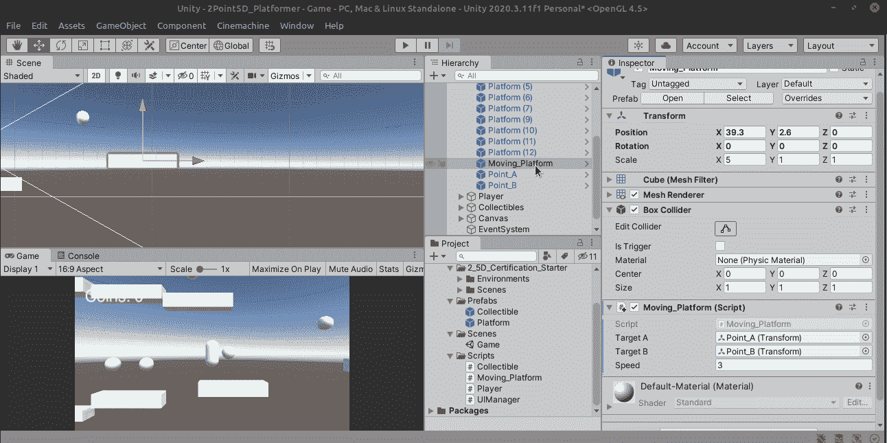
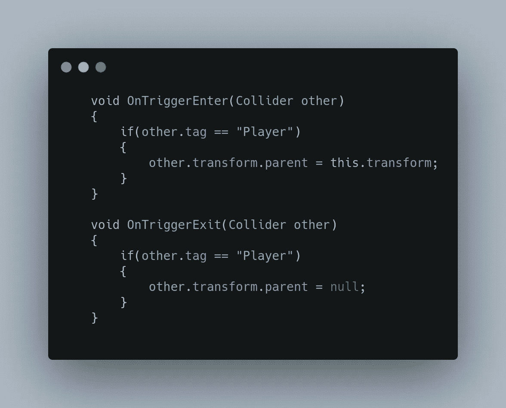
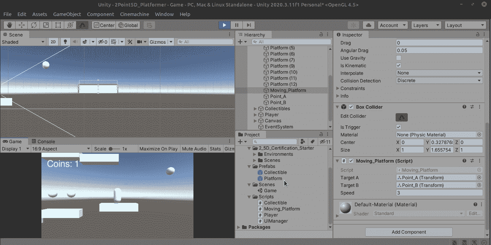
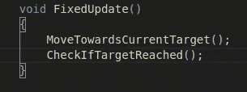
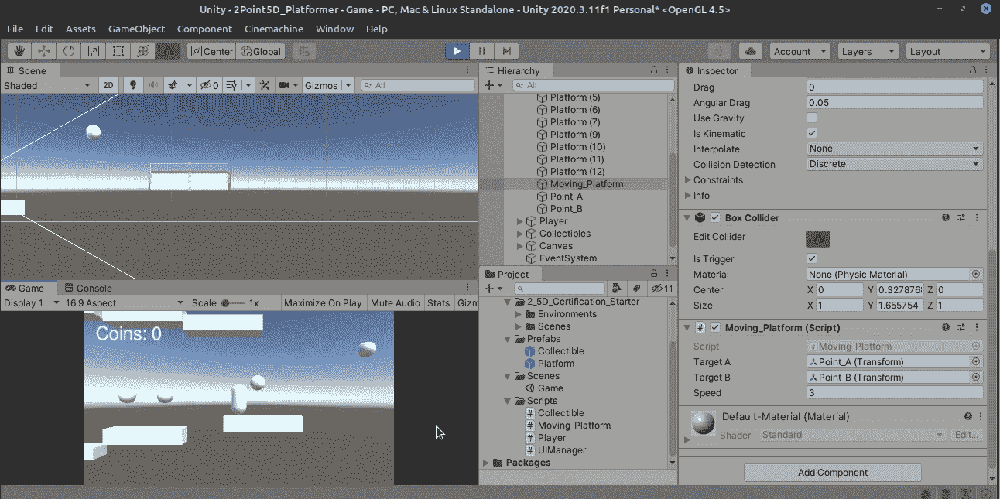

# 将玩家保持在移动的平台上

> 原文：<https://medium.com/nerd-for-tech/keeping-the-player-on-a-moving-platform-fbdf5ec2b7fa?source=collection_archive---------18----------------------->

因此，我们已经成功地编写了我们的移动平台，但我们的球员不会停留在它上面！幸运的是，有一个简单的解决方案，可以让玩家暂时依赖于平台。之前有一些准备工作要做，但没什么大不了的:

首先，在移动平台上再加一个箱式碰撞器，使其略高于平台。还要确保选中 isTrigger。还要确保刚体是打开的，这样触发器才能工作，记住要设置为运动学，并关闭重力，以避免很多麻烦。

剩下的就简单了。OnTrigger enter:父玩家。当播放器退出时，将父级设置为 null。

让我们试一试！

等等…为什么玩家会摔倒？为什么没有亲子化？

稍微研究一下就会发现，你需要使用 FixedUpdate()方法，这是专门针对像我们一样依赖刚体的物理对象的。

好吧…祈祷吧！

是啊！完美运作！！！

明天我们来谈谈模块化平台。