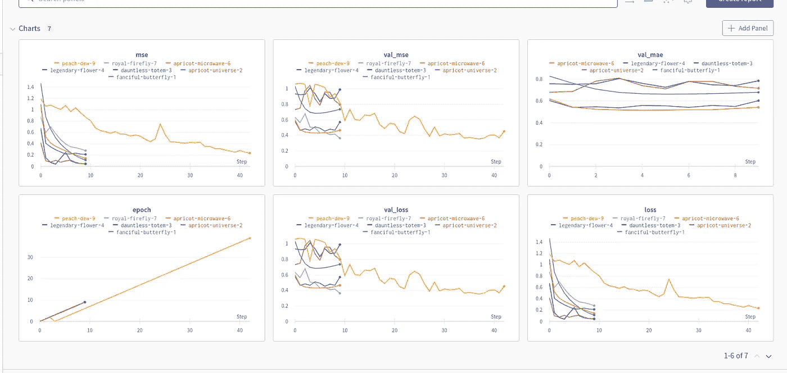
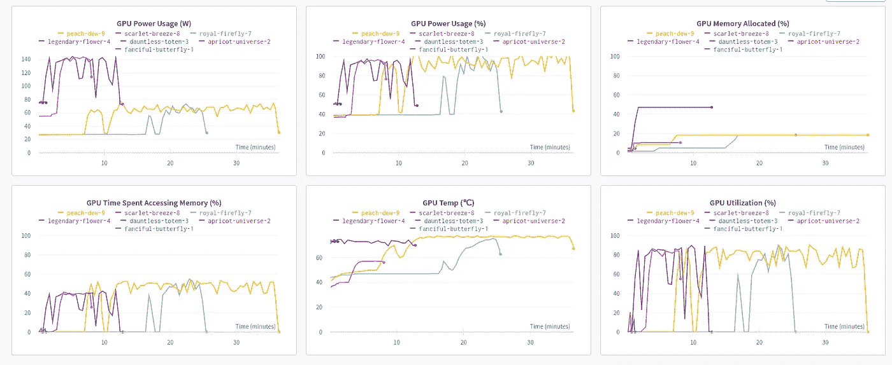

# 在训练 ML 模型时跟踪进度

> 原文：<https://medium.com/nerd-for-tech/keeping-the-track-of-progress-while-training-ml-models-a33be1ad38fc?source=collection_archive---------5----------------------->


照片由 [Unsplash](https://unsplash.com?utm_source=medium&utm_medium=referral) 上的 [Onur Binay](https://unsplash.com/@onurbinay?utm_source=medium&utm_medium=referral) 拍摄

通常在训练模型时保持跟踪是一项单调乏味的任务，它需要大量的工作、回调、绘制指标、可视化数据、存储要驱动的结果等等

在此之后，保存模型是一项不同的任务，collab 经常断开连接，无法恢复以前的进度，构建和处理创建模型的任务变得更加繁忙

# 解决办法

接下来是寻找上述问题的解决方案，同时保存我们的模型的进度，同时可视化它的训练绘制矩阵，并在完成训练后自动保存模型。所有这些事情看起来很多，但有一种方法可以自动完成所有这些事情:)


所有这些我们都可以在 [wandb.ai](http://wandb.ai/) 的帮助下完成，他们有针对特定库的回调，即使你想在你的个人资料中记录任何内容，你也可以在一行代码中完成:)



# 让我们看看如何将它包含在我们的笔记本中

如果你用 TensorFlow 或者 PyTorch 来训练你的模型

```
!pip install wandb
import wandb 
wandb.login()
```

这里我们使用上面的代码登录我们的 wands 账户(如果你是 wandb 新手，你必须创建一个 wandb.ai 账户)

完成此操作后，如果您正在使用 Tensorflow，则可以通过使用

```
from wandb.keras import WandbCallback
```

如果你使用 PyTorch，你可以使用

```
wandb.watch(model, log_freq=100)
```

这里 log_freq=100 表示在 wandb 记录我们的矩阵之后有多少批

除了基本指标之外，wandb 还存储了系统性能指标，以防运行时出现故障，而您需要检查系统的状态



我们还可以指定保存哪个模型，以便将模型保存在 wandb 存储器中。我们所要做的就是

```
wandb.save('model_dir')
```

要在笔记本电脑上再次下载相同的型号，我们可以借助

```
best_model = wandb.restore(
  'model-best.h5', run_path="vanpelt/my-project/a1b2c3d")
```

我们可以记录几乎任何与模型相关的东西

```
wandb.log({"myMat": data_to_be_logged})
```

虽然 wandb 提供了许多功能，如工件、创建报告、存储数据集、可视化数据集等，但我们将在未来的博客文章中涵盖更多内容:)这就是这篇文章的全部内容，我将在未来的博客文章中发布更多关于 wandb 的内容

> 感谢你阅读我的博客:)关注更多，在评论中向我问好，这给了我写更多博客的鼓励:)祝你有美好的一天:)