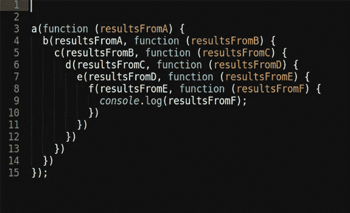

# JavaScript 中的关键概念

> 原文：<https://medium.com/nerd-for-tech/key-concepts-in-javascript-8ecf990b335d?source=collection_archive---------16----------------------->

source([https://georgianstan . medium . com/why-you-should-build-apps-with-vanilla-js-and-how-to-do-it-9281 eccb 73 fc](https://georgianstan.medium.com/why-you-should-build-apps-with-vanilla-js-and-how-to-do-it-9281eccb73fc))

# JavaScript 是什么？？

JavaScript 是一种符合 **ECMAScript** 规范的编程语言。它是全世界使用的主要编程语言之一。默认情况下，JavaScript 程序使用一个**单线程**运行。尽管有创建新线程的方法，但 JavaScript 被认为是单线程语言。JavaScript 不会等待 I/O 操作完成；相反，它继续执行程序。这被称为**非阻塞 I/O** 。如果它等待 I/O 操作完成，JavaScript 将不能很好地执行。由于这个 NIO，JavaScript 是异步的。除此之外，它还是一种**动态**、**弱类型**和**多范例语言**，因为它支持面向对象和函数式编程。JavaScript 有一个管理异步操作的事件系统。

# 变量范围

JavaScript 有三种类型的变量作用域，分别是 **var、let、**和 **const。**它们之间的主要区别是 **var** 是全局作用域或函数作用域，而 **let** 和 **const** 是块作用域。

## 定义变量

*   变量可以在同一个块或范围内重新声明。
*   用 var 关键字声明的变量可以被提升。

## 让

*   不能在同一块或范围内重新声明变量。
*   不能提升用 let 关键字声明的变量。
*   不能通过窗口对象访问。

## 常数

*   不能在同一个块或作用域中重新声明 Same as let，并且不能由窗口对象访问。
*   用 as const 声明的变量必须立即赋值，以后不能再给它们赋值。
*   如果常量变量是一个对象或数组，我们可以添加新的数组元素和对象属性值，并更新这些值。

JavaScript 中的变量范围

# 数据类型

JavaScript 是一种动态类型的语言，就像用于保存不同数据类型的相同变量一样。**数字**，**字符串**，**布尔**，**数组**，对象是 JavaScript 的主要数据类型。

JavaScript 中的数据类型

# JavaScript 对象

JavaScript 对象是用花括号( **{ }** )写的。对象由冒号( **:** )分隔的属性名和值对组成，如上所示。可以通过点符号(**)来访问对象属性。**)作为 **obj.propertyName** 。在 ECMAScript 的新版本中，如果我们用来表示属性名和值的变量是相同的，我们可以使用如下所示的单个变量来表示它们。为了避免 JavaScript 对象在程序中可能发生的任何变化，我们可以使用 **freeze()** 方法，这样就没有人能够修改该对象。但是 freeze()方法只对对象内部的第一级值起作用。如果该对象有另一个嵌套对象，它将被更改。**对象内部的动态属性**在我们执行时不知道密钥的地方会很有帮助。因此，我们可以为对象键设置一个占位符，如下所示。

JavaScript 对象基础

# JavaScript 函数

JavaScript 中有两种类型的函数，分别是**函数声明**和**函数表达式**。变量声明和函数声明被提升，但定义为表达式的函数没有被提升。函数表达式可以自我调用，但函数声明不能。除此之外，我们还有另一种类型的函数叫做**箭头函数**。箭头函数不代表函数的调用方，也就是说它不能代表**这个**关键字在里面。

JavaScript 函数的类型

# JavaScript 闭包

JavaScript **闭包**是一个返回另一个函数的函数。在 JavaScript 中，闭包用于将变量封装到函数中，并限制外部对它的访问。当创建内部函数时，JavaScript 创建一个环境，其中包含外部函数的所有局部变量。因此，closure 是一个即使在父函数关闭后仍能访问父作用域的函数。

JavaScript 闭包

# 严格模式和“this”关键字

与 JavaScript 中的其他语言不同，**这个**关键字的作用不同。在一个物体内部，**这个**是指物体本身。在全局上下文中，**这个**关键字指的是全局对象(在浏览器中，就是窗口对象)。这种行为将在严格模式下被改变。如果一个使用**这个**关键字的函数被传递给另一个对象，那么**这个**将引用那个对象，而不是引用最初声明该函数的原始对象。这种行为在回调和闭包中非常明显。

严格模式是 JavaScript 的受限版本。目的是让编写安全的 JavaScript 更容易。严格模式使 JavaScript 中的不良做法成为错误。让开发人员不要使用在未来的 JavaScript 开发中会失效的语法。例如，它不允许创建没有 var 关键字的变量(必须声明变量)。另一个例子是，它将停止从外部对象实例引用窗口对象为 **this** 。

# 构造函数和类

在 JavaScript 中，创建对象时，构造函数与 **new** key 关键字一起使用。构造函数只是另一个函数。当函数与 **new** 关键字一起使用时，该函数充当一个类。新版 JavaScript 引入了 **class** 关键字，现在它被大多数 JavaScript 引擎所采用。创建对象的另一种方式是使用对象文字( **{ }** )，如上所示。这些对象被认为是单一的。JavaScript 也支持静态方法和变量。当使用 **new** 关键字时，会创建一个新对象，并在调用构造函数期间将其指定为 **this** 。

## 原型

当我们使用**构造函数创建对象时，**那些函数类可以访问一个名为**原型**的对象。这个对象在概念上类似于 **Java 对象类。**原型用于给构造函数添加方法和属性，实现函数类之间的继承。只有功能类(比如 Person)可以访问**原型**，而不是对象(比如 p1)。

JavaScript 中的原型

## 构造函数

如上图所示，用于创建对象的函数称为**构造函数**。我们可以如下实现两个功能类之间的继承。

构造函数和它们之间继承关系的建立

## 类别语法

我们可以使用 ES6 中引入的**类**语法来实现上述场景。早期，很多浏览器都不支持。但是现在，大多数浏览器都支持**类**语法。

JavaScript 中的类语法

# 回电和承诺

*   JavaScript 是异步的。JavaScript 中的所有 I/O 操作本质上都是异步实现的。
*   由于 JavaScript 是一种单线程语言，如果一个 I/O 操作占用了线程直到它完成，JavaScript 作为一种编程语言就不会有很好的表现。
*   但是当我们需要使用数据进行同步处理时，异步操作带来了困难。
*   我们用**回调**和**承诺**来解决这个问题。
*   回调是一个函数，也就是说，被传递给一个异步任务，在完成时，该函数将被执行。
*   承诺是从异步任务返回的对象。Promise 具有同步处理异步操作的属性。

## 重点

🔸为了使用数据进行密集的同步处理，有时我们必须向一个异步任务序列传递许多嵌套的回调；这叫做**回调地狱**。为了解决这个问题，我们使用承诺对象。Promise 对象拥有处理复杂嵌套回调的属性和方法。

图 1:回调地狱

JavaScript 回调函数

JavaScript 承诺

我们将在另一篇文章中讨论更多关于回调和承诺的细节，比如我们使用它们的情况，不同种类的承诺方法，以及何时最好使用承诺而不是回调函数，等等。如果您正在使用 JavaScript 框架，那么更好地理解上述概念是很重要的。例如，如果您正在使用 React、Node 或 Angular，那么很好地掌握上述概念非常重要。

# 参考

要进一步了解详情，请查看这些资源；

*   [https://www.youtube.com/watch?v=Jc2iW4yVv38](https://www.youtube.com/watch?v=Jc2iW4yVv38)
*   [https://www.youtube.com/watch?v=XK_lB5-XzhQ](https://www.youtube.com/watch?v=XK_lB5-XzhQ)
*   [https://www.w3schools.com/js/](https://www.w3schools.com/js/)