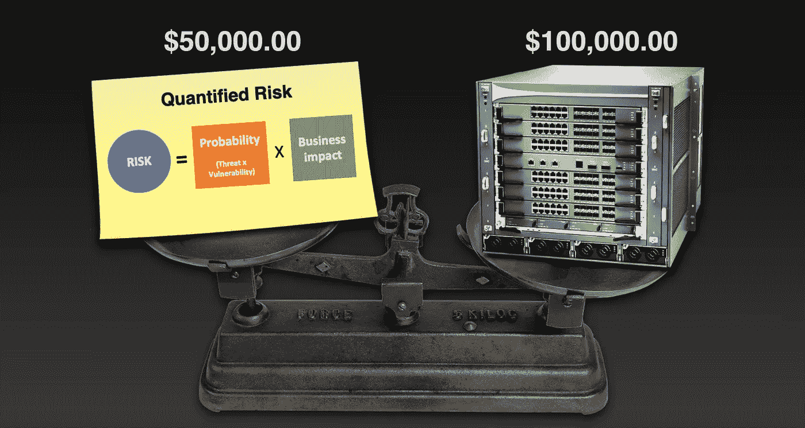
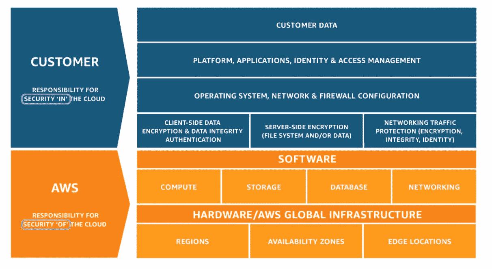
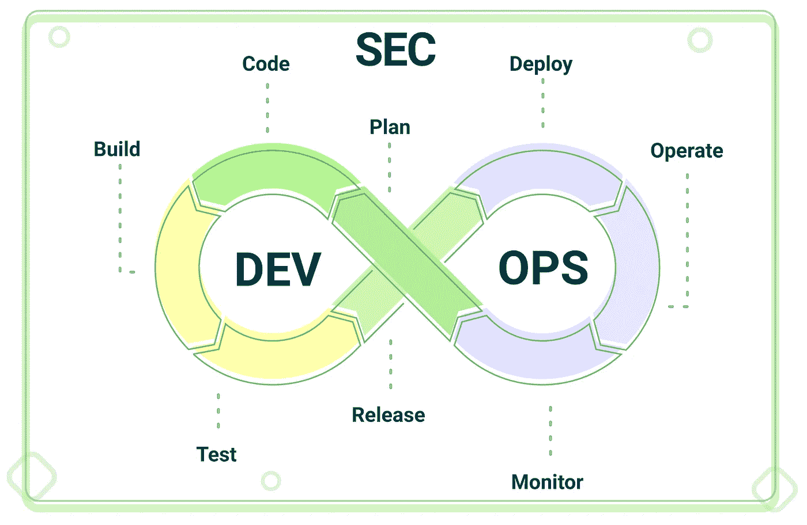

# 每个现代组织都需要具备的关键网络安全能力

> 原文：<https://medium.com/nerd-for-tech/key-cyber-security-capabilities-that-every-modern-organisation-needs-to-have-bf8a4ecf84b?source=collection_archive---------24----------------------->

在我之前关于云安全的文章中，我提到了从传统的基于边界的安全到基于数据的安全的转变。这种转变带来了 IT 和网络安全治理的额外变化——现代组织及其 IT 安全专家需要具备的新能力。在这篇文章中，我想分享这种能力的前 5 名，至少在我看来是最重要的。

# **1。软技能和社交技能**

*更贴近业务，了解组织独特的弱点、优势以及行业或业务特定的威胁。*

有人说，如果 it 人员不喜欢社交，坐在地下室的某个地方，带着他们的服务器和电线，那也没关系。其他人甚至害怕与他们擦肩而过——现在最好这样做，只有在生死攸关的时候才联系它。我认为这是错误的想法，因为缺乏一般的 it 知识，而且业务决策者对他们的数据安全性不感兴趣。

在现代组织和云时代，老派的 IT 或安全思维不再有效

在现代 IT 安全中，软技能的含义略有不同，虽然社交沟通和团队合作很重要，但批判性思维甚至普通心理学是现代 IT 安全专家更重要的技能。他或她需要:

*   像*坏人一样思考，*
*   了解社会工程技术，以识别可能的威胁，如网络钓鱼攻击，
*   了解组织的其他员工和客户可能如何应对威胁，如何提高他们的意识，并训练他们的应变能力，
*   现代 IT 和 IT 安全专家需要更接近业务，以了解组织独特的漏洞、优势以及行业或业务特定的威胁，
*   在压力下能够很好地工作，并能够在发生攻击时迅速确定行动的优先顺序，将损失降至最低。

拥有这些软技能和社交技能以及技术知识为 IT 和 IT 安全专家在现代社会履行职责奠定了基础。

# **2。威胁和风险评估技能**

*评估相关因素并选择适当的措施，在锁定和创新之间达成妥协*

在我的职业生涯中，我碰巧看到了许多这样的案例:老派 IT 专家毫无顾虑地捍卫巨额预算，购买高于所需等级的设备作为风险缓解措施，其暴露程度比设备价格低数倍。你猜怎么着，我也看到这些组织陷入数据泄露、可用性故障和个人数据被洪水冲走的大丑闻中。

在网络时代，越来越多的努力和金钱花在网络攻击、勒索病毒和令人震惊的有效社会工程操纵上，组织比以往任何时候都更需要具备良好的威胁和风险评估能力。不再可能将组织的边界与所有可能的威胁隔离开来，也没有机会保护您的组织免受所有可能的攻击。默认情况下，世界上任何组织都有(并将继续有)许多漏洞。没有钱可以买到组织的完全安全或“无漏洞”状态，因此首席执行官晚上睡得更好的唯一方法是意识到风险、可能的暴露，并确保负责的团队有足够的技能来选择针对业务关键风险的最相关的安全措施。

额外提示:询问您的 IT/团队是否知道以下等式，当他们要求对硬件/软件进行大量资本支出投资作为风险缓解措施时，请询问 ROSI:

计算证券投资回报的简单公式(`ROSI`)

**其中:**

*   安全投资回报(ROSI) =要实施的安全控制/解决方案的投资回报(ROI)。
*   年度预期损失(ALE) =单次安全事故的估计货币损失 x 年度发生率。
*   修正的 ALE(男性)=修正的年度货币损失，考虑了预期安全控制的有效性。
*   解决方案成本=与解决方案购买、实施和维护相关的所有成本。

# **3。安全“在云端”**

*评估和管理云服务安全性，在云端安全地管理业务数据。*

首先，每个现代组织首先需要理解这样一种观念，即一旦进入云中，所有的安全性都由云提供商来处理。

由 AWS 创建的共同责任

为了更好地理解组织在云中的安全责任范围，请查看我关于[云中的安全与](https://sakalas.info/security-in-the-cloud-vs-security-of-the-cloud-114dbcf962a9)云中的安全的故事。

> “云已经很安全了，为什么我还需要担心额外的安全性？”

不仅仅是 IT 专家，bdm(业务代表)交流和理解共享责任模型也同样重要。这是因为云安全的主要焦点是**业务数据**——每一个现代组织的主要资产。

> 投资于您的 IT 员工的技能和知识，投入他们的时间来学习和跟上云服务的超频繁变化

一旦组织学习了[共享责任模型](https://aws.amazon.com/compliance/shared-responsibility-model/)并了解了自己的责任，它需要从确定精通开发(Sec)运营的内部人员、具备云技能的内部团队和/或获得能够利用云安全标准、特定于云的最佳实践和安全控制的值得信赖的 MSP 合作伙伴开始。

# **4。开发-安全-运营和自动化**

*将安全性嵌入业务解决方案开发生命周期，而不是之后*

DevSecOps 就像是开发团队处理安全性方法的一种进化。以前，安全性是系统管理员或单独的安全团队需要在开发过程的最后阶段，甚至是在部署到生产环境之后，为应用程序/系统量身定制并“缝上”的东西。然后安全性需要由单独的质量保证(QA)团队进行测试，等等。像事后诸葛亮一样对待安全性导致了著名的数据泄露，并使 IT 社区考虑新的方法来将安全性嵌入软件开发生命周期的每个阶段。

在我们的 DevOps 团队中，我们有一句话 *'* 自动化优先'。每当有人需要执行某项任务、设置新的 AWS/Azure 基础架构或为客户的新应用程序部署准备一个强大的平台时，他们需要回答的第一个问题是——我是否至少有一点可能需要再次执行相同的任务，或者我可能需要重建平台？如果答案是肯定的——该任务不是手动执行的，而是通过编写自动化脚本(如 Terraform、Ansible、CHEF)执行的，即基础设施代码(IaC)。同样的方法应该嵌入到现代应用程序的安全性中。正如著名的 DevSecOps [宣言](https://www.devsecops.org)所言:

> 通过将安全性开发为代码，我们将努力创造出令人惊叹的产品和服务，直接向开发者提供见解，并且通常更喜欢迭代，而不是在部署之前总是试图找到最佳答案。

# **5。监督和合理性**

*能够(I)从大量数据和大量误报警报中识别真实事件，(II)快速消除它们，以及(III)合理评估风险、威胁和损失。*

复杂的 IT 系统会产生大量日志、活动信息和其他数据，现代 IT 专家必须能够处理这些数据，以维护安全性、合规性并优化资源。因此，他/她需要同时具备技能和适当的工具，以便能够吸收大量信息，并在几分钟内提出最佳行动计划。通过检查单个问题领域来看到全局并准确说出需要解决的问题的能力是现代 IT 专家与众不同的地方。

简而言之，现代组织需要采用以数据为中心的“大数据”方法来实现安全性。