# 基于 BERT 的文本分类摘要关键特征提取

> 原文：<https://medium.com/nerd-for-tech/key-feature-extraction-from-classified-summary-of-a-text-file-using-bert-c1472f7b493?source=collection_archive---------0----------------------->

# 利用 BERT 嵌入的强大功能

在本文中，我将向您展示 BERT 如何解决一个基本的文本摘要和分类问题。

> **关于伯特(**来自变压器的双向编码器表示)

> 简而言之，BERT 是一个理解如何表示文本的模型。你给它输入一个序列，它会左右扫描多次，然后为每个单词生成一个向量表示作为输出。
> 
> BERT 和其他 Transformer 编码器架构在 NLP(自然语言处理)中的各种任务上取得了巨大成功。

# **伯特的结构**

## **1。伯特总结者**

*   它有两个部分:一个 BERT 编码器和一个摘要分类器。
*   在编码器中，我们学习文档中标记之间的交互，而在摘要分类器中，我们学习句子之间的交互。

为了给每个句子分配一个标签，我们需要在每个句子前添加一个标记`[CLS]`，表示该句子是否应该包含在最终的摘要中。

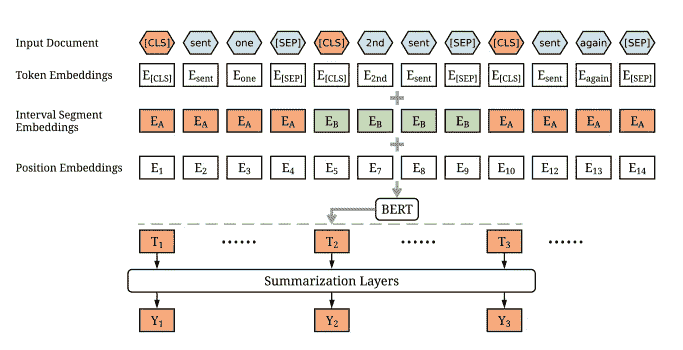

用于摘要的 BERT 结构

## **2。伯特分类器**

输入——在每个序列的开始有一个`[CLS]`标记(分类),还有一个特殊的`[SEP]`标记将输入分成两部分。

输出—对于分类，我们使用第一个令牌的输出(`[CLS]`令牌)。对于更复杂的输出，我们可以使用所有其他的令牌输出。

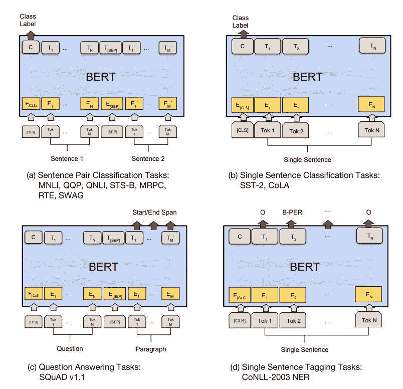

# **比较 BERT 与** XLNet & GPT-2、**基于性能的文本摘要**

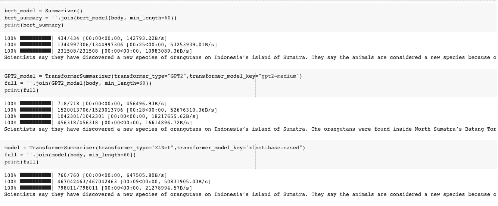

安装 Bert-extract-summarizer 后的比较，变压器==2.2.0，空间

**结果:**

*   性能方面——GPT-2-中等是最好的
*   耗时— XLNet (11 秒)GPT-2 中等(35 秒)Bert(30 秒)
*   易用性条款— BERT

## **第一步:选择 BERT 模型**

有多种 BERT 模型可供选择。

*   [伯特-基](https://tfhub.dev/tensorflow/bert_en_uncased_L-12_H-768_A-12/3)，
*   [小铺位](https://tfhub.dev/google/collections/bert/1)
*   艾伯特
*   [伯特专家](https://tfhub.dev/google/collections/experts/bert/1)
*   [伊莱克特](https://tfhub.dev/google/collections/electra/1)

> **最终使用的型号:DistilBERT**
> 
> 它是一个小型、快速、廉价、轻便的变压器模型，通过提取 BERT base 训练而成。
> 
> 根据 GLUE 语言理解基准测试，它比 bert-base-uncased 少 40%的参数，运行速度快 60%，同时保留了超过 95%的 bert 性能。

## **第二步:使用 BERT 进行文本分类**

> 你的大脑一定在和伯特开启的所有可能性赛跑。对于我们的 NLP 应用程序，我们可以在无数的上下文中使用 BERT 庞大的知识库！

## **1。让我们开始吧！**

我使用了来自 [tensorflow/models](https://github.com/tensorflow/models) 的 AdamW 优化器。

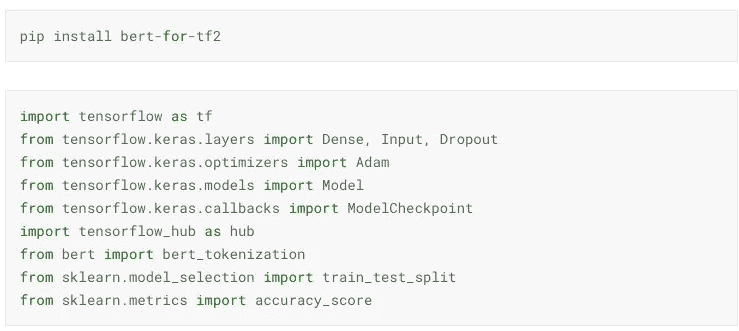

## **2。**导入并预处理数据集

来源:[卡格尔](https://www.kaggle.com/cfpb/us-consumer-finance-complaints)

> 数据集由 CFPB 向公司发送的消费者对金融产品和服务的投诉组成，以便公司做出回应，帮助改善金融市场。

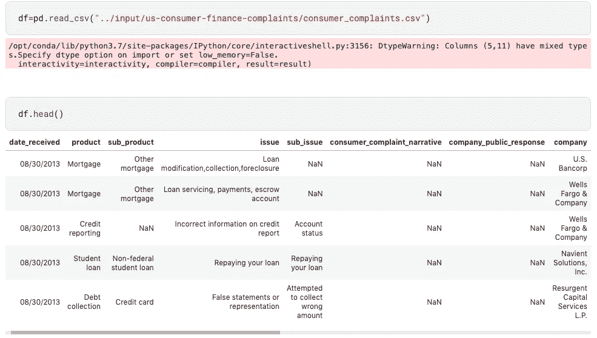

加载数据集

**2.1。功能选择**

我选择了与重新解决问题直接相关的列，并将它们分类到产品类别中

下面的输出显示我们的数据集有 555，957 行和 18 列。

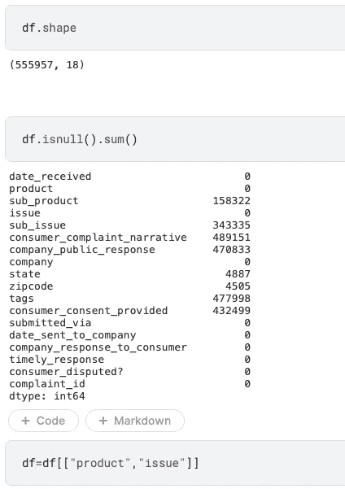

从 18 个功能中选择 2 个。

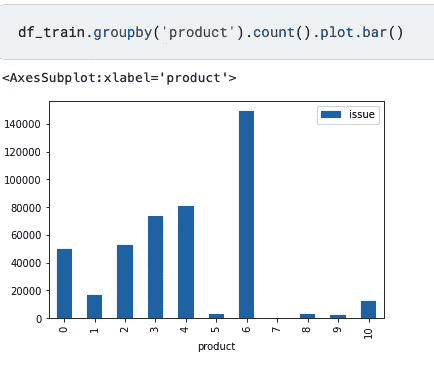

问题分为 10 个产品类别

**2.2。标签编码**

我已经对 ***产品*** 列进行了标签编码，以使用`**LabelEncoder**`将文本格式转换为标签格式。

> `**LabelEncoder**`:允许给分类数据分配序数级。
> 
> `**fit_transform**` (y):安装标签编码器，返回编码后的标签。

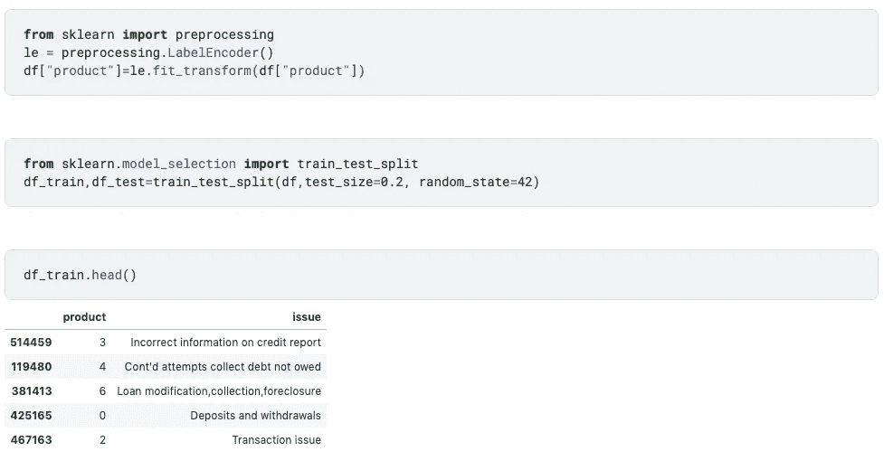

## 3.创建 BERT 记号赋予器

> 在输入到 BERT 之前，文本输入需要转换为**数字标记 id**并排列在几个**张量**中。
> 
> 标记化是指把一个句子分成单个的单词。为了对我们的文本进行分词，我们将使用 BERT 分词器。

**导入 BERT 专用的预训练模型和标记器**

*   从`hub.KerasLayer`导入 BERT 模型，创建一个 BERT 嵌入层
*   以一个 ***numpy 数组的形式检索 BERT ***词汇文件*** 。***
*   将文本设置为小写，并将我们的`vocab_file`和`do_lower`变量传递给`BertTokenizer`对象。
*   初始化 tokenizer_for_bert。

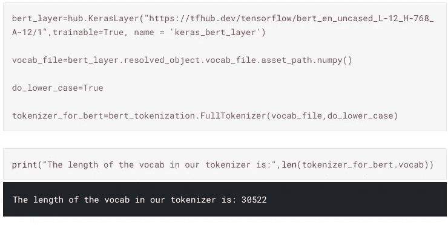

## 4.为文本预处理定义辅助函数

*   ***encode_text*** 函数将原始文本数据转换为编码文本(' CLS '+令牌+ 'SEP ')，该编码文本被拟合并转换为令牌
*   为了创建长度相等的句子，我填充了 ***token_ids、mask_ids、segment_ids*** 来截断具有所提供的批量大小的记号。

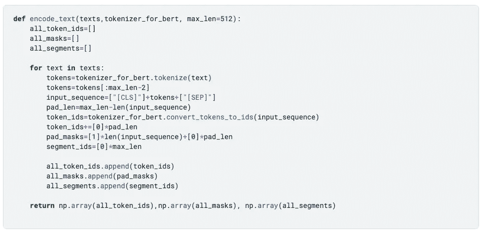

*   该模型将字符串作为输入，并返回适当格式的对象，这些对象可以传递给 BERT。

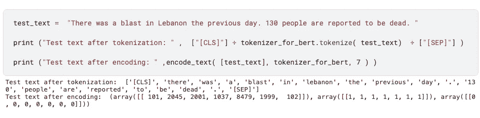

将 **test_text** 中的文本传递给 **encode_text** 函数

> 由于这个文本预处理器是一个 TensorFlow 模型，它可以直接包含在任何模型中。

## 5.定义模型

*   创建一个非常简单的微调模型，包括预处理模型、选定的 BERT 模型、一个密集层和一个用于正则化的下降层。
*   如您所见，BERT 模型将使用预处理的 3 个输出(`input_words_id`、`input_mask`和`segment_ids`)。

*批处理大小= 40 意味着如果输入是>大于 40，它将被截断为 40 个令牌，如果输入是< 40，它将填充为 40 个令牌。*

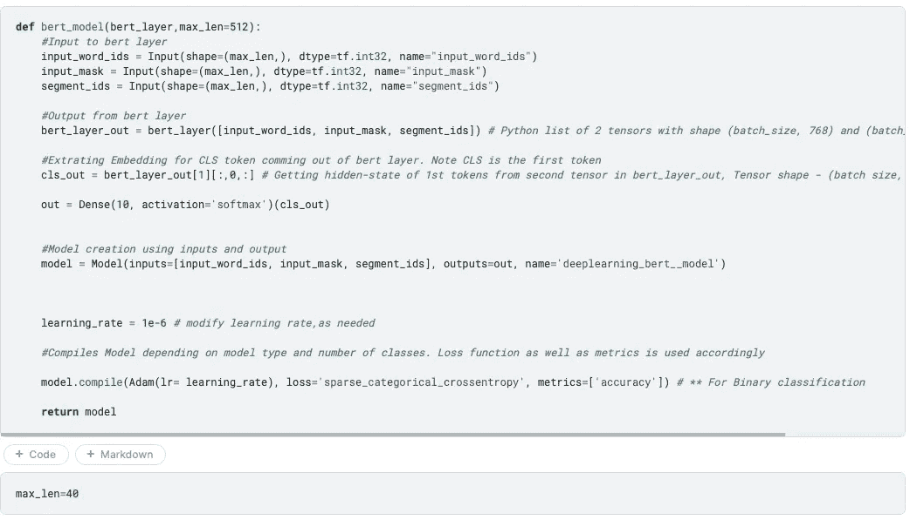

## **6。将列车文本转换为编码格式**

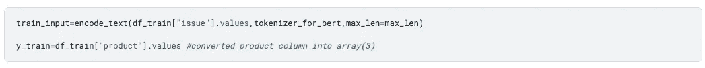

## 7.文本分类模型的微调

微调遵循 BERT 预训练中的优化器设置:它使用 ***AdamW*** 优化器

> 伯特最初接受的训练是:“适应时刻”(亚当)。该优化器最小化预测损失，并通过权重衰减进行正则化。

要提高精确度，请增加历元的数量

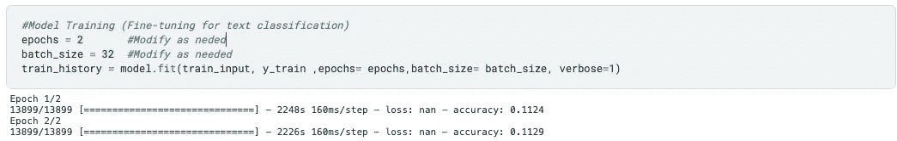

# 建筑管道

> **管道流量:**
> 
> **使用 BERT 的文本摘要>使用 BERT 的文本分类>使用 spaCy 的名称实体识别**

**文本摘要:**

提取、抽象和混合总结是最常用的策略。

*   *提取策略* —它选择最能代表文章重要主题的前 N 个句子。
*   抽象的摘要——它试图用新词来重新表述文章的主要思想。

1.  **安装 Bert-extract-summarizer:**
2.  **安装空间:**最小的英语语言模型只需要一会儿就可以下载，因为它大约有 11MB

> 该工具利用**hugging face**py torch transformers 库来运行提取摘要。
> 
> **首先嵌入句子，然后运行聚类算法，找到最接近聚类中心的句子**

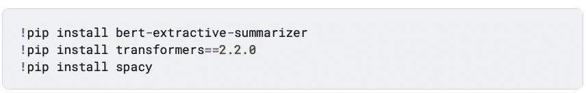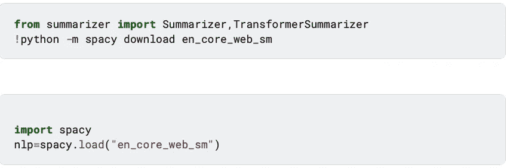

**3。定义管道功能**

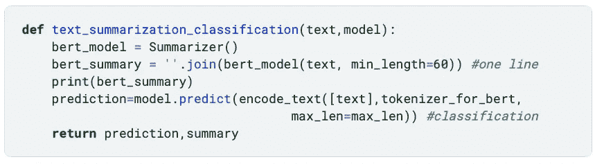

# 测试模型

将输入传递给已训练的模型以对文本进行总结和分类。

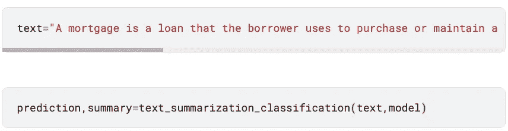

# 基于空间聚类的关键特征提取

> 关于空间命名实体识别
> 
> spaCy 的命名实体识别(NER)将非结构化文本中的命名实体定位并识别为标准类别，如人名、位置、组织、时间表达式、数量、货币值、百分比、代码等。

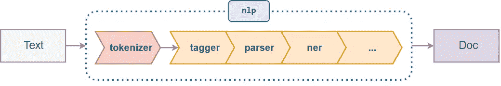

空间 NER 的结构

**访问生成的文本摘要上的实体注释**

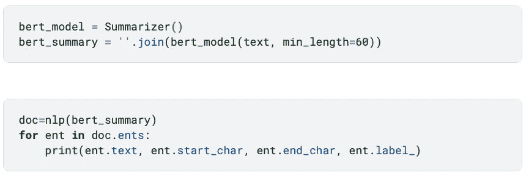

是具有自己的注释集的标记范围

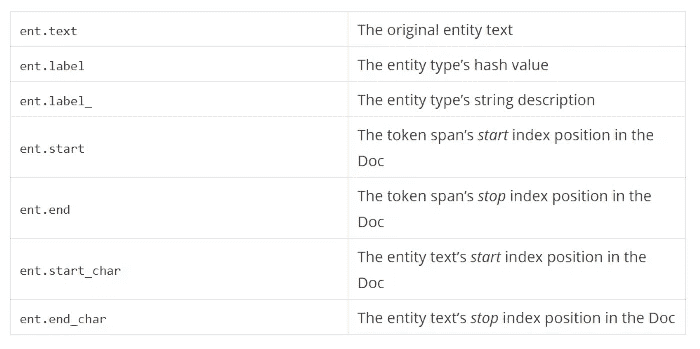

实体注释

# 进一步的想法

对于一个更快的方法，我可以通过使用 spaCy 从生成的文本摘要中提取**名词短语**来直接提取关键特征。

这将有助于通过统计文本文件中所有标记的频率来获得最常见的名词、动词、副词等。

请随意使用 spaCy，因为它有更多的内置功能可用。我会在我的下一篇博客中这样做。保持联系！