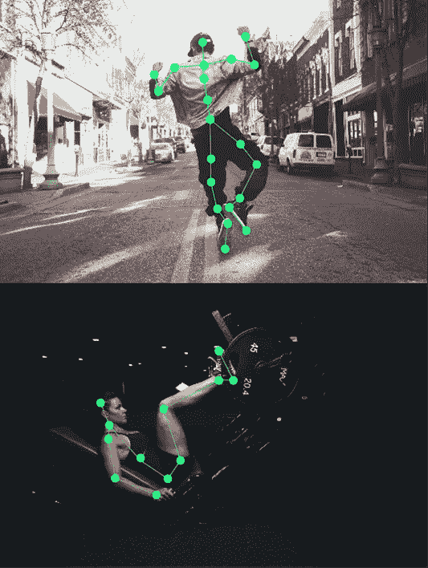

# 关键点标注案例研究

> 原文：<https://medium.com/nerd-for-tech/key-point-annotation-case-study-bff88c8eea35?source=collection_archive---------6----------------------->

字节桥关键点注释

## 关键点注释

关键点标记，包括人脸、人体和特定类型对象的关键点标记，通常用于训练人脸识别模型和统计模型。

带关键点的人脸标注是通过测量两眼之间的距离、下巴的形状、鼻子和嘴巴之间的距离来精确定位人脸特征，生成所谓的人脸“指纹”，适用于特定个人代码的唯一性。

人体关键点注释是为了在线体育教学(如瑜伽)而跟踪和监控人体(手、臂、头和腿)。在驾驶过程中，司机可以察觉到他们是在打电话还是在吸烟。在安全领域，它可以用于监控工人不符合安全规则的异常行为。

贴标机需要在关键点注释中具有三维感，以便标签图像可以是立体的。当存在被遮蔽的点或看不见的点时，贴标者在这个过程中要有空间想象的能力。

## **关键点标签**要求

这是标签名称和顺序。而且一定要按照上图的 ID 顺序进行。

鼻子、左眼、右眼、左耳、右耳、左肩、右肩、左肘、右肘、左手腕、右手腕、左臀部、右臀部、左膝盖、右膝盖、左脚踝和右脚踝。

## **标签说明**

关键点需要标记在关节的中心。

即使看不到眼睛、耳朵等具体的关键点，也要对图像进行预测和标注。

在某些关节看不见的情况下，如果你能预测它们的位置，就标记它们。

注意:只有在你看不到和预测不到的情况下，才不需要标注。

## 关键点注释面临的挑战

首先，通常会有很多重点。而在贴标签的过程中，一个人需要弄清楚它们的含义，数量可以是几个，甚至几百个。所以，重点越多，出错的几率就越大。

其次，标签好坏的标准是模糊的，导致贴标机检查错误的机会较少。给定这么多标记点，一个偏离位置的点不容易及时发现。毕竟，人不是机器，肉眼很难在两点之间找到一个相等的转移点。

## 您配置，我们注释

将你的数据标注任务外包给[字节桥](https://tinyurl.com/yc3v3zba)，你可以更便宜更快的获得高质量的 ML 训练数据集！

*   无需信用卡的免费试用:您可以快速获得样品结果，检查输出，并直接向我们的项目经理反馈。
*   100%人工验证
*   透明和标准定价:[有明确的定价](https://www.bytebridge.io/#/?module=price)(包括人工成本)

## **为什么不试一试？**