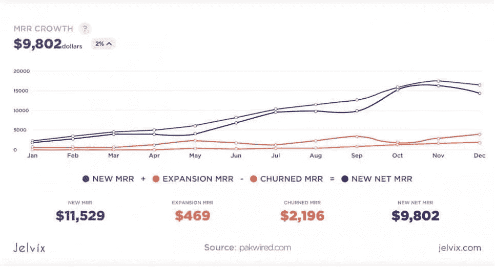
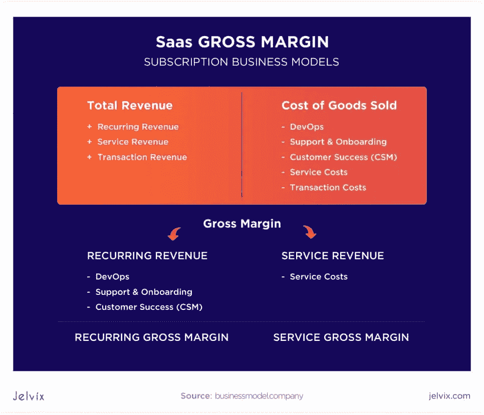
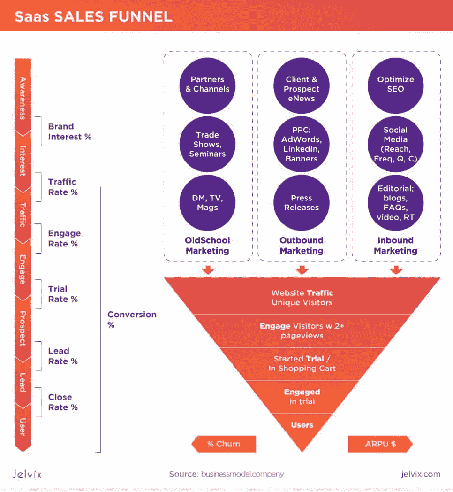
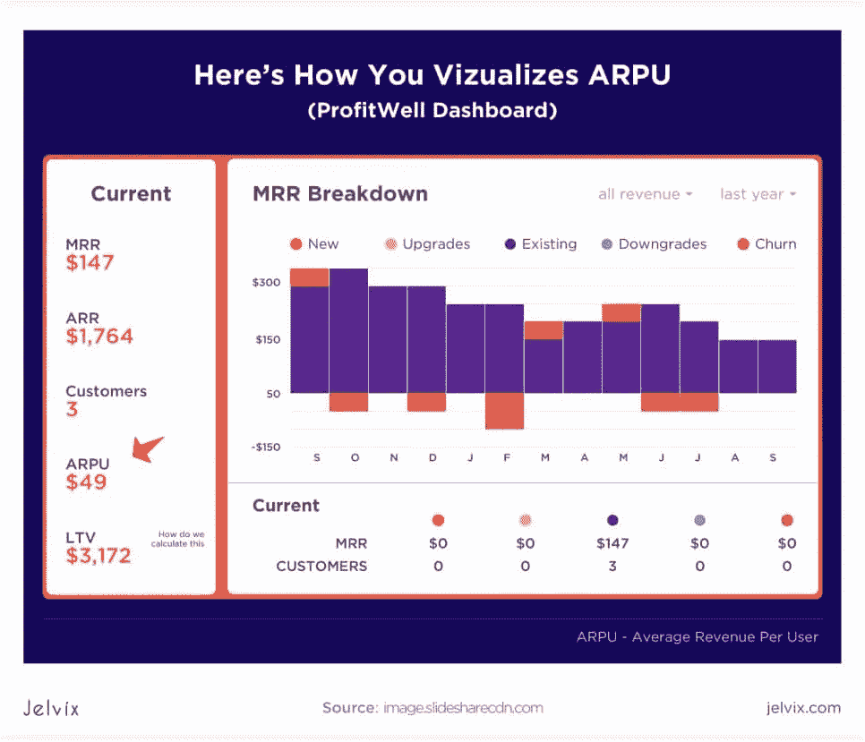
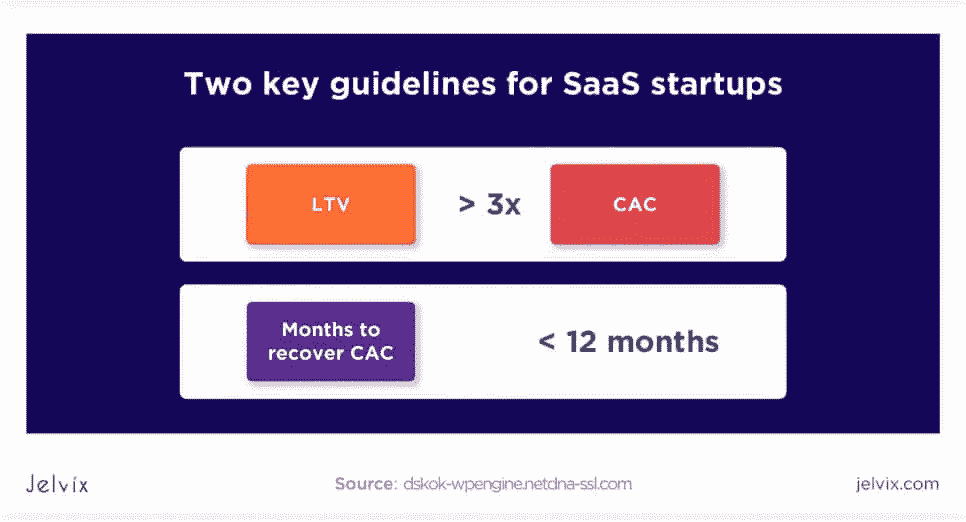
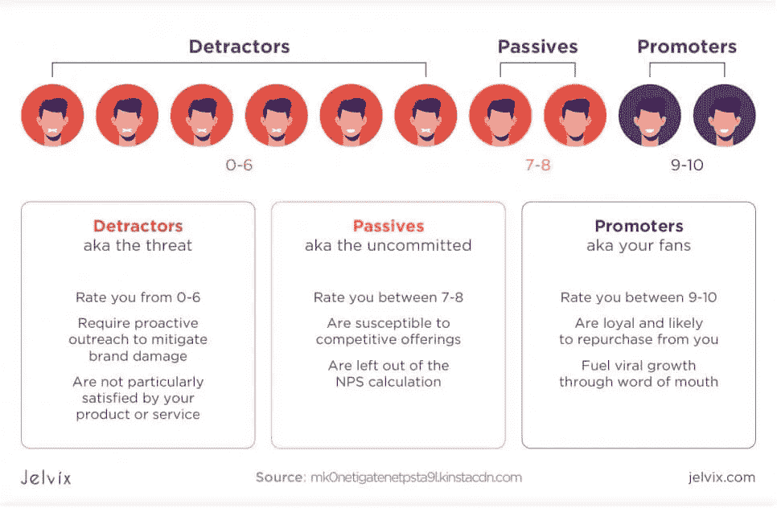
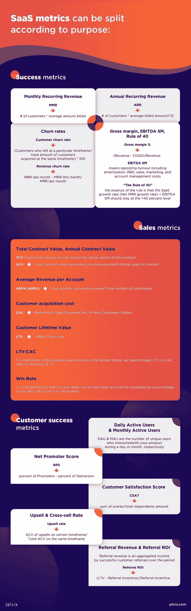

# 关键 SaaS 增长指标和 Saas KPIs

> 原文：<https://medium.com/nerd-for-tech/key-saas-growth-metrics-and-saas-kpis-3b01c6b03516?source=collection_archive---------1----------------------->

像网飞、Dropbox、优步、Slack 和其他公司是如何在现代市场中生存下来的？我们知道答案！绩效指标、标杆管理和分析是成功的 SaaS 公司的法宝。

"*指标仅仅是你现有产品策略的反映。数据是强大的，因为它是具体的。对于许多企业家来说，尤其是有技术背景的企业家，经验数据可以胜过一切——最佳实践、受过良好教育的人和头衔——这是有充分理由的。这真的是怀疑论者的最佳武器，也是帮助初创公司以新的创新方式解决问题的重要工具。*”([陈楚翔，优步骑手成长引领](https://andrewchen.co/know-the-difference-between-data-informed-and-versus-data-driven/))

# SaaS 是 IT 市场的驱动者

简而言之，SaaS(软件即服务)是指一个或多个供应商基于订阅远程提供的软件。在过去的几年里，SaaS 被认为是发展最快的 IT 市场之一。

根据 [Gartner 的预测](https://www.gartner.com/en/newsroom/press-releases/2020-07-23-gartner-forecasts-worldwide-public-cloud-revenue-to-grow-6point3-percent-in-2020)，基于订阅的软件将继续增长，通过 SaaS 收入模式的可扩展性，将在 2022 年达到 3.64 亿美元，并将保持最大的 IT 市场份额。由于今年新冠肺炎的封锁，迫使人们需要具有更好功能和工作速度的协作工具。这导致了全球对 SaaS 产品的更大兴趣。

# 在 SaaS 使用数据指标

Jelvix 帮助 SaaS 客户在关键指标解释的帮助下确定增长点和减分点。性能的测量和解释显示了机会，并有助于有效地节约资源。

在这篇博客中，我们旨在阐明一种 SaaS 度量的方法，并解释您需要缩放哪些度量以及何时缩放。

为了制定有利的增长战略并揭示成功点，团队需要了解什么是 SaaS 指标，知道指标的类型，习惯性地跟踪它们，并学习如何从分析中获得洞察力。

**SaaS 指标可以根据它们的用途进行拆分:**

*   成功指标
*   销售指标
*   客户成功指标

让我们仔细看看每一组。

# 成功指标

我们在这里收集了一份 SaaS 公司的关键指标列表，这些指标反映了您业务的整体情况——结合了 SaaS 财务指标、销售额、客户成功率和营销数据。通过这份 SaaS 指标列表，您可以快速获得有关总体绩效和进一步发展方向的信息:

*   MRR，每月经常性收入
*   年度经常性收入
*   流失率
*   毛利润、COGS、EBITDA SM、40 法则

**MRR，每月经常性收入**

**MRR** 显示每月的经常性收入，是 SaaS 报告中应该跟踪的重要指标之一。如果你的商业模式主要是按月订阅，我们建议你注意这一点。该索引有助于将所有订阅计划归纳为每月跟踪的单个号码。

**公式:**

MRR =客户数量*平均账单金额

10 名客户*每月 100 美元= 1000 美元 MRR

## 年度经常性收入

ARR 与 MRR 非常相似，但主要用于有年度订阅计划的公司。然而，MRR 和 ARR 都很重要。

**年度经常性收入**的计算方法是将 MRR 乘以 12(月)，得出年度收入。

**公式:**

ARR =(客户数量*平均账单金额)*12

(10 名客户* 100 美元/月)* 12 = 12，000 美元

**MRR (ARR):净值和增长率**

一些因素影响 MRR 或 ARR 动态(取决于所审查的时期)，汇总不同来源的值并形成**净 MRR (ARR)** :

*   新 MRR (ARR) —新增收入统计；
*   搅动的 MRR(ARR)——退订统计。这可以是负数；
*   扩展 MRR (ARR) —扩展订阅的统计；
*   收缩 MRR (ARR) —降级订阅的统计。这可以是负数；
*   重新激活 MRR(ARR)——统计从以前流失的顾客那里获得的收益。

综上所述，我们可以得到一个全面的 MRR 数字，表明该公司的增长:

**净 MRR 增长率** **公式:**

MRR 增长率，%=(MRR 第 2 个月的净值—MRR 第 1 个月的净值)/MRR 第 1 个月的净值* 100

**流失率**

SaaS 收入在客户生命周期中平均分配，而销售成本在前期支出，这导致有必要为客户流失建立合适的指标。由于这项业务的重复性，只要客户继续使用这项服务，SaaS 就应该获得收入。

**客户流失率**

正如你所看到的，客户流失率表明了签约后离开的客户数量。此指标可用作 SaaS 营销指标之一。更多地了解客户意味着收集反馈、竞争对手分析，并采取措施满足客户的期望。

**公式:**

客户流失率=(在特定时间段离开的客户/在同一时间段获得的客户总数)*100

例如:这个月你有 200 名顾客，其中 5 名顾客离开了。这使得流失率为 2.5%

除了每月的数字之外，每年的客户流失率也很重要。原因很简单——你可以设定一个可接受的月流失率，却忽略了一个事实，那就是一年之后，这将变成一场灾难。

例如，在 12 个月的基础上，每月 5%的流失率将变成可怕的 54%。

**公式:**

年客户流失率=(1-月流失率)* 12

收入流失率

我们还将**收入流失率、**或 MRR 流失率作为关键的 SaaS 指标之一。它表示由于订阅降级和客户退订造成的 MRR 损失率。为了计算这一点，我们将上一时期的 MRR 和当前的 MRR 之间的差异除以上个月的 MRR。

**公式:**

收入流失率=上月 MRR—本月 MRR/上月 MRR

11 月 MRR = 9000 美元，12 月 MRR = 8750 美元，收入流失率将为 9000–8750/9000 = 2.7%或 250 美元

所有这些例子都很简单，尽管在实际业务中，客户流失的计算可能会更复杂，因为我们必须考虑追加销售、各种定价包等。因此，收入流失率可以是负的，而客户流失率是正的。例如，在同一个月有一个不满意的客户和一次追加销售。因此，我们必须利用 SaaS 度量的相互联系来看清这幅清晰的画面。

## 毛利润，EBITDA SM

毛利润是扣除获取客户和服务的成本后剩下的收入比率。这些成本也称为销货成本(COGS)，在 SaaS，它们通常包括客户支持、托管费、第三方服务付款等支出。

**通用公式:**

毛利百分比(收入-销货成本)/收入

毛利润是最常见的业务指标之一，您可以在 SaaS 找到详细的一致性信息:

SaaS 商业模式的一个显著标志是能够无限期地赢得客户，并保持相对相同的销售成本，从而提高这项业务的毛利率。

**EBITDA SM** (未计利息、税项、折旧、摊销、销售和营销前的收益)指的是运营收益，包括摊销、研发、销售、营销和账户管理成本。

整个软件行业的通用性能基准是遵循 40%规则。

**《四十的法则》**

坚持这条规则是保持公司“健康”的一种方式该规则的本质是 SaaS 增长率(净 MRR 增长率)+ EBITDA SM 应保持在 40%以上的水平。让我们检查一些例子来澄清。

*   如果公司增长 20%(增长率)，它应该在同一时期产生 20%的利润(EBITDA SM)，也就是 40%。
*   如果增长率为 40 %,同期利润为 0%是可以接受的。
*   如果增长率是 50%，那么 10%的损失不会压垮企业。

遵循 40 的规则会产生令人印象深刻的结果。

# 销售指标:如何衡量销售增长？

将关键 SaaS 指标分组是区分衡量盈利业务不同优势的工具的一种方式。所以让我们转向 SaaS 销售。SaaS 的销售过程大致看起来是这样的:

一次成功的 SaaS 销售是另一篇博文的主题。在这里，我们想解释 SaaS 的关键销售指标，这些指标揭示了您的销售团队的效率、定价模式的有效性，以及最重要的—客户对您的服务的寿命。

指标列表:

*   总合同价值(TCV)，年度合同价值(ACV)
*   每个账户的平均收入(ARPA)
*   客户获取成本(CAC)
*   客户终身价值(LTV)

## 总合同价值(TCV)，年度合同价值(ACV)

**年度合同价值**代表每份合同的年收入。**合同总金额**分别表示整个合同期间的收入。

**公式:**

ACV =合同总价值(不包括一次性付款)/合同总年数

让我们看一个例子:

有三个客户计划按年付款:

客户 A:1 年 800 美元/年

客户 B:700 美元/年，为期两年

客户 C:3 年每年 600 美元

那么，第一年的 ACV 将是:

($800+$700+$600)/3 = $ 700

第 2 年的 ACV 会更低，因为合同中有两个客户:

($700+$600)/2 = $650

三年级的 ACV 将是最低的:

在这种情况下，TCV 对客户 A 来说是 800 美元，对客户 B 来说是 1400 美元，对客户 c 来说是 1800 美元

## 每个账户的平均收入(ARPA)

我们帮助客户调查的一个方面是业务可行性。每个账户的平均收入是运营指标之一，它表明“标准”客户承诺了多少收入。将这一指标分别与新客户和现有客户联系起来，以观察他们的行为并揭示模式也是合理的。

ARPA 也可以修改成 ARPU 或平均单位收入。

**公式:**

ARPA (ARPU) =每月经常性总收入/用户总数

例如，看看 ARPU 是如何被可视化的:

## 客户获取成本(CAC)

在早期发展阶段，客户获取成本是对 SaaS 尤为重要的增长指标之一。这种商业模式在成长阶段面临着获取客户的巨额前期支出，而投资回报却需要很长时间。目前，当来自现有客户的利润覆盖了获得新客户的成本时——你的公司度过了这个时期并开始盈利。

**公式:**

CAC =营销和销售费用/新增客户数量

也就是说，客户获取成本表示单个客户获取的成本，可以分为三种类型:

*   混合 CAC:这个指数反映了你为获得 1 个客户在营销和销售上花费的金额；
*   付费 CAC 表示您在获取单个客户的付费活动上的支出；
*   CAC 回收期(月)显示了收回签约客户获取成本所需的时间。它是通过将 CAC 除以每个客户的 MRR 来计算的。

## 客户终身价值(LTV 或 CLTV，CLV)

客户终身价值—该指标代表客户在整个订阅期内带来的总收入。

我们建议关注 LTV，因为它提供了两个有价值的见解:

*   每个客户创造的收入额；
*   客户产生收入的时间。

了解了这些信息，我们就可以通过专注于留住那些在更长时间内带来更多价值的客户来改进保留策略。

(如果你按月计算流失率，那么 ARPA 也应该按月计算)

## LTV: CAC

为了衡量业务的可伸缩性，我们需要混合 SaaS 指标，探索现有的业务模型，提供相关性和成本价值比。其中一个案例是 LTV 和 CAC，这两个指标结合起来更有意义。

为了了解企业是否会在不久的将来盈利，我们需要将 LTV 与资本充足率保持在大于 3 的水平。

如果一家公司从客户那里获得的利润超过了它在收购上的支出，那么它就处于安全区。与之相关的我们关注的是恢复 CAC 的时间。目的是让它不到一年，提高盈利能力，尽快拿到现金。

## 胜率

检查销售效率的一个简单方法是统计赢得合同的比率。它是以赢得的交易占总交易的份额来计算的，可以用百分比来表示，也可以用价值来计算。

赢得率比率= 1 的常见基准表明，合同收入将涵盖未来 4 个季度的销售和营销费用。虽然，有一个巨大的问题，线索的类型(无论是来自推荐或有机搜索)，交易规模等。

# 客户成功指标

谈到 SaaS 成功指标时，我们必须考虑的另一个要点是客户保持率。你的产品具有满足顾客需求的所有特性吗？用户如何与你的服务或产品互动？他们想从中得到什么？了解顾客可以为追加销售打开广阔的机会，并为如何改进产品本身提供思路。

我们建议您查看这些主要指标，这将有助于您系统化有关客户的数据:

*   日活跃用户和月活跃用户(DAU 和 MAU)
*   净推介值(NPS)
*   客户满意度得分(CSAT)
*   追加销售和交叉销售率
*   推荐收入和推荐投资回报率

## 每日活跃用户和每月活跃用户

DAU 和毛分别是一天或一个月内与你的产品互动的独立用户的数量。这里最重要的事情是定义什么将被算作“用户”:今天登录的人，在应用程序中花了一些时间的人，点击了特定按钮的人，等等。

跟踪这一指标可以表明一切是否正确，人们是否在日常使用软件。如果活跃用户数下降，应该是出了问题的信号，要检查产品了。

## 净推介值(NPS)

与 SaaS 分析公司合作，我们通常跟踪常规指数。但是当谈到客户时，我们需要使用 NPS 来研究客户体验。

简单来说，Net Promoter Score 只问了一个关于向朋友或同事推荐服务/品牌的可能性的问题。受访者通过从 0 到 10 中选择可能性来回答。

根据对该问卷的回答，我们将客户分为三组:

*   诋毁者——不喜欢服务的人；
*   被动者——冷漠者；
*   推销者——喜欢并乐意推荐服务的人。

**公式:**

NPS =促进者的百分比—反对者的百分比

理想的目标是拥有尽可能多的推广人员。根据净推广分数，公司可以为每个群体开发特定的活动来鼓励和维护客户。

## 客户满意度得分(CSAT)

NPS 衡量的是总体客户满意度，而 CSAT 则用来了解用户对产品特定功能的看法。为了给 CSAT 打分，用户需要对产品和/或其特性进行评分(1-3，0-7，1-10，等等)。).

**公式:**

CSAT =得分总和/被调查者总数

## 追加销售和交叉销售率

这些指标用于计算现有客户升级其账户或购买额外服务/功能的情况。

**公式:**

追加销售率=特定时间段内追加销售的 ACV/同一时间段内的总 ACV

相同的公式用于计算交叉销售率。

## 推荐收入和推荐投资回报率

推荐收入是一段时间内成功客户推荐的总收入。为了从这个数字中获得洞察力，应该将它与推荐项目的投资数量进行比较。

让人们参与推荐计划是产生潜在客户的经济有效的方法之一。客户不仅为他们的合同带来收入，还会邀请新用户。推荐投资回报率揭示了公司在 LTV 期间在推荐项目上花费的每一美元将产生多少收益。我们可以计算在推荐上花费的金额，并将其与潜在的推荐收入进行比较:

**公式:**

推荐投资回报率=(LTV-推荐激励)/推荐激励

例如，一个普通客户在 24 个月内每月支付 800 美元。

LTV = 800 美元* 24 = 19200

推荐计划意味着为用户和他邀请的人提供-20%的月费(800 * 0.2 = 160 美元)，为期 12 个月。

因此，推荐提议激励的成本是$160*12)+($160*12) = $3840

推荐投资回报率= ($19200 — $3840) / $3840 = 4

因此，该公司在推荐项目上每花 1 美元就能获得 4 美元。还不错。

营销管理:一个公司应该在营销上花多少钱？

这是我们从 SaaS 客户那里得到的一个常见问题，在营销上花多少钱，什么时候花。考虑到前期支出，公司管理层希望在这一领域谨慎行事。

通常的基准是:一般收入的 10%可用于营销。但实际上，我们意识到在估算营销费用时需要注意两个额外的支柱:

*   平均交易规模和公司规模；
*   比较计划支出和新订单，而不是收入。

关于营销支出，没有万能的配方。在与我们的客户交谈时，我们经常看到他们对自己的 CAC 水平过于乐观。我们的建议主要是回顾不同的渠道，找出最有效和最合理的渠道。通过这样做，我们可以识别无谓的支出，优化营销成本。

对 SaaS 来说，另一个检验他们是否在营销上花费足够多的方法是将自己与类似规模和产品类型的公司进行比较。

# SaaS 标杆管理

“好”是什么样子的？我们跟踪很多指标，但是我们如何知道事情是否如其所愿？这是一项具有挑战性的任务，以计算出多少和在哪里投资，以获得最大的投资回报率。

标杆管理是一条路径，而不是严格的指导方针。有许多专题文章和数字对报告很有用，也是战略会议的投入。一般来说，你可以找到带有通用数据的[标杆报告](https://f.hubspotusercontent10.net/hubfs/366266/2020_SaaSProductBenchmarks.pdf)。

在 Jelvix，我们期待为客户提高业务绩效和营销效率的方法。我们可以为 SaaS 业务发展的每个阶段制定基准和 SaaS 关键绩效指标。[联系我们获取基准测试技巧！](https://jelvix.com/contact-us)

# 结论

SaaS 估值指标服务于一个目标:帮助您做出最佳决策，以推动您的业务。它可以是指向正确的原因、发展机会和最终解决方案的指南针。

SaaS 的业务是关于客户的生命周期。业务发展的每一个阶段和客户参与的每一个阶段都是可数的，可以追踪的。汇总所有数据并明智地使用收集到的数据可以推动另一个成功的世界知名企业。

我们希望以上信息能让您对 SaaS 测量有所了解。如果您有任何想法，请加入讨论或给我们留言。

*最初发表于*[T5【https://jelvix.com】](https://jelvix.com/blog/saas-business-metrics)*。*