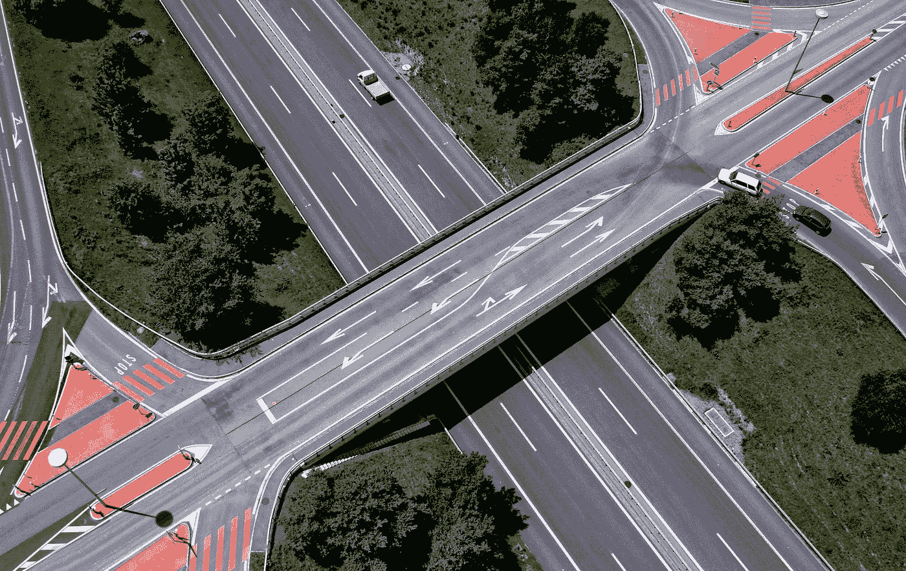

# 关键点注释-道路箭头案例研究

> 原文：<https://medium.com/nerd-for-tech/keypoint-annotation-road-arrow-case-study-d8cc2f4213ee?source=collection_archive---------3----------------------->

我们经常在路上看到各种箭头。这些箭头是具有导向作用的道路交通标志，表示前方道路只能按照路面上的导向箭头行驶。

它们主要为交通参与者提供引导信息。指示器类型通常为行人和驾驶员提供准确的道路交通信息，以使道路交通顺畅和安全。

人们通常怎么开车？

*   观察:观察路况，如车距、行人、交通标志等。
*   分析:根据经验分析是否加速、减速或停止
*   做决定:根据实际情况行动，比如踩油门或刹车。

自动驾驶的过程与人类驾驶员没有什么不同:

*   感知:通过摄像头、雷达等硬件采集图像等数据，相当于人眼的观察
*   分析:通过深度学习模型对图像进行实时分析，为下一步做出决策
*   做出决策:

为了让无人驾驶车辆能够安全、无障碍地在道路上行驶，我们需要允许车辆自主识别各种类型的道路交通标志。数据标注的场景通常包括变道和超车、通过交叉路口、无红绿灯控制的无保护左转和右转。

我们来看一个路箭头的重点注释案例。

## 关键点注释

用关键点标记道路箭头。每种类型的箭头都有固定的点数。这些点按逆时针方向标记，并按顺序连接。

**1 标签类型**

道路箭头

箭头 _ 直线

向左箭头

向右箭头

箭头 _ 合并 _ 向左

箭头 _ 合并 _ 向右

向左向右箭头

向左直行箭头

向右直行箭头

箭头方向

arrow_ruturn

笔直的箭头

箭头 _ 返回 _ 直线

向左箭头

向右箭头

箭头 _ 直线 _ 左 _ 右

**2 标签要求**

*   各点应严格按照其对应位置逆时针标注
*   如果由于遮挡而不清楚它是什么类型的箭头，或者如果它的一部分很难辨别，就不要标记它
*   不得有遗漏或错误的标签

# 结束

将您的数据标注任务外包给 [ByteBridge，](https://tinyurl.com/27u4e4sc)您可以更便宜、更快地获得高质量的 ML 训练数据集！

*   无需信用卡的免费试用:您可以快速获得样品结果，检查输出，并直接向我们的项目经理反馈。
*   100%人工验证
*   透明和标准定价:[有明确的定价](https://www.bytebridge.io/#/?module=price)(包括人工成本)

## 为什么不试一试？