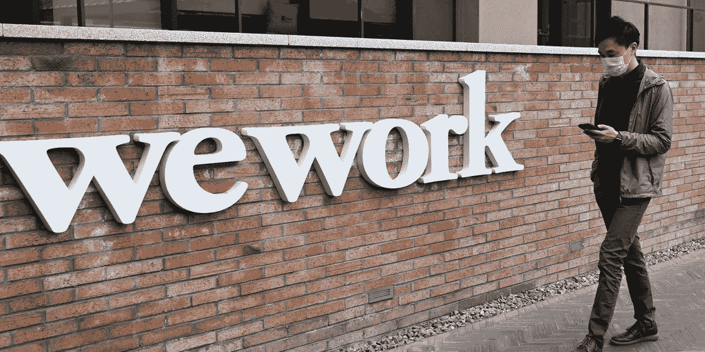
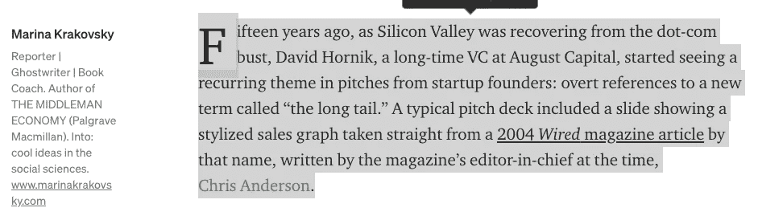
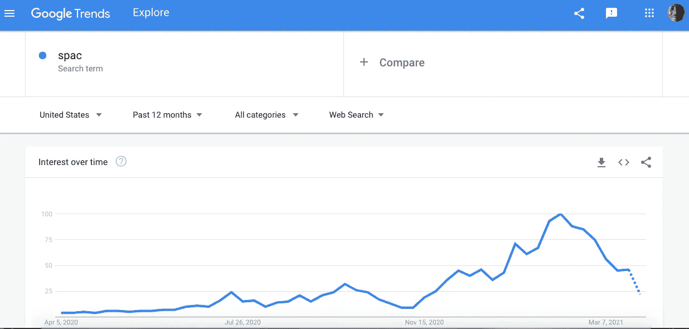
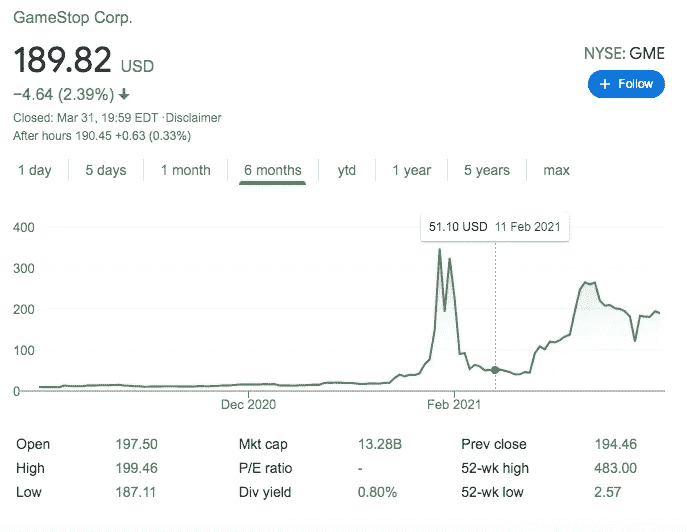

# 创业推介或特殊目的收购公司套牌中的关键词

> 原文：<https://medium.com/nerd-for-tech/keywords-in-startups-pitch-or-spac-decks-d12db42000ed?source=collection_archive---------14----------------------->

Marina Krakovsky 的文章的这一段[只是强调了一个数据驱动的创业公司产品使用创业公司创始人的 buzz 关键字之一的机会。真诚地试图根据 UI 和 UX 的构建方式，在媒体上发布另一篇关于阅读体验的文章，但被这台运行 windows 10 内部程序的计算机打断了，它一直在崩溃，因为它也告诉我，它也有一些问题，就像我写的一样。仍然试图解决这个问题或错误的内部程序的窗口，只是停止浏览器的进程，并刷新整个屏幕每分钟左右。为了完成这篇关于 RX、UX 和 UI 的文章，我跳到了我的 mac 电脑上，同时寻找媒体的文章作为这篇文章的插图，我看到我可以阅读来自](https://marker.medium.com/the-failed-promise-of-the-long-tail-6ba8a3afb9b1) [Marina 的这篇文章。我认识她，浏览过她的博客，也读过克里斯·安德森的《长尾理论》](/@marinakrakovsky)[。丢掉我想写的第二篇文章，翻到这一段。](https://en.wikipedia.org/wiki/The_Long_Tail_(book))

一旦消费的段落强调了一个产品的机会，这是处理所有创业的摊位甲板和做一些关键字分析。这可以为风险天使投资者提供清晰的见解，并告诉他们什么是热门的技术词汇。

如果你也喜欢，你可以通过这种形式的 IPO 来处理特殊目的收购公司上市的创业公司。

请注意，特殊目的收购公司也是一个嗡嗡作响的词。

但它似乎失去了势头。

这是 Gamestop 现在的势头

