# KMM 用户界面架构-第 1 部分

> 原文：<https://medium.com/nerd-for-tech/kmm-ui-architecture-part-1-6362e14ee52a?source=collection_archive---------1----------------------->

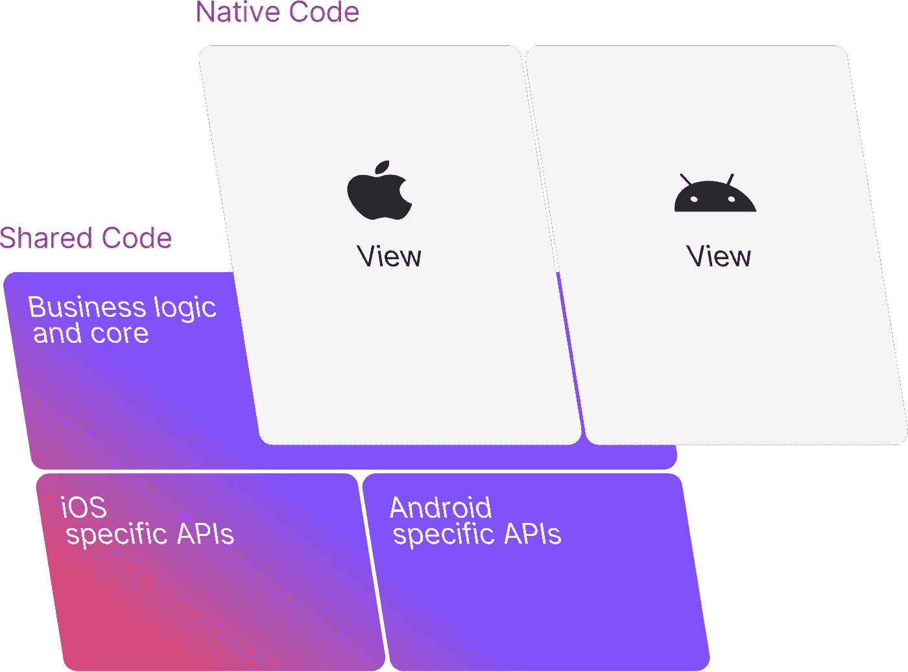

# 概观

这是两篇系列文章的第 1 部分:

*   [**第一部分**](/p/6362e14ee52a) **:常见 ui 模式的总结以及我们从它们身上学到的东西**
*   第 2 部分:为 Kotlin 多平台创建一个简单的、适应性强的、可预测的和可组合的 UI 框架

# 问题陈述

KMM(科特林多平台手机)的承诺是字面上的:

> 用纯 kot Lin([https://kotlinlang.org/lp/mobile](https://kotlinlang.org/lp/mobile/))语言为你的 iOS 和 Android 应用编写一次业务逻辑

与其他跨平台框架如 Flutter 或 React Native 不同，KMM 不承诺用户界面的单一代码基础。这引发了如下问题:

*   到底什么是用户界面？
*   如何分解用户界面，分解后的哪些部分是平台不可知的？

通过回答这些问题，我们将能够:

*   更好地分离不同的用户界面组件，特别是独立于平台和特定于平台的代码
*   增加跨目标平台共享的代码量

为了从不同的角度看待问题和潜在的解决方案，本系列的第一部分将解释一些常见的架构模式，如 MVC、MVP、MVVM、MVI、SAM、BLoC、React/Redux，并尝试提取它们的基本思想。

# 用户界面问题

在其最基本的形式中，一个 ui 架构有两个主要关注点(我称之为*关注点*遵循[关注点分离原则](https://en.wikipedia.org/wiki/Separation_of_concerns)，这是“将[计算机程序](https://en.wikipedia.org/wiki/Computer_program)分离成不同部分的设计原则”，也注意到[这个建议](https://stackoverflow.com/a/25012230/534471)忽略围绕 [SRP](https://en.wikipedia.org/wiki/Single-responsibility_principle) 和 [SoC](https://en.wikipedia.org/wiki/Separation_of_concerns) 的学术讨论):

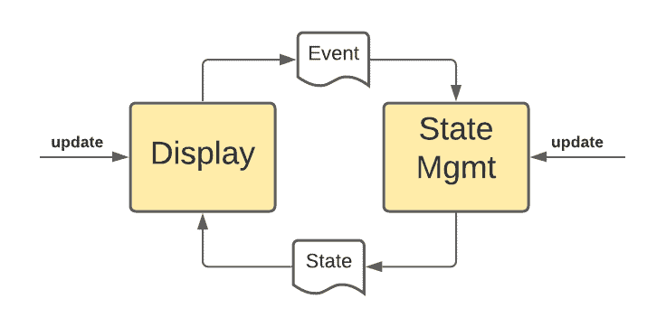

1.  **显示**:向用户显示一些内容=呈现状态(在大多数模型中，这是“视图”)
2.  **状态管理**:检索、存储、转换状态/数据- >业务逻辑

存在两个触发器:

1.  用户与显示的内容进行交互，这可以导致状态改变，状态改变可以导致显示内容的改变
2.  状态更新可以由 ui 框架之外的元素触发，例如异步网络呼叫或设备事件(位置更新、网络事件、传入消息等)。)会导致显示内容的变化

理论上，显示的代码可以直接读取和更新状态，或者管理状态的代码可以侦听 ui 事件来更新自身，也可以直接更新/操作显示。我们都知道这种紧密耦合的设计是一个糟糕的想法(在谷歌推出 [ViewModels](https://developer.android.com/topic/libraries/architecture/viewmodel) 之前，这在 Android 上是常见的做法)。为了实现某种解耦，我们需要介于两者之间的“某种东西”:

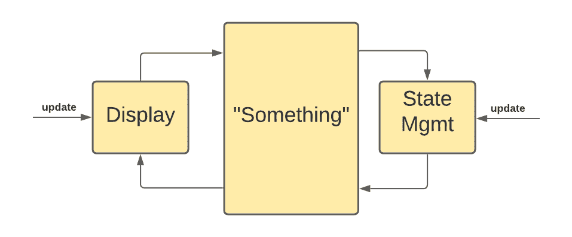

每个 ui 架构都定义了介于这两者之间的“某些东西”:

*   观察 ui 更改以更新状态
*   获取状态并准备呈现

观察力敏锐的读者会注意到，我刚刚定义了(至少)另外四个关注点:

1.  **收集:**监听用户界面事件(键盘、触摸、鼠标)、过滤事件(例如去抖)、聚集事件(例如将触摸事件聚集到滑动以消除事件)
2.  **转换:**将收集步骤的结果转换成状态变化(在一些框架中，该结果被称为*意图*)
3.  **选择:**观察状态并选择与用户界面相关的变化
4.  **绑定:**准备要显示的状态，例如通过过滤相关数据和/或将其映射为用户友好的格式，如将 UTC 时间戳转换为本地时区等。

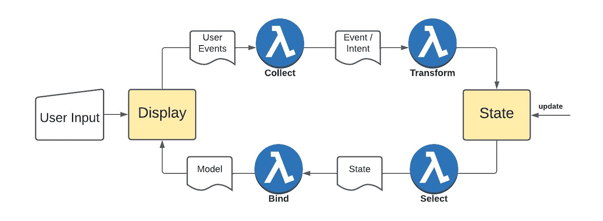

## 间奏曲:干净的建筑

现在我们有了一个通用的(唉，抽象的)ui 架构，让我们把它放到一个更大的[干净架构](https://blog.cleancoder.com/uncle-bob/2012/08/13/the-clean-architecture.html)的环境中(如果你对干净架构不感兴趣，跳过这一章):


虽然它是在考虑 web 而不是移动应用程序的情况下创建的，但它仍然是一个有用的模型，这不仅仅是因为所提出的分解，还因为依赖规则:

> 这条规则说*源代码依赖*只能向内指向*。内圈的任何东西都不可能了解外圈的任何东西。*

*将[依赖性反转原则](https://en.wikipedia.org/wiki/Dependency_inversion_principle)应用于架构的所有层:*

*   *没有一个组件知道位于外圈的组件*
*   *外环中的组件与内环中组件的抽象(例如接口)一起工作*

*在提出 KMM ui 架构时，我们将遵循这一原则。*

*在他的[原始文章](https://blog.cleancoder.com/uncle-bob/2012/08/13/the-clean-architecture.html)中，“Bob 叔叔”将我们上面定义的所有关注点放入绿色环中:*

> *例如，正是这一层将完全包含 GUI 的 MVC 架构。演示者、视图和控制器都属于这里。*

*我不想打断你，但我不同意那种说法。
MVC 中的模型不仅仅是数据，它是:*

> *图案的中心部分。[…]动态数据结构[…]直接管理应用程序的数据、逻辑和规则。*

*根据这一点，它也是业务逻辑的一部分，因此也存在于红色的“用例”圈中。*

*[MVC](https://en.wikipedia.org/wiki/Model%E2%80%93view%E2%80%93controller) 里的视图显然也生活在蓝圈里。即使演示者创建了所有的 HTML/CSS/JavaScript，我们仍然需要一个浏览器(位于蓝色圆圈中)来呈现和收集用户输入。*

*[这篇文章](http://www.plainionist.net/Implementing-Clean-Architecture-Controller-Presenter/)非常详细地解释了视图、演示者、控制器和模型/用例的交互，并为我们描绘了这一切:*

*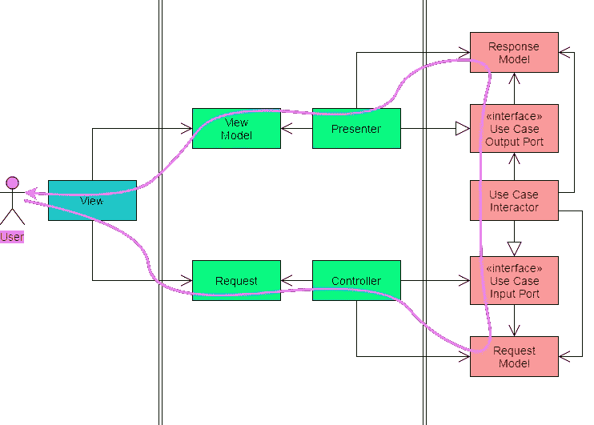*

*这正是我们上面定义的:*

*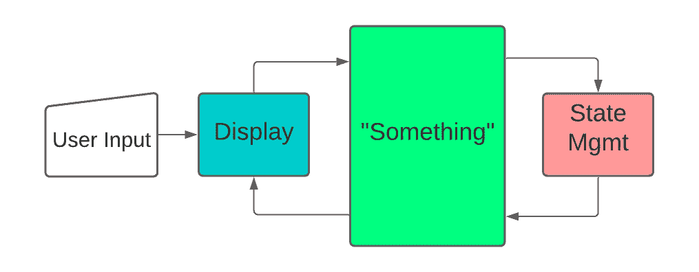*

*所以在一个[干净架构](https://blog.cleancoder.com/uncle-bob/2012/08/13/the-clean-architecture.html)的环境中，我们的 ui 架构跨越了外部三层的部分。*

# *现有模式/框架*

## *模型-视图-控制器*

*当研究 MVC 时，你会发现它一点也不清晰。有两种主要模式:*

*   *[三角形模式](https://tinyurl.com/mvctrianglemodel)(是 1979 年的[原始模式):视图直接与模型交互，控制器也直接与模型交互](https://folk.universitetetioslo.no/trygver/themes/mvc/mvc-index.html)*
*   *[链式模式](https://tinyurl.com/mvcchainmodel):控制器与视图和模型交互，但视图和模型之间没有直接交互*

*链式模式是与我们自己的 ui 架构相匹配的，而控制器是介于两者之间的“某物”:*

*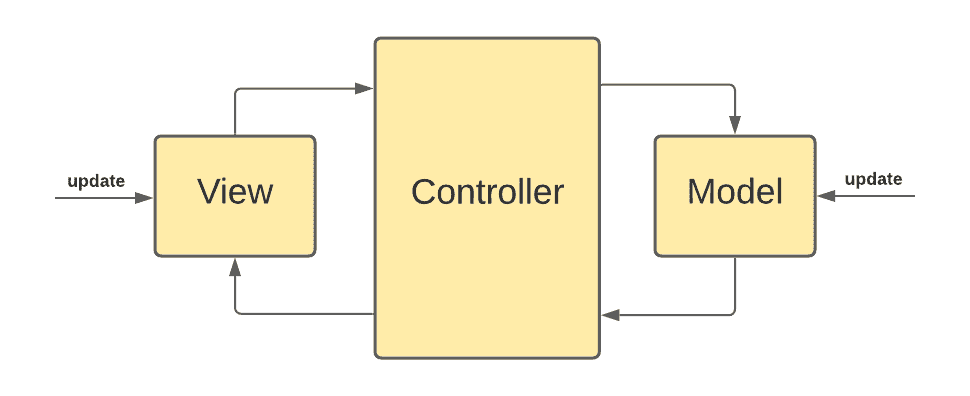*

*这三个组件之间的交互和依赖关系(哪个组件知道其他什么组件)也没有明确定义。有拉模式、推模式或反应模式以及不同级别的解耦(视图知道控制器或视图不知道控制器的任何事情，控制器知道模型，控制器与注入模型一起工作，等等。).由于缺乏共识，我们真的无法从 MVC 模式中学到更多东西。*

## *模型-视图-演示者*

*在 MVP 中，演示者是视图和模型之间的粘合剂:*

*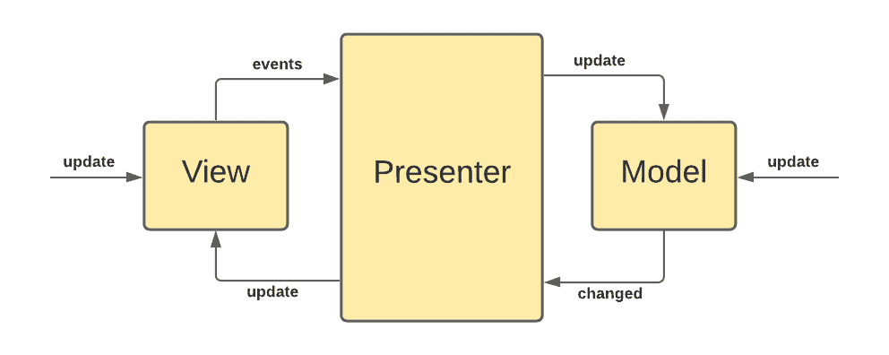*

*演示者更新模型并观察或接收来自模型的更新。在大多数实现中，呈现者有一个对视图的引用，并直接与视图交互(像这里的或这里的)反之亦然(视图直接与呈现者交互以转发 ui 事件)。视图和演示者都应该针对接口进行编码，但是它们仍然相互引用。就解耦而言，MVP 比 MVC 更好，但是演示者有太多的责任和太多关于其他组件的知识。*

## *MVVM(模型-视图-视图模型)*

*MVVM 和 MVP 有两个主要区别:*

1.  *MVVM 的视图模型不引用视图，而在大多数 MVP 实现中，展示者引用视图。视图模型通常被注入到视图中。*
2.  *MVVM 在视图和模型的视图特定部分之间引入了数据绑定，以允许 gui 开发(视图)与业务逻辑开发的分离。*

*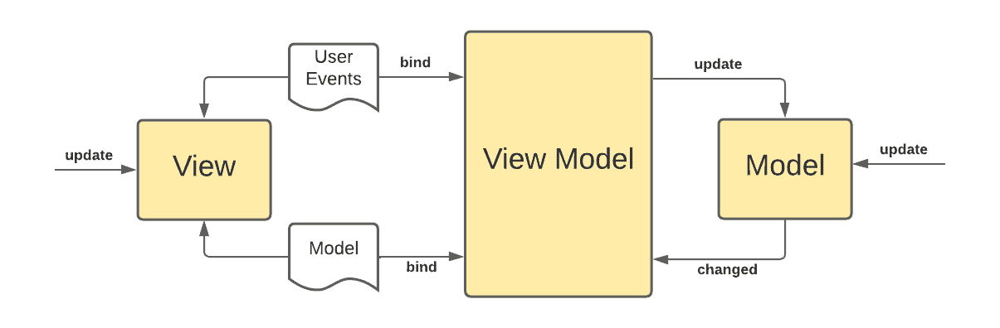*

*MVVM 模型的新颖之处在于声明性的数据(模型)和命令(事件)绑定，这几乎消除了所有的 gui 代码(并用一些标记语言来代替，如 XML 或 [XAML](https://en.wikipedia.org/wiki/Extensible_Application_Markup_Language) )。如果没有这种绑定技术，人们通常会使用 MVP 模式。*

## *MVI(模型-视图-意图)*

*MVI 基本上是安卓/KMM 模式。它的新颖之处在于受 [Cycle.js 框架](https://cycle.js.org/)启发的单向循环数据流:*

*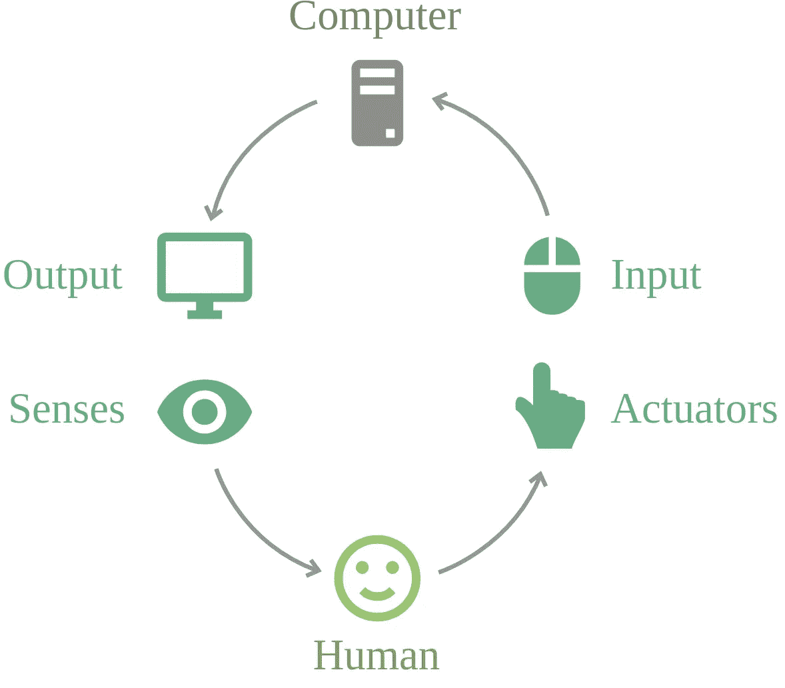*

*来源:[https://cycle.js.org/dialogue.html](https://cycle.js.org/dialogue.html)*

*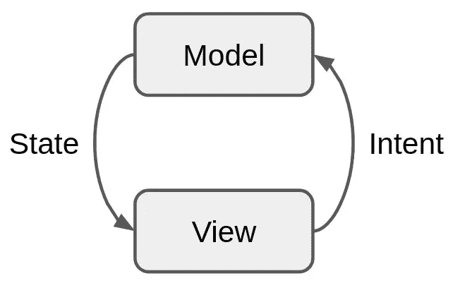*

*来源:[https://github.com/arkivanov/MVIKotlin](https://github.com/arkivanov/MVIKotlin)*

*MVI 没有提到通常位于模型和视图之间的“某物”组件。将这两个组件粘合在一起的模式是不可知的。它只定义了:*

*   *状态是从模型中派生出来的不可变数据，由视图呈现*
*   *用户动作被翻译成用于更新模型的`intents`(尽管在某些定义中`intent`是一个函数而不是“东西”)*
*   *数据流是单向的*

*您可以找到该模式的几个实现，例如 [MVIKotlin](https://arkivanov.github.io/MVIKotlin/) 、 [MVFlow](https://pedroql.github.io/mvflow/) 、 [Orbit](https://orbit-mvi.org/Core/architecture) 或 [Reduce](https://github.com/genaku/Reduce) (列表不完整)以及一篇关于 MVI [的精彩文章。](https://hannesdorfmann.com/android/mosby3-mvi-1/)*

## *状态-动作-模型*

*SAM 是 web 应用程序的一种模式，但是它的概念值得在移动应用程序的环境中讨论。两个主要的想法/概念是:*

1.  *`view`是`model`的一个函数，意味着有一段代码将`model`转换成`state representation`，由`view`呈现/显示。
    执行从`model`到`state representation`转换的那段代码是一个名为`State`的函数(这个命名是不恰当的，因为状态是所有其他模式中的数据)。在 MVP 中，`State`将是`presenter`的一部分，在 MVVM，这将是`binder`。*
2.  *视图`events`被转换成`proposal`以呈现给`model`潜在地导致`model`更新。
    `Actions`是执行从`events`到`proposals`的翻译的函数。`Proposals`是 MVI 的`Intents`。*

*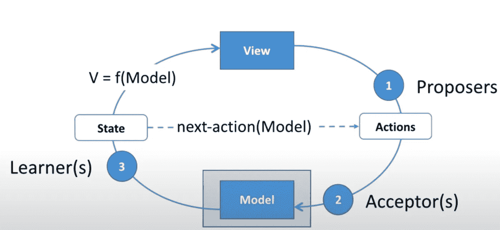*

*在图中可以看到，`State`函数也可以在创建`state presentation`之前触发`Actions`，因此伪代码的流程是:*

```
*// accept/reject proposal and alter state
model.accept(proposal)          // optional: trigger another action (State function)
     .then(nextAction) // create the state representation (State function)
     .then(createStateRepresentation) // render the state representation (View)
     .then(renderView) // record and send events (View)
     .then(sendEvent) // create a proposal (Action function)
     .then(createProposal) // and here we come full circle
     .then(acceptProposal)*
```

*像 MVI 一样，萨姆定义了模型和视图之间的单向流动，而`Actions`是 MVI 的`Intents`。那么这和 MVI 有什么不同呢？*

*MVI 只把不变性、单向流和意图定义为表达用户意图的载体。剩下的部分有待解释，不同的实现有不同的解决方案来填补空白。*

*另一方面，SAM 在定义模式的不同部分时更加具体/精确，尤其是在定义什么是函数、对象或数据结构时。例如，`State`是一个函数，而`Actions`是数据。这很重要，因为最终我们需要对视图和模型之间的“某些东西”做出具体的决定。到目前为止，我们讨论的大多数模式都相当模糊。例如，维基百科关于 MVVM 的文章[将视图模型描述为:](https://en.wikipedia.org/wiki/Model%E2%80%93view%E2%80%93viewmodel)*

> **视图模型*是公开公共属性和命令的视图的抽象。[…].MVVM 有一个*绑定器*，它自动化了视图和视图模型中绑定属性之间的通信。*

*不清楚视图模型到底是什么。它公开公共属性(是对象还是函数？)还有命令(它实现了[命令模式](https://en.wikipedia.org/wiki/Command_pattern)吗？)绑定器是什么，是类/对象还是函数？*

*有了萨姆，事情就一清二楚了。*

## *BLoC(业务逻辑组件)*

*块是一个抖动的概念，它非常具体地定义了视图和块(“某些东西”)之间的交互，但没有定义块和模型如何交互:*

*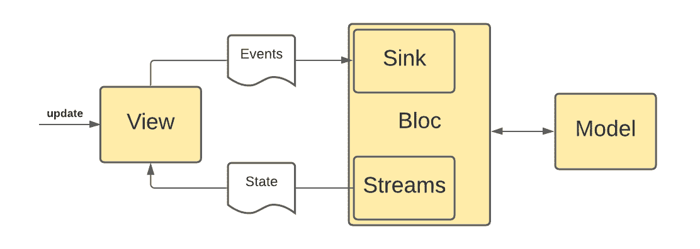*

*   *`State`由 Bloc 作为流发出，由视图使用。Dart 中的一个`[Stream](https://api.dart.dev/stable/2.15.1/dart-async/Stream-class.html)`相当于一个 Rx `[Observable](http://reactivex.io/RxJava/3.x/javadoc/io/reactivex/rxjava3/core/Observable.html)`(可以观察到取回发射的物品)。*
*   *`Events`由视图发送到 Bloc 入汇。Dart 中的一个`[Sink](https://api.dart.dev/stable/2.15.1/dart-core/Sink-class.html)`相当于一个 Rx `[Observer](http://reactivex.io/RxJava/3.x/javadoc/io/reactivex/rxjava3/core/Observer.html)`(可以接收物品)。*

*bloc 的新特性是它在视图和 Bloc 之间传播反应模式，并引入了有意义的命名约定(event -> sink，stream -> state)，因为它们是自我解释的。*

*在此基础上，触及了一个我们还没有讨论的话题，ui 到组件的分解。*

## *反应/还原*

*[**React**](https://reactjs.org/) 本身就是一个框架，用来创建声明式的、可组合的 GUI/web 组件。这些组件呈现用户界面，具有生命周期，并且可以具有本地状态。没有提到控制器、模型、视图模型等等。因此，许多不同的框架试图填补空白(状态管理和视图绑定)。我们只讨论最流行的状态管理框架及其官方绑定库:Redux 和 [React Redux](https://react-redux.js.org/) 。*

*[**Redux**](https://redux.js.org/)**相当简单:***

***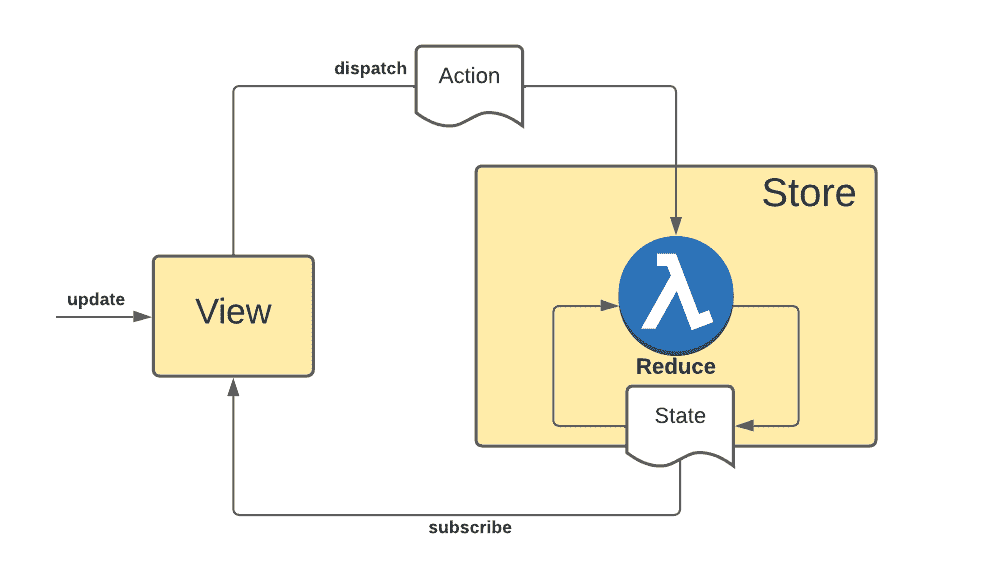***

*   ***集中式的`**store**`管理应用程序状态。它保存当前状态(包括视图状态)并使用`**reducers**`修改它，这个函数的签名是:`(state: State, action: Action) -> State`***
*   ***视图订阅状态更改并相应地更新自身***
*   ***视图调度`actions`，它是`reducers`的输入***
*   ***状态是不可变的，流是单向的***

***其他状态管理库/模式如 [Flux](https://facebook.github.io/flux/) 或 [MobX](https://facebook.github.io/flux/) 非常相似，但是使用多个存储而不是一个。它们都共享由存储服务的不可变状态的单向流。虽然 Redux 涵盖了状态管理和 React 视图部分，但我们仍然需要连接这两者的“东西”。***

***[**React Redux**](https://react-redux.js.org/) 是官方 React UI 绑定层[，将](https://react-redux.js.org/api/connect)存储状态连接到组件属性(Store - > View，`[mapStateToProps](https://react-redux.js.org/using-react-redux/connect-mapstate)`)并公开触发状态变化的函数(View - > Store，`[mapDispatchToProps](https://react-redux.js.org/using-react-redux/connect-mapdispatch)`)。将`React`与`Redux`和`React Redux`一起使用很大程度上遵循了 MVVM 模式，其中`React Redux`是 MVVM 特有的绑定器。***

***我想再提一个对视图和商店之间的交互很重要的机制，那就是`selectors`的使用。如果您直接订阅商店，那么无论何时发生任何变化，即使与 ui 组件无关，您都会得到通知。通过使用像 [**Reselect**](https://github.com/reduxjs/reselect) 这样的库，视图可以选择子状态，并且只有在特定的子状态改变时才检索更新(选择器是[记忆函数](https://en.wikipedia.org/wiki/Memoization)，它会记住先前调用的结果)。***

***React / Redux 带来了一些新的想法(与我们之前讨论的其他模式相比):***

*   ***一个集中的全球国有商店***
*   ***更新全局状态的减速器的概念***
*   ***声明性 ui 组件***
*   ***到处都是反应模式***
*   ***记忆选择器***

## ***总结与展望***

***在过去的 40 多年里，我们经历了从 **MVC** (在 it[1979 年](https://folk.universitetetioslo.no/trygver/themes/mvc/mvc-index.html)的最初定义中)中的紧密耦合组件到 **MVP** 中的视图和模型的解耦，再到 **MVVM** 中的(工具支持的)数据绑定的演变。***

*****MVI** 将不可变数据和单向流添加到等式中，而 **SAM** 将流形式化，并将状态突变和视图绑定定义为功能和设计模式的一等公民。***

*****Bloc** 增加了反应式编程和一些有用的术语(Bloc、stream、sink)，而 **React/Redux** 引入了声明式 ui 组件、全局状态存储(或 multiple with Flux/MobX)和记忆化选择器(等等)。***

***我们将在这个系列的[第二部分](/p/e52b84aeb94d)中把这些都放在一起。***